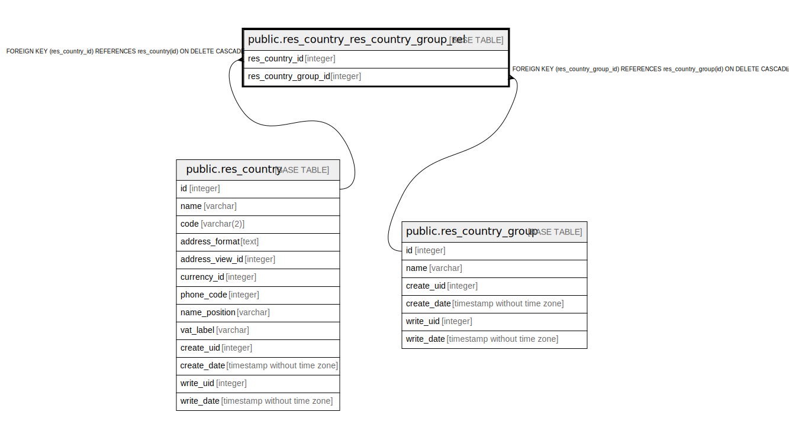

# public.res_country_res_country_group_rel

## Description

RELATION BETWEEN res_country AND res_country_group

## Columns

| Name | Type | Default | Nullable | Children | Parents | Comment |
| ---- | ---- | ------- | -------- | -------- | ------- | ------- |
| res_country_id | integer |  | false |  | [public.res_country](public.res_country.md) |  |
| res_country_group_id | integer |  | false |  | [public.res_country_group](public.res_country_group.md) |  |

## Constraints

| Name | Type | Definition |
| ---- | ---- | ---------- |
| res_country_res_country_group_rel_res_country_id_fkey | FOREIGN KEY | FOREIGN KEY (res_country_id) REFERENCES res_country(id) ON DELETE CASCADE |
| res_country_res_country_group_res_country_id_res_country_gr_key | UNIQUE | UNIQUE (res_country_id, res_country_group_id) |
| res_country_res_country_group_rel_res_country_group_id_fkey | FOREIGN KEY | FOREIGN KEY (res_country_group_id) REFERENCES res_country_group(id) ON DELETE CASCADE |

## Indexes

| Name | Definition |
| ---- | ---------- |
| res_country_res_country_group_res_country_id_res_country_gr_key | CREATE UNIQUE INDEX res_country_res_country_group_res_country_id_res_country_gr_key ON public.res_country_res_country_group_rel USING btree (res_country_id, res_country_group_id) |
| res_country_res_country_group_rel_res_country_id_idx | CREATE INDEX res_country_res_country_group_rel_res_country_id_idx ON public.res_country_res_country_group_rel USING btree (res_country_id) |
| res_country_res_country_group_rel_res_country_group_id_idx | CREATE INDEX res_country_res_country_group_rel_res_country_group_id_idx ON public.res_country_res_country_group_rel USING btree (res_country_group_id) |

## Relations

---

> Generated by [tbls](https://github.com/k1LoW/tbls)
