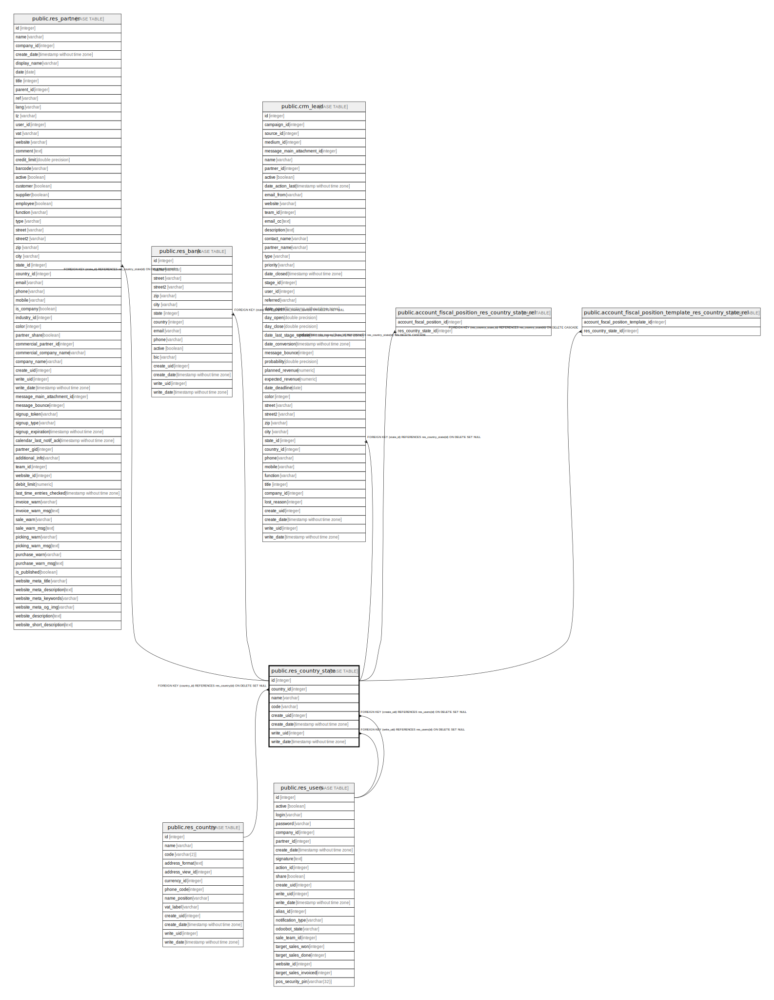

# public.res_country_state

## Description

Country state

## Columns

| Name | Type | Default | Nullable | Children | Parents | Comment |
| ---- | ---- | ------- | -------- | -------- | ------- | ------- |
| id | integer | nextval('res_country_state_id_seq'::regclass) | false | [public.res_partner](public.res_partner.md) [public.res_bank](public.res_bank.md) [public.crm_lead](public.crm_lead.md) [public.account_fiscal_position_res_country_state_rel](public.account_fiscal_position_res_country_state_rel.md) [public.account_fiscal_position_template_res_country_state_rel](public.account_fiscal_position_template_res_country_state_rel.md) |  |  |
| country_id | integer |  | false |  | [public.res_country](public.res_country.md) | Country |
| name | varchar |  | false |  |  | State Name |
| code | varchar |  | false |  |  | State Code |
| create_uid | integer |  | true |  | [public.res_users](public.res_users.md) | Created by |
| create_date | timestamp without time zone |  | true |  |  | Created on |
| write_uid | integer |  | true |  | [public.res_users](public.res_users.md) | Last Updated by |
| write_date | timestamp without time zone |  | true |  |  | Last Updated on |

## Constraints

| Name | Type | Definition | Comment |
| ---- | ---- | ---------- | ------- |
| res_country_state_create_uid_fkey | FOREIGN KEY | FOREIGN KEY (create_uid) REFERENCES res_users(id) ON DELETE SET NULL |  |
| res_country_state_write_uid_fkey | FOREIGN KEY | FOREIGN KEY (write_uid) REFERENCES res_users(id) ON DELETE SET NULL |  |
| res_country_state_country_id_fkey | FOREIGN KEY | FOREIGN KEY (country_id) REFERENCES res_country(id) ON DELETE SET NULL |  |
| res_country_state_pkey | PRIMARY KEY | PRIMARY KEY (id) |  |
| res_country_state_name_code_uniq | UNIQUE | UNIQUE (country_id, code) | unique(country_id, code) |

## Indexes

| Name | Definition |
| ---- | ---------- |
| res_country_state_pkey | CREATE UNIQUE INDEX res_country_state_pkey ON public.res_country_state USING btree (id) |
| res_country_state_name_code_uniq | CREATE UNIQUE INDEX res_country_state_name_code_uniq ON public.res_country_state USING btree (country_id, code) |

## Relations

---

> Generated by [tbls](https://github.com/k1LoW/tbls)
