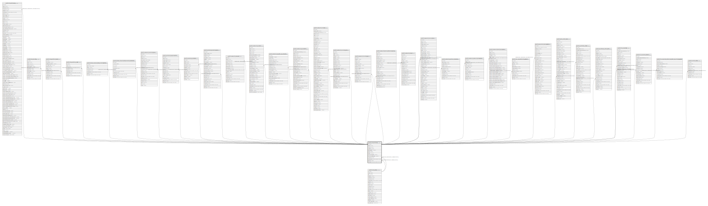

# public.res_currency

## Description

## Columns

| Name | Type | Default | Nullable | Children | Parents | Comment |
| ---- | ---- | ------- | -------- | -------- | ------- | ------- |
| id | integer | nextval('res_currency_id_seq'::regclass) | false | [public.res_company](public.res_company.md) [public.res_country](public.res_country.md) [public.res_partner_bank](public.res_partner_bank.md) [public.res_currency_rate](public.res_currency_rate.md) [public.base_import_tests_models_float](public.base_import_tests_models_float.md) [public.base_import_tests_models_complex](public.base_import_tests_models_complex.md) [public.account_analytic_line](public.account_analytic_line.md) [public.product_supplierinfo](public.product_supplierinfo.md) [public.product_pricelist](public.product_pricelist.md) [public.product_pricelist_item](public.product_pricelist_item.md) [public.account_account](public.account_account.md) [public.account_journal](public.account_journal.md) [public.account_register_payments](public.account_register_payments.md) [public.account_payment](public.account_payment.md) [public.account_invoice](public.account_invoice.md) [public.account_invoice_line](public.account_invoice_line.md) [public.account_invoice_tax](public.account_invoice_tax.md) [public.account_bank_statement_line](public.account_bank_statement_line.md) [public.account_move](public.account_move.md) [public.account_move_line](public.account_move_line.md) [public.account_partial_reconcile](public.account_partial_reconcile.md) [public.account_account_template](public.account_account_template.md) [public.account_chart_template](public.account_chart_template.md) [public.tax_adjustments_wizard](public.tax_adjustments_wizard.md) [public.payment_transaction](public.payment_transaction.md) [public.sale_order_line](public.sale_order_line.md) [public.purchase_order](public.purchase_order.md) [public.purchase_order_line](public.purchase_order_line.md) [public.hr_expense](public.hr_expense.md) [public.hr_expense_sheet](public.hr_expense_sheet.md) [public.hr_expense_sheet_register_payment_wizard](public.hr_expense_sheet_register_payment_wizard.md) [public.lunch_order](public.lunch_order.md) |  |  |
| name | varchar |  | false |  |  |  |
| symbol | varchar |  | false |  |  |  |
| rounding | numeric |  | true |  |  | Rounding Factor |
| decimal_places | integer |  | true |  |  | Decimal Places |
| active | boolean |  | true |  |  | Active |
| position | varchar |  | true |  |  | Symbol Position |
| currency_unit_label | varchar |  | true |  |  | Currency Unit |
| currency_subunit_label | varchar |  | true |  |  | Currency Subunit |
| create_uid | integer |  | true |  | [public.res_users](public.res_users.md) | Created by |
| create_date | timestamp without time zone |  | true |  |  | Created on |
| write_uid | integer |  | true |  | [public.res_users](public.res_users.md) | Last Updated by |
| write_date | timestamp without time zone |  | true |  |  | Last Updated on |

## Constraints

| Name | Type | Definition | Comment |
| ---- | ---- | ---------- | ------- |
| res_currency_rounding_gt_zero | CHECK | CHECK ((rounding > (0)::numeric)) | CHECK (rounding>0) |
| res_currency_create_uid_fkey | FOREIGN KEY | FOREIGN KEY (create_uid) REFERENCES res_users(id) ON DELETE SET NULL |  |
| res_currency_write_uid_fkey | FOREIGN KEY | FOREIGN KEY (write_uid) REFERENCES res_users(id) ON DELETE SET NULL |  |
| res_currency_pkey | PRIMARY KEY | PRIMARY KEY (id) |  |
| res_currency_unique_name | UNIQUE | UNIQUE (name) | unique (name) |

## Indexes

| Name | Definition |
| ---- | ---------- |
| res_currency_pkey | CREATE UNIQUE INDEX res_currency_pkey ON public.res_currency USING btree (id) |
| res_currency_unique_name | CREATE UNIQUE INDEX res_currency_unique_name ON public.res_currency USING btree (name) |

## Relations

---

> Generated by [tbls](https://github.com/k1LoW/tbls)
