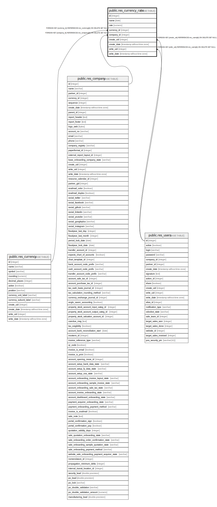

# public.res_currency_rate

## Description

Currency Rate

## Columns

| Name | Type | Default | Nullable | Children | Parents | Comment |
| ---- | ---- | ------- | -------- | -------- | ------- | ------- |
| id | integer | nextval('res_currency_rate_id_seq'::regclass) | false |  |  |  |
| name | date |  | false |  |  | Date |
| rate | numeric |  | true |  |  | Rate |
| currency_id | integer |  | true |  | [public.res_currency](public.res_currency.md) | Currency |
| company_id | integer |  | true |  | [public.res_company](public.res_company.md) | Company |
| create_uid | integer |  | true |  | [public.res_users](public.res_users.md) | Created by |
| create_date | timestamp without time zone |  | true |  |  | Created on |
| write_uid | integer |  | true |  | [public.res_users](public.res_users.md) | Last Updated by |
| write_date | timestamp without time zone |  | true |  |  | Last Updated on |

## Constraints

| Name | Type | Definition | Comment |
| ---- | ---- | ---------- | ------- |
| res_currency_rate_currency_rate_check | CHECK | CHECK ((rate > (0)::numeric)) | CHECK (rate>0) |
| res_currency_rate_create_uid_fkey | FOREIGN KEY | FOREIGN KEY (create_uid) REFERENCES res_users(id) ON DELETE SET NULL |  |
| res_currency_rate_write_uid_fkey | FOREIGN KEY | FOREIGN KEY (write_uid) REFERENCES res_users(id) ON DELETE SET NULL |  |
| res_currency_rate_currency_id_fkey | FOREIGN KEY | FOREIGN KEY (currency_id) REFERENCES res_currency(id) ON DELETE SET NULL |  |
| res_currency_rate_company_id_fkey | FOREIGN KEY | FOREIGN KEY (company_id) REFERENCES res_company(id) ON DELETE SET NULL |  |
| res_currency_rate_pkey | PRIMARY KEY | PRIMARY KEY (id) |  |
| res_currency_rate_unique_name_per_day | UNIQUE | UNIQUE (name, currency_id, company_id) | unique (name,currency_id,company_id) |

## Indexes

| Name | Definition |
| ---- | ---------- |
| res_currency_rate_pkey | CREATE UNIQUE INDEX res_currency_rate_pkey ON public.res_currency_rate USING btree (id) |
| res_currency_rate_name_index | CREATE INDEX res_currency_rate_name_index ON public.res_currency_rate USING btree (name) |
| res_currency_rate_unique_name_per_day | CREATE UNIQUE INDEX res_currency_rate_unique_name_per_day ON public.res_currency_rate USING btree (name, currency_id, company_id) |

## Relations

---

> Generated by [tbls](https://github.com/k1LoW/tbls)
