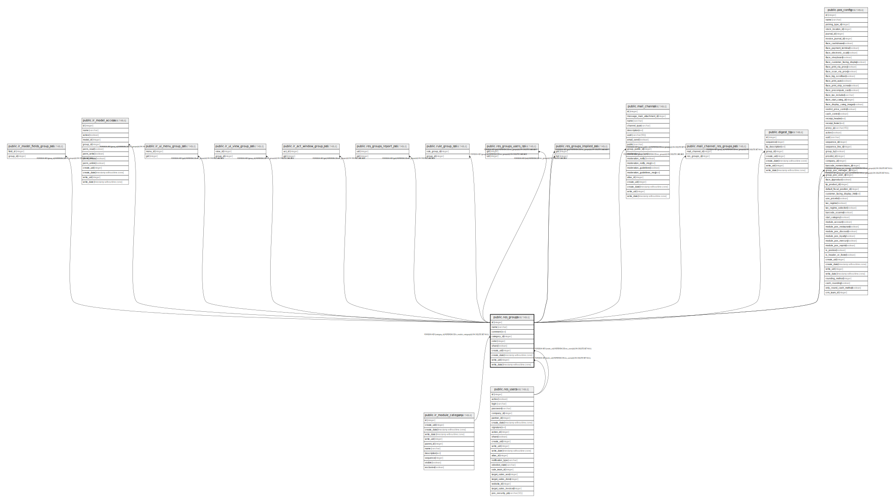

# public.res_groups

## Description

## Columns

| Name | Type | Default | Nullable | Children | Parents | Comment |
| ---- | ---- | ------- | -------- | -------- | ------- | ------- |
| id | integer | nextval('res_groups_id_seq'::regclass) | false | [public.ir_model_fields_group_rel](public.ir_model_fields_group_rel.md) [public.ir_model_access](public.ir_model_access.md) [public.ir_ui_menu_group_rel](public.ir_ui_menu_group_rel.md) [public.ir_ui_view_group_rel](public.ir_ui_view_group_rel.md) [public.ir_act_window_group_rel](public.ir_act_window_group_rel.md) [public.res_groups_report_rel](public.res_groups_report_rel.md) [public.rule_group_rel](public.rule_group_rel.md) [public.res_groups_users_rel](public.res_groups_users_rel.md) [public.res_groups_implied_rel](public.res_groups_implied_rel.md) [public.mail_channel](public.mail_channel.md) [public.mail_channel_res_groups_rel](public.mail_channel_res_groups_rel.md) [public.digest_tip](public.digest_tip.md) [public.pos_config](public.pos_config.md) |  |  |
| name | varchar |  | false |  |  |  |
| comment | text |  | true |  |  | Comment |
| category_id | integer |  | true |  | [public.ir_module_category](public.ir_module_category.md) | Application |
| color | integer |  | true |  |  | Color Index |
| share | boolean |  | true |  |  | Share Group |
| create_uid | integer |  | true |  | [public.res_users](public.res_users.md) | Created by |
| create_date | timestamp without time zone |  | true |  |  | Created on |
| write_uid | integer |  | true |  | [public.res_users](public.res_users.md) | Last Updated by |
| write_date | timestamp without time zone |  | true |  |  | Last Updated on |

## Constraints

| Name | Type | Definition | Comment |
| ---- | ---- | ---------- | ------- |
| res_groups_create_uid_fkey | FOREIGN KEY | FOREIGN KEY (create_uid) REFERENCES res_users(id) ON DELETE SET NULL |  |
| res_groups_write_uid_fkey | FOREIGN KEY | FOREIGN KEY (write_uid) REFERENCES res_users(id) ON DELETE SET NULL |  |
| res_groups_pkey | PRIMARY KEY | PRIMARY KEY (id) |  |
| res_groups_category_id_fkey | FOREIGN KEY | FOREIGN KEY (category_id) REFERENCES ir_module_category(id) ON DELETE SET NULL |  |
| res_groups_name_uniq | UNIQUE | UNIQUE (category_id, name) | unique (category_id, name) |

## Indexes

| Name | Definition |
| ---- | ---------- |
| res_groups_pkey | CREATE UNIQUE INDEX res_groups_pkey ON public.res_groups USING btree (id) |
| res_groups_category_id_index | CREATE INDEX res_groups_category_id_index ON public.res_groups USING btree (category_id) |
| res_groups_name_uniq | CREATE UNIQUE INDEX res_groups_name_uniq ON public.res_groups USING btree (category_id, name) |

## Relations

---

> Generated by [tbls](https://github.com/k1LoW/tbls)
