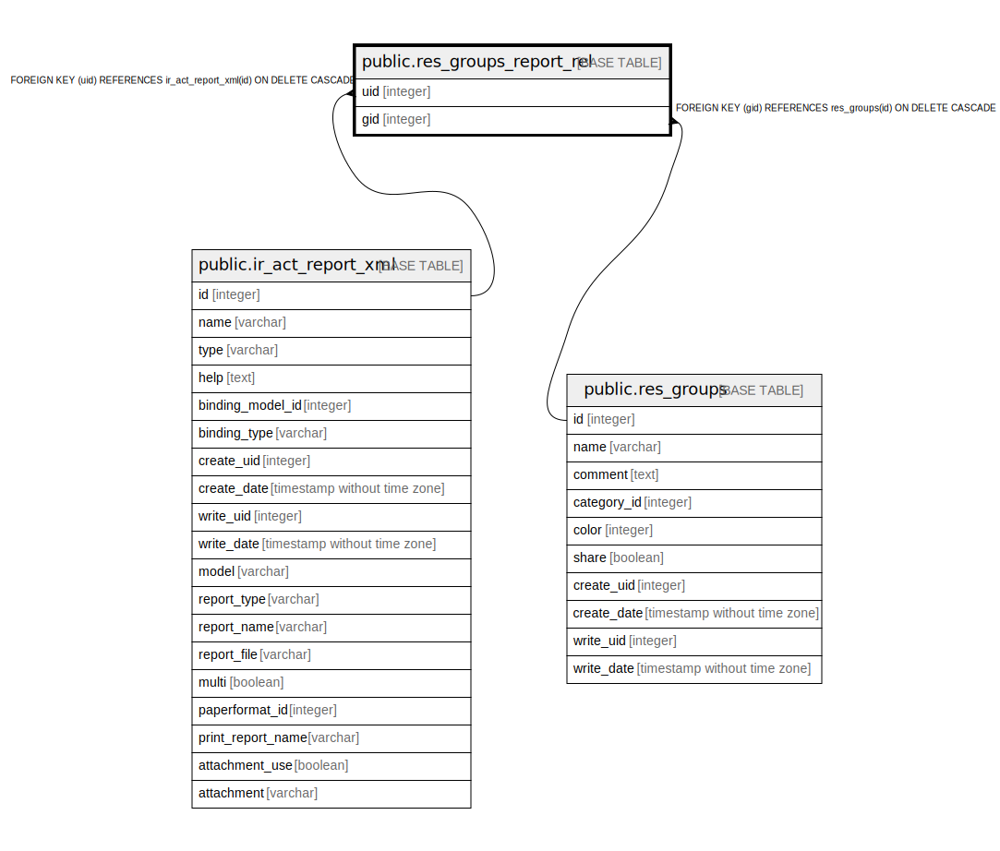

# public.res_groups_report_rel

## Description

RELATION BETWEEN ir_act_report_xml AND res_groups

## Columns

| Name | Type | Default | Nullable | Children | Parents | Comment |
| ---- | ---- | ------- | -------- | -------- | ------- | ------- |
| uid | integer |  | false |  | [public.ir_act_report_xml](public.ir_act_report_xml.md) |  |
| gid | integer |  | false |  | [public.res_groups](public.res_groups.md) |  |

## Constraints

| Name | Type | Definition |
| ---- | ---- | ---------- |
| res_groups_report_rel_uid_fkey | FOREIGN KEY | FOREIGN KEY (uid) REFERENCES ir_act_report_xml(id) ON DELETE CASCADE |
| res_groups_report_rel_gid_fkey | FOREIGN KEY | FOREIGN KEY (gid) REFERENCES res_groups(id) ON DELETE CASCADE |
| res_groups_report_rel_uid_gid_key | UNIQUE | UNIQUE (uid, gid) |

## Indexes

| Name | Definition |
| ---- | ---------- |
| res_groups_report_rel_uid_gid_key | CREATE UNIQUE INDEX res_groups_report_rel_uid_gid_key ON public.res_groups_report_rel USING btree (uid, gid) |
| res_groups_report_rel_uid_idx | CREATE INDEX res_groups_report_rel_uid_idx ON public.res_groups_report_rel USING btree (uid) |
| res_groups_report_rel_gid_idx | CREATE INDEX res_groups_report_rel_gid_idx ON public.res_groups_report_rel USING btree (gid) |

## Relations

---

> Generated by [tbls](https://github.com/k1LoW/tbls)
