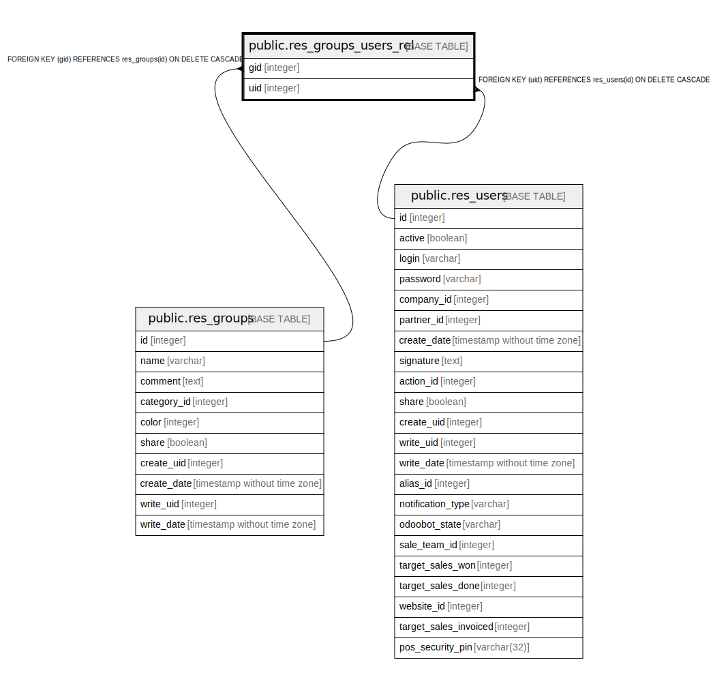

# public.res_groups_users_rel

## Description

RELATION BETWEEN res_groups AND res_users

## Columns

| Name | Type | Default | Nullable | Children | Parents | Comment |
| ---- | ---- | ------- | -------- | -------- | ------- | ------- |
| gid | integer |  | false |  | [public.res_groups](public.res_groups.md) |  |
| uid | integer |  | false |  | [public.res_users](public.res_users.md) |  |

## Constraints

| Name | Type | Definition |
| ---- | ---- | ---------- |
| res_groups_users_rel_uid_fkey | FOREIGN KEY | FOREIGN KEY (uid) REFERENCES res_users(id) ON DELETE CASCADE |
| res_groups_users_rel_gid_fkey | FOREIGN KEY | FOREIGN KEY (gid) REFERENCES res_groups(id) ON DELETE CASCADE |
| res_groups_users_rel_gid_uid_key | UNIQUE | UNIQUE (gid, uid) |

## Indexes

| Name | Definition |
| ---- | ---------- |
| res_groups_users_rel_gid_uid_key | CREATE UNIQUE INDEX res_groups_users_rel_gid_uid_key ON public.res_groups_users_rel USING btree (gid, uid) |
| res_groups_users_rel_gid_idx | CREATE INDEX res_groups_users_rel_gid_idx ON public.res_groups_users_rel USING btree (gid) |
| res_groups_users_rel_uid_idx | CREATE INDEX res_groups_users_rel_uid_idx ON public.res_groups_users_rel USING btree (uid) |

## Relations

---

> Generated by [tbls](https://github.com/k1LoW/tbls)
