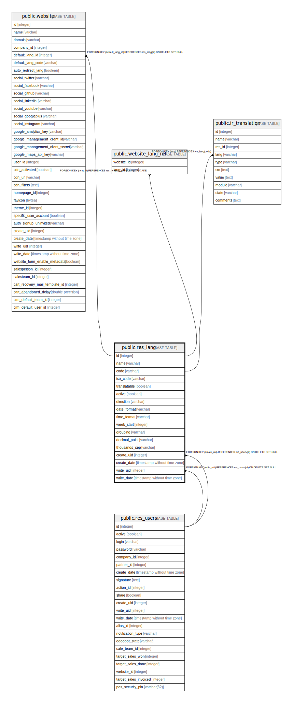

# public.res_lang

## Description

Languages

## Columns

| Name | Type | Default | Nullable | Children | Parents | Comment |
| ---- | ---- | ------- | -------- | -------- | ------- | ------- |
| id | integer | nextval('res_lang_id_seq'::regclass) | false | [public.website](public.website.md) [public.website_lang_rel](public.website_lang_rel.md) |  |  |
| name | varchar |  | false |  |  | Name |
| code | varchar |  | false | [public.ir_translation](public.ir_translation.md) |  | Locale Code |
| iso_code | varchar |  | true |  |  | ISO code |
| translatable | boolean |  | true |  |  | Translatable |
| active | boolean |  | true |  |  | Active |
| direction | varchar |  | false |  |  | Direction |
| date_format | varchar |  | false |  |  | Date Format |
| time_format | varchar |  | false |  |  | Time Format |
| week_start | integer |  | false |  |  | First Day of Week |
| grouping | varchar |  | false |  |  | Separator Format |
| decimal_point | varchar |  | false |  |  | Decimal Separator |
| thousands_sep | varchar |  | true |  |  | Thousands Separator |
| create_uid | integer |  | true |  | [public.res_users](public.res_users.md) | Created by |
| create_date | timestamp without time zone |  | true |  |  | Created on |
| write_uid | integer |  | true |  | [public.res_users](public.res_users.md) | Last Updated by |
| write_date | timestamp without time zone |  | true |  |  | Last Updated on |

## Constraints

| Name | Type | Definition | Comment |
| ---- | ---- | ---------- | ------- |
| res_lang_create_uid_fkey | FOREIGN KEY | FOREIGN KEY (create_uid) REFERENCES res_users(id) ON DELETE SET NULL |  |
| res_lang_write_uid_fkey | FOREIGN KEY | FOREIGN KEY (write_uid) REFERENCES res_users(id) ON DELETE SET NULL |  |
| res_lang_pkey | PRIMARY KEY | PRIMARY KEY (id) |  |
| res_lang_code_uniq | UNIQUE | UNIQUE (code) | unique(code) |
| res_lang_name_uniq | UNIQUE | UNIQUE (name) | unique(name) |

## Indexes

| Name | Definition |
| ---- | ---------- |
| res_lang_pkey | CREATE UNIQUE INDEX res_lang_pkey ON public.res_lang USING btree (id) |
| res_lang_code_uniq | CREATE UNIQUE INDEX res_lang_code_uniq ON public.res_lang USING btree (code) |
| res_lang_name_uniq | CREATE UNIQUE INDEX res_lang_name_uniq ON public.res_lang USING btree (name) |

## Relations

---

> Generated by [tbls](https://github.com/k1LoW/tbls)
