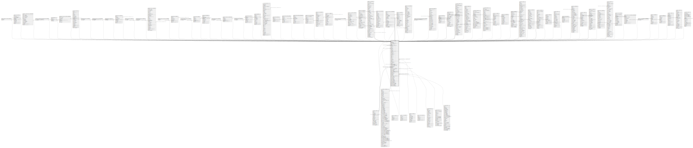

# public.res_partner

## Description

## Columns

| Name | Type | Default | Nullable | Children | Parents | Comment |
| ---- | ---- | ------- | -------- | -------- | ------- | ------- |
| id | integer | nextval('res_partner_id_seq'::regclass) | false | [public.res_users](public.res_users.md) [public.res_company](public.res_company.md) [public.res_partner](public.res_partner.md) [public.res_partner_res_partner_category_rel](public.res_partner_res_partner_category_rel.md) [public.res_partner_bank](public.res_partner_bank.md) [public.base_partner_merge_automatic_wizard](public.base_partner_merge_automatic_wizard.md) [public.base_partner_merge_automatic_wizard_res_partner_rel](public.base_partner_merge_automatic_wizard_res_partner_rel.md) [public.mail_followers](public.mail_followers.md) [public.mail_message_res_partner_needaction_rel](public.mail_message_res_partner_needaction_rel.md) [public.mail_message](public.mail_message.md) [public.mail_message_res_partner_rel](public.mail_message_res_partner_rel.md) [public.mail_message_res_partner_starred_rel](public.mail_message_res_partner_starred_rel.md) [public.mail_mail_res_partner_rel](public.mail_mail_res_partner_rel.md) [public.mail_channel_partner](public.mail_channel_partner.md) [public.ir_act_server_res_partner_rel](public.ir_act_server_res_partner_rel.md) [public.mail_wizard_invite_res_partner_rel](public.mail_wizard_invite_res_partner_rel.md) [public.mail_compose_message](public.mail_compose_message.md) [public.mail_compose_message_res_partner_rel](public.mail_compose_message_res_partner_rel.md) [public.mail_resend_partner](public.mail_resend_partner.md) [public.email_template_preview_res_partner_rel](public.email_template_preview_res_partner_rel.md) [public.calendar_contacts](public.calendar_contacts.md) [public.calendar_attendee](public.calendar_attendee.md) [public.calendar_event_res_partner_rel](public.calendar_event_res_partner_rel.md) [public.res_partner_autocomplete_sync](public.res_partner_autocomplete_sync.md) [public.portal_share_res_partner_rel](public.portal_share_res_partner_rel.md) [public.portal_wizard_user](public.portal_wizard_user.md) [public.snailmail_letter](public.snailmail_letter.md) [public.crm_lead](public.crm_lead.md) [public.crm_partner_binding](public.crm_partner_binding.md) [public.crm_lead2opportunity_partner](public.crm_lead2opportunity_partner.md) [public.crm_lead2opportunity_partner_mass](public.crm_lead2opportunity_partner_mass.md) [public.account_analytic_account](public.account_analytic_account.md) [public.account_analytic_line](public.account_analytic_line.md) [public.product_supplierinfo](public.product_supplierinfo.md) [public.account_reconcile_model_res_partner_rel](public.account_reconcile_model_res_partner_rel.md) [public.account_register_payments](public.account_register_payments.md) [public.account_payment](public.account_payment.md) [public.account_invoice](public.account_invoice.md) [public.account_invoice_line](public.account_invoice_line.md) [public.account_bank_statement_line](public.account_bank_statement_line.md) [public.account_move](public.account_move.md) [public.account_move_line](public.account_move_line.md) [public.account_reconcile_model_template_res_partner_rel](public.account_reconcile_model_template_res_partner_rel.md) [public.payment_transaction](public.payment_transaction.md) [public.payment_token](public.payment_token.md) [public.rating_rating](public.rating_rating.md) [public.sale_order](public.sale_order.md) [public.sale_order_line](public.sale_order_line.md) [public.project_project](public.project_project.md) [public.project_task](public.project_task.md) [public.stock_inventory](public.stock_inventory.md) [public.stock_inventory_line](public.stock_inventory_line.md) [public.stock_location](public.stock_location.md) [public.stock_move](public.stock_move.md) [public.stock_move_line](public.stock_move_line.md) [public.stock_picking](public.stock_picking.md) [public.stock_quant](public.stock_quant.md) [public.stock_rule](public.stock_rule.md) [public.procurement_group](public.procurement_group.md) [public.stock_warehouse](public.stock_warehouse.md) [public.stock_scrap](public.stock_scrap.md) [public.purchase_order](public.purchase_order.md) [public.purchase_order_line](public.purchase_order_line.md) [public.hr_employee](public.hr_employee.md) [public.hr_expense_sheet](public.hr_expense_sheet.md) [public.hr_expense_sheet_register_payment_wizard](public.hr_expense_sheet_register_payment_wizard.md) [public.lunch_order_line_lucky_res_partner_rel](public.lunch_order_line_lucky_res_partner_rel.md) [public.lunch_order_line](public.lunch_order_line.md) [public.lunch_product](public.lunch_product.md) [public.lunch_alert](public.lunch_alert.md) [public.pos_order](public.pos_order.md) [public.blog_post](public.blog_post.md) |  |  |
| name | varchar |  | true |  |  |  |
| company_id | integer |  | true |  | [public.res_company](public.res_company.md) |  |
| create_date | timestamp without time zone |  | true |  |  |  |
| display_name | varchar |  | true |  |  | Display Name |
| date | date |  | true |  |  | Date |
| title | integer |  | true |  | [public.res_partner_title](public.res_partner_title.md) | Title |
| parent_id | integer |  | true |  | [public.res_partner](public.res_partner.md) | Related Company |
| ref | varchar |  | true |  |  | Internal Reference |
| lang | varchar |  | true |  |  | Language |
| tz | varchar |  | true |  |  | Timezone |
| user_id | integer |  | true |  | [public.res_users](public.res_users.md) | Salesperson |
| vat | varchar |  | true |  |  | Tax ID |
| website | varchar |  | true |  |  | Website |
| comment | text |  | true |  |  | Notes |
| credit_limit | double precision |  | true |  |  | Credit Limit |
| barcode | varchar |  | true |  |  | Barcode |
| active | boolean |  | true |  |  | Active |
| customer | boolean |  | true |  |  | Is a Customer |
| supplier | boolean |  | true |  |  | Is a Vendor |
| employee | boolean |  | true |  |  | Employee |
| function | varchar |  | true |  |  | Job Position |
| type | varchar |  | true |  |  | Address Type |
| street | varchar |  | true |  |  | Street |
| street2 | varchar |  | true |  |  | Street2 |
| zip | varchar |  | true |  |  | Zip |
| city | varchar |  | true |  |  | City |
| state_id | integer |  | true |  | [public.res_country_state](public.res_country_state.md) | State |
| country_id | integer |  | true |  | [public.res_country](public.res_country.md) | Country |
| email | varchar |  | true |  |  | Email |
| phone | varchar |  | true |  |  | Phone |
| mobile | varchar |  | true |  |  | Mobile |
| is_company | boolean |  | true |  |  | Is a Company |
| industry_id | integer |  | true |  | [public.res_partner_industry](public.res_partner_industry.md) | Industry |
| color | integer |  | true |  |  | Color Index |
| partner_share | boolean |  | true |  |  | Share Partner |
| commercial_partner_id | integer |  | true |  | [public.res_partner](public.res_partner.md) | Commercial Entity |
| commercial_company_name | varchar |  | true |  |  | Company Name Entity |
| company_name | varchar |  | true |  |  | Company Name |
| create_uid | integer |  | true |  | [public.res_users](public.res_users.md) | Created by |
| write_uid | integer |  | true |  | [public.res_users](public.res_users.md) | Last Updated by |
| write_date | timestamp without time zone |  | true |  |  | Last Updated on |
| message_main_attachment_id | integer |  | true |  | [public.ir_attachment](public.ir_attachment.md) | Main Attachment |
| message_bounce | integer |  | true |  |  | Bounce |
| signup_token | varchar |  | true |  |  | Signup Token |
| signup_type | varchar |  | true |  |  | Signup Token Type |
| signup_expiration | timestamp without time zone |  | true |  |  | Signup Expiration |
| calendar_last_notif_ack | timestamp without time zone |  | true |  |  | Last notification marked as read from base Calendar |
| partner_gid | integer |  | true |  |  | Company database ID |
| additional_info | varchar |  | true |  |  | Additional info |
| team_id | integer |  | true |  | [public.crm_team](public.crm_team.md) | Sales Team |
| website_id | integer |  | true |  | [public.website](public.website.md) | Registration Website |
| debit_limit | numeric |  | true |  |  | Payable Limit |
| last_time_entries_checked | timestamp without time zone |  | true |  |  | Latest Invoices & Payments Matching Date |
| invoice_warn | varchar |  | true |  |  | Invoice |
| invoice_warn_msg | text |  | true |  |  | Message for Invoice |
| sale_warn | varchar |  | true |  |  | Sales Warnings |
| sale_warn_msg | text |  | true |  |  | Message for Sales Order |
| picking_warn | varchar |  | true |  |  | Stock Picking |
| picking_warn_msg | text |  | true |  |  | Message for Stock Picking |
| purchase_warn | varchar |  | true |  |  | Purchase Order |
| purchase_warn_msg | text |  | true |  |  | Message for Purchase Order |
| is_published | boolean |  | true |  |  | Is published |
| website_meta_title | varchar |  | true |  |  | Website meta title |
| website_meta_description | text |  | true |  |  | Website meta description |
| website_meta_keywords | varchar |  | true |  |  | Website meta keywords |
| website_meta_og_img | varchar |  | true |  |  | Website opengraph image |
| website_description | text |  | true |  |  | Website Partner Full Description |
| website_short_description | text |  | true |  |  | Website Partner Short Description |

## Constraints

| Name | Type | Definition | Comment |
| ---- | ---- | ---------- | ------- |
| res_partner_check_name | CHECK | CHECK (((((type)::text = 'contact'::text) AND (name IS NOT NULL)) OR ((type)::text <> 'contact'::text))) | CHECK( (type='contact' AND name IS NOT NULL) or (type!='contact') ) |
| res_partner_create_uid_fkey | FOREIGN KEY | FOREIGN KEY (create_uid) REFERENCES res_users(id) ON DELETE SET NULL |  |
| res_partner_user_id_fkey | FOREIGN KEY | FOREIGN KEY (user_id) REFERENCES res_users(id) ON DELETE SET NULL |  |
| res_partner_write_uid_fkey | FOREIGN KEY | FOREIGN KEY (write_uid) REFERENCES res_users(id) ON DELETE SET NULL |  |
| res_partner_company_id_fkey | FOREIGN KEY | FOREIGN KEY (company_id) REFERENCES res_company(id) ON DELETE SET NULL |  |
| res_partner_commercial_partner_id_fkey | FOREIGN KEY | FOREIGN KEY (commercial_partner_id) REFERENCES res_partner(id) ON DELETE SET NULL |  |
| res_partner_parent_id_fkey | FOREIGN KEY | FOREIGN KEY (parent_id) REFERENCES res_partner(id) ON DELETE SET NULL |  |
| res_partner_pkey | PRIMARY KEY | PRIMARY KEY (id) |  |
| res_partner_message_main_attachment_id_fkey | FOREIGN KEY | FOREIGN KEY (message_main_attachment_id) REFERENCES ir_attachment(id) ON DELETE SET NULL |  |
| res_partner_country_id_fkey | FOREIGN KEY | FOREIGN KEY (country_id) REFERENCES res_country(id) ON DELETE RESTRICT |  |
| res_partner_state_id_fkey | FOREIGN KEY | FOREIGN KEY (state_id) REFERENCES res_country_state(id) ON DELETE RESTRICT |  |
| res_partner_title_fkey | FOREIGN KEY | FOREIGN KEY (title) REFERENCES res_partner_title(id) ON DELETE SET NULL |  |
| res_partner_industry_id_fkey | FOREIGN KEY | FOREIGN KEY (industry_id) REFERENCES res_partner_industry(id) ON DELETE SET NULL |  |
| res_partner_team_id_fkey | FOREIGN KEY | FOREIGN KEY (team_id) REFERENCES crm_team(id) ON DELETE SET NULL |  |
| res_partner_website_id_fkey | FOREIGN KEY | FOREIGN KEY (website_id) REFERENCES website(id) ON DELETE SET NULL |  |

## Indexes

| Name | Definition |
| ---- | ---------- |
| res_partner_pkey | CREATE UNIQUE INDEX res_partner_pkey ON public.res_partner USING btree (id) |
| res_partner_name_index | CREATE INDEX res_partner_name_index ON public.res_partner USING btree (name) |
| res_partner_display_name_index | CREATE INDEX res_partner_display_name_index ON public.res_partner USING btree (display_name) |
| res_partner_date_index | CREATE INDEX res_partner_date_index ON public.res_partner USING btree (date) |
| res_partner_parent_id_index | CREATE INDEX res_partner_parent_id_index ON public.res_partner USING btree (parent_id) |
| res_partner_ref_index | CREATE INDEX res_partner_ref_index ON public.res_partner USING btree (ref) |
| res_partner_vat_index | CREATE INDEX res_partner_vat_index ON public.res_partner USING btree (vat) |
| res_partner_company_id_index | CREATE INDEX res_partner_company_id_index ON public.res_partner USING btree (company_id) |
| res_partner_commercial_partner_id_index | CREATE INDEX res_partner_commercial_partner_id_index ON public.res_partner USING btree (commercial_partner_id) |
| res_partner_message_main_attachment_id_index | CREATE INDEX res_partner_message_main_attachment_id_index ON public.res_partner USING btree (message_main_attachment_id) |

## Relations

---

> Generated by [tbls](https://github.com/k1LoW/tbls)
