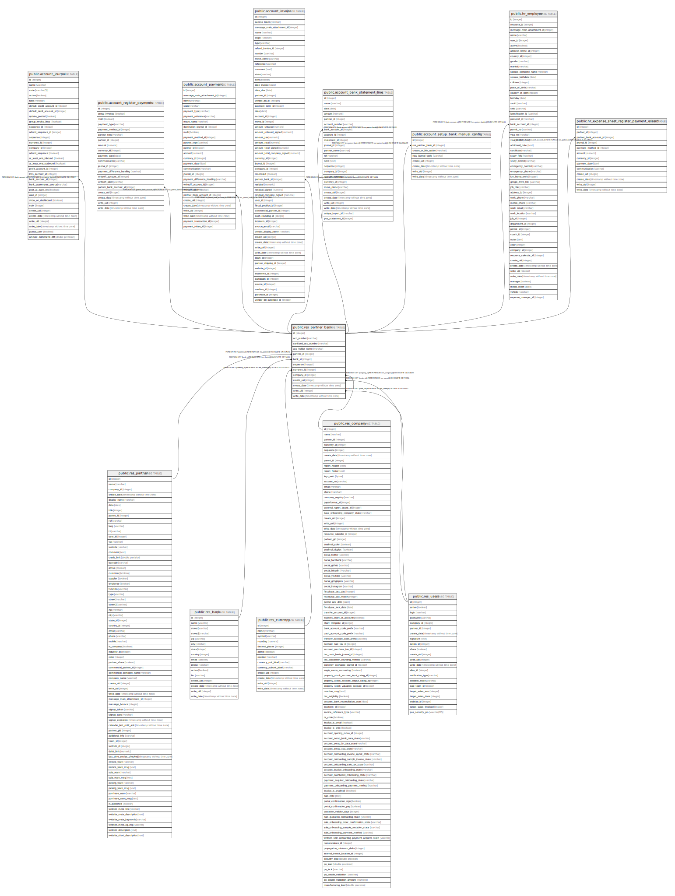

# public.res_partner_bank

## Description

Bank Accounts

## Columns

| Name | Type | Default | Nullable | Children | Parents | Comment |
| ---- | ---- | ------- | -------- | -------- | ------- | ------- |
| id | integer | nextval('res_partner_bank_id_seq'::regclass) | false | [public.account_journal](public.account_journal.md) [public.account_register_payments](public.account_register_payments.md) [public.account_payment](public.account_payment.md) [public.account_invoice](public.account_invoice.md) [public.account_bank_statement_line](public.account_bank_statement_line.md) [public.account_setup_bank_manual_config](public.account_setup_bank_manual_config.md) [public.hr_employee](public.hr_employee.md) [public.hr_expense_sheet_register_payment_wizard](public.hr_expense_sheet_register_payment_wizard.md) |  |  |
| acc_number | varchar |  | false |  |  | Account Number |
| sanitized_acc_number | varchar |  | true |  |  | Sanitized Account Number |
| acc_holder_name | varchar |  | true |  |  | Account Holder Name |
| partner_id | integer |  | false |  | [public.res_partner](public.res_partner.md) | Account Holder |
| bank_id | integer |  | true |  | [public.res_bank](public.res_bank.md) | Bank |
| sequence | integer |  | true |  |  | Sequence |
| currency_id | integer |  | true |  | [public.res_currency](public.res_currency.md) | Currency |
| company_id | integer |  | true |  | [public.res_company](public.res_company.md) | Company |
| create_uid | integer |  | true |  | [public.res_users](public.res_users.md) | Created by |
| create_date | timestamp without time zone |  | true |  |  | Created on |
| write_uid | integer |  | true |  | [public.res_users](public.res_users.md) | Last Updated by |
| write_date | timestamp without time zone |  | true |  |  | Last Updated on |

## Constraints

| Name | Type | Definition | Comment |
| ---- | ---- | ---------- | ------- |
| res_partner_bank_create_uid_fkey | FOREIGN KEY | FOREIGN KEY (create_uid) REFERENCES res_users(id) ON DELETE SET NULL |  |
| res_partner_bank_write_uid_fkey | FOREIGN KEY | FOREIGN KEY (write_uid) REFERENCES res_users(id) ON DELETE SET NULL |  |
| res_partner_bank_currency_id_fkey | FOREIGN KEY | FOREIGN KEY (currency_id) REFERENCES res_currency(id) ON DELETE SET NULL |  |
| res_partner_bank_company_id_fkey | FOREIGN KEY | FOREIGN KEY (company_id) REFERENCES res_company(id) ON DELETE CASCADE |  |
| res_partner_bank_partner_id_fkey | FOREIGN KEY | FOREIGN KEY (partner_id) REFERENCES res_partner(id) ON DELETE CASCADE |  |
| res_partner_bank_bank_id_fkey | FOREIGN KEY | FOREIGN KEY (bank_id) REFERENCES res_bank(id) ON DELETE SET NULL |  |
| res_partner_bank_pkey | PRIMARY KEY | PRIMARY KEY (id) |  |
| res_partner_bank_unique_number | UNIQUE | UNIQUE (sanitized_acc_number, company_id) | unique(sanitized_acc_number, company_id) |

## Indexes

| Name | Definition |
| ---- | ---------- |
| res_partner_bank_pkey | CREATE UNIQUE INDEX res_partner_bank_pkey ON public.res_partner_bank USING btree (id) |
| res_partner_bank_partner_id_index | CREATE INDEX res_partner_bank_partner_id_index ON public.res_partner_bank USING btree (partner_id) |
| res_partner_bank_unique_number | CREATE UNIQUE INDEX res_partner_bank_unique_number ON public.res_partner_bank USING btree (sanitized_acc_number, company_id) |

## Relations

---

> Generated by [tbls](https://github.com/k1LoW/tbls)
