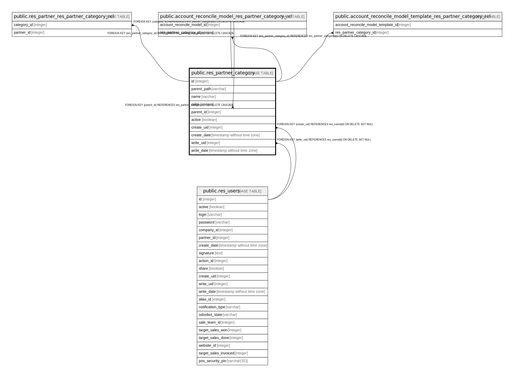

# public.res_partner_category

## Description

Partner Tags

## Columns

| Name | Type | Default | Nullable | Children | Parents | Comment |
| ---- | ---- | ------- | -------- | -------- | ------- | ------- |
| id | integer | nextval('res_partner_category_id_seq'::regclass) | false | [public.res_partner_category](public.res_partner_category.md) [public.res_partner_res_partner_category_rel](public.res_partner_res_partner_category_rel.md) [public.account_reconcile_model_res_partner_category_rel](public.account_reconcile_model_res_partner_category_rel.md) [public.account_reconcile_model_template_res_partner_category_rel](public.account_reconcile_model_template_res_partner_category_rel.md) |  |  |
| parent_path | varchar |  | true |  |  |  |
| name | varchar |  | false |  |  | Tag Name |
| color | integer |  | true |  |  | Color Index |
| parent_id | integer |  | true |  | [public.res_partner_category](public.res_partner_category.md) | Parent Category |
| active | boolean |  | true |  |  | Active |
| create_uid | integer |  | true |  | [public.res_users](public.res_users.md) | Created by |
| create_date | timestamp without time zone |  | true |  |  | Created on |
| write_uid | integer |  | true |  | [public.res_users](public.res_users.md) | Last Updated by |
| write_date | timestamp without time zone |  | true |  |  | Last Updated on |

## Constraints

| Name | Type | Definition |
| ---- | ---- | ---------- |
| res_partner_category_create_uid_fkey | FOREIGN KEY | FOREIGN KEY (create_uid) REFERENCES res_users(id) ON DELETE SET NULL |
| res_partner_category_write_uid_fkey | FOREIGN KEY | FOREIGN KEY (write_uid) REFERENCES res_users(id) ON DELETE SET NULL |
| res_partner_category_parent_id_fkey | FOREIGN KEY | FOREIGN KEY (parent_id) REFERENCES res_partner_category(id) ON DELETE CASCADE |
| res_partner_category_pkey | PRIMARY KEY | PRIMARY KEY (id) |

## Indexes

| Name | Definition |
| ---- | ---------- |
| res_partner_category_pkey | CREATE UNIQUE INDEX res_partner_category_pkey ON public.res_partner_category USING btree (id) |
| res_partner_category_parent_id_index | CREATE INDEX res_partner_category_parent_id_index ON public.res_partner_category USING btree (parent_id) |
| res_partner_category_parent_path_index | CREATE INDEX res_partner_category_parent_path_index ON public.res_partner_category USING btree (parent_path) |

## Relations

---

> Generated by [tbls](https://github.com/k1LoW/tbls)
