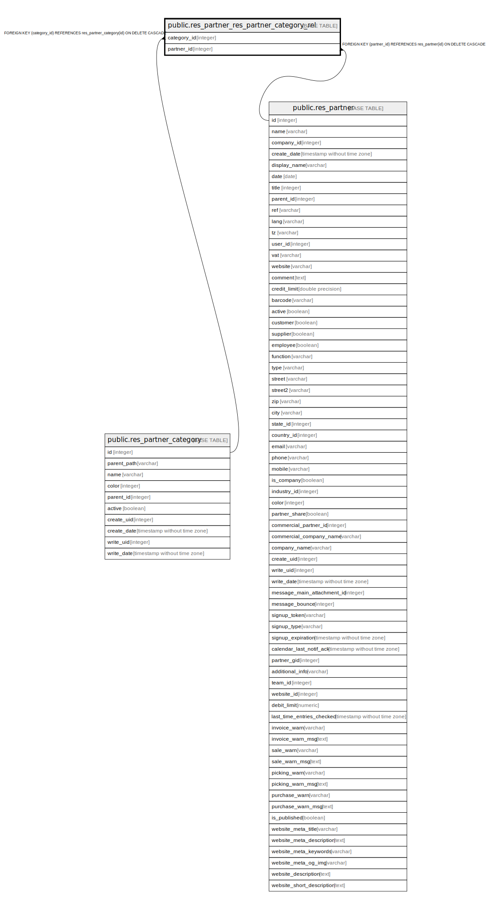

# public.res_partner_res_partner_category_rel

## Description

RELATION BETWEEN res_partner_category AND res_partner

## Columns

| Name | Type | Default | Nullable | Children | Parents | Comment |
| ---- | ---- | ------- | -------- | -------- | ------- | ------- |
| category_id | integer |  | false |  | [public.res_partner_category](public.res_partner_category.md) |  |
| partner_id | integer |  | false |  | [public.res_partner](public.res_partner.md) |  |

## Constraints

| Name | Type | Definition |
| ---- | ---- | ---------- |
| res_partner_res_partner_category_rel_partner_id_fkey | FOREIGN KEY | FOREIGN KEY (partner_id) REFERENCES res_partner(id) ON DELETE CASCADE |
| res_partner_res_partner_category_rel_category_id_fkey | FOREIGN KEY | FOREIGN KEY (category_id) REFERENCES res_partner_category(id) ON DELETE CASCADE |
| res_partner_res_partner_category_rel_category_id_partner_id_key | UNIQUE | UNIQUE (category_id, partner_id) |

## Indexes

| Name | Definition |
| ---- | ---------- |
| res_partner_res_partner_category_rel_category_id_partner_id_key | CREATE UNIQUE INDEX res_partner_res_partner_category_rel_category_id_partner_id_key ON public.res_partner_res_partner_category_rel USING btree (category_id, partner_id) |
| res_partner_res_partner_category_rel_category_id_idx | CREATE INDEX res_partner_res_partner_category_rel_category_id_idx ON public.res_partner_res_partner_category_rel USING btree (category_id) |
| res_partner_res_partner_category_rel_partner_id_idx | CREATE INDEX res_partner_res_partner_category_rel_partner_id_idx ON public.res_partner_res_partner_category_rel USING btree (partner_id) |

## Relations

---

> Generated by [tbls](https://github.com/k1LoW/tbls)
