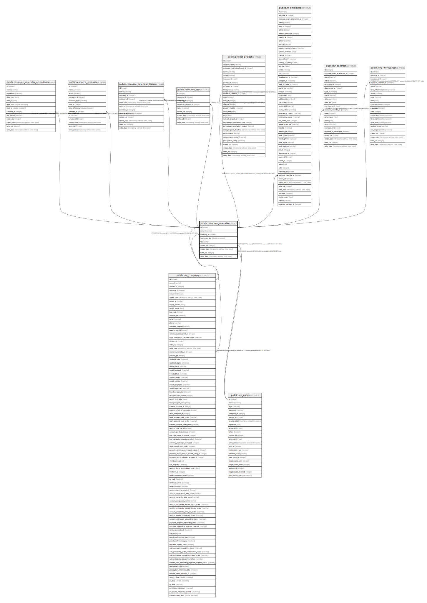

# public.resource_calendar

## Description

Resource Working Time

## Columns

| Name | Type | Default | Nullable | Children | Parents | Comment |
| ---- | ---- | ------- | -------- | -------- | ------- | ------- |
| id | integer | nextval('resource_calendar_id_seq'::regclass) | false | [public.res_company](public.res_company.md) [public.resource_calendar_attendance](public.resource_calendar_attendance.md) [public.resource_resource](public.resource_resource.md) [public.resource_calendar_leaves](public.resource_calendar_leaves.md) [public.resource_test](public.resource_test.md) [public.project_project](public.project_project.md) [public.hr_employee](public.hr_employee.md) [public.hr_contract](public.hr_contract.md) [public.mrp_workcenter](public.mrp_workcenter.md) |  |  |
| name | varchar |  | false |  |  | Name |
| company_id | integer |  | true |  | [public.res_company](public.res_company.md) | Company |
| hours_per_day | double precision |  | true |  |  | Average hour per day |
| tz | varchar |  | false |  |  | Timezone |
| create_uid | integer |  | true |  | [public.res_users](public.res_users.md) | Created by |
| create_date | timestamp without time zone |  | true |  |  | Created on |
| write_uid | integer |  | true |  | [public.res_users](public.res_users.md) | Last Updated by |
| write_date | timestamp without time zone |  | true |  |  | Last Updated on |

## Constraints

| Name | Type | Definition |
| ---- | ---- | ---------- |
| resource_calendar_create_uid_fkey | FOREIGN KEY | FOREIGN KEY (create_uid) REFERENCES res_users(id) ON DELETE SET NULL |
| resource_calendar_write_uid_fkey | FOREIGN KEY | FOREIGN KEY (write_uid) REFERENCES res_users(id) ON DELETE SET NULL |
| resource_calendar_company_id_fkey | FOREIGN KEY | FOREIGN KEY (company_id) REFERENCES res_company(id) ON DELETE SET NULL |
| resource_calendar_pkey | PRIMARY KEY | PRIMARY KEY (id) |

## Indexes

| Name | Definition |
| ---- | ---------- |
| resource_calendar_pkey | CREATE UNIQUE INDEX resource_calendar_pkey ON public.resource_calendar USING btree (id) |

## Relations

---

> Generated by [tbls](https://github.com/k1LoW/tbls)
