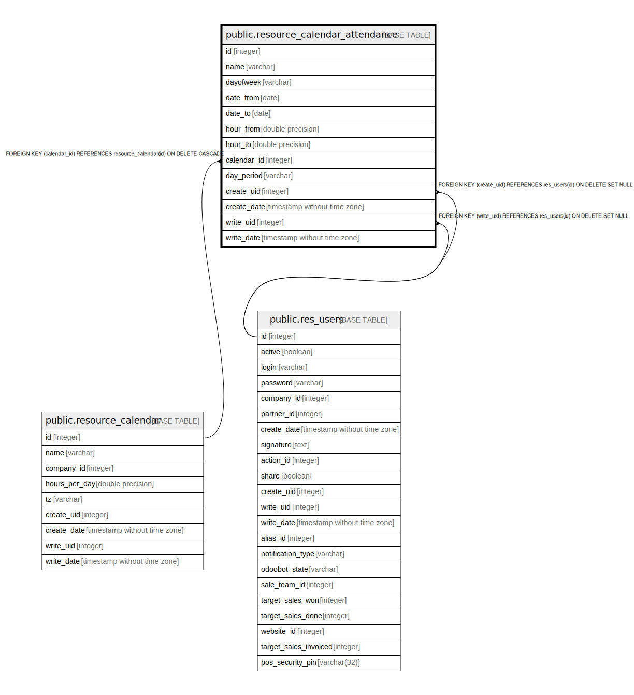

# public.resource_calendar_attendance

## Description

Work Detail

## Columns

| Name | Type | Default | Nullable | Children | Parents | Comment |
| ---- | ---- | ------- | -------- | -------- | ------- | ------- |
| id | integer | nextval('resource_calendar_attendance_id_seq'::regclass) | false |  |  |  |
| name | varchar |  | false |  |  | Name |
| dayofweek | varchar |  | false |  |  | Day of Week |
| date_from | date |  | true |  |  | Starting Date |
| date_to | date |  | true |  |  | End Date |
| hour_from | double precision |  | false |  |  | Work from |
| hour_to | double precision |  | false |  |  | Work to |
| calendar_id | integer |  | false |  | [public.resource_calendar](public.resource_calendar.md) | Resource's Calendar |
| day_period | varchar |  | false |  |  | Day Period |
| create_uid | integer |  | true |  | [public.res_users](public.res_users.md) | Created by |
| create_date | timestamp without time zone |  | true |  |  | Created on |
| write_uid | integer |  | true |  | [public.res_users](public.res_users.md) | Last Updated by |
| write_date | timestamp without time zone |  | true |  |  | Last Updated on |

## Constraints

| Name | Type | Definition |
| ---- | ---- | ---------- |
| resource_calendar_attendance_create_uid_fkey | FOREIGN KEY | FOREIGN KEY (create_uid) REFERENCES res_users(id) ON DELETE SET NULL |
| resource_calendar_attendance_write_uid_fkey | FOREIGN KEY | FOREIGN KEY (write_uid) REFERENCES res_users(id) ON DELETE SET NULL |
| resource_calendar_attendance_calendar_id_fkey | FOREIGN KEY | FOREIGN KEY (calendar_id) REFERENCES resource_calendar(id) ON DELETE CASCADE |
| resource_calendar_attendance_pkey | PRIMARY KEY | PRIMARY KEY (id) |

## Indexes

| Name | Definition |
| ---- | ---------- |
| resource_calendar_attendance_pkey | CREATE UNIQUE INDEX resource_calendar_attendance_pkey ON public.resource_calendar_attendance USING btree (id) |
| resource_calendar_attendance_dayofweek_index | CREATE INDEX resource_calendar_attendance_dayofweek_index ON public.resource_calendar_attendance USING btree (dayofweek) |
| resource_calendar_attendance_hour_from_index | CREATE INDEX resource_calendar_attendance_hour_from_index ON public.resource_calendar_attendance USING btree (hour_from) |

## Relations

---

> Generated by [tbls](https://github.com/k1LoW/tbls)
