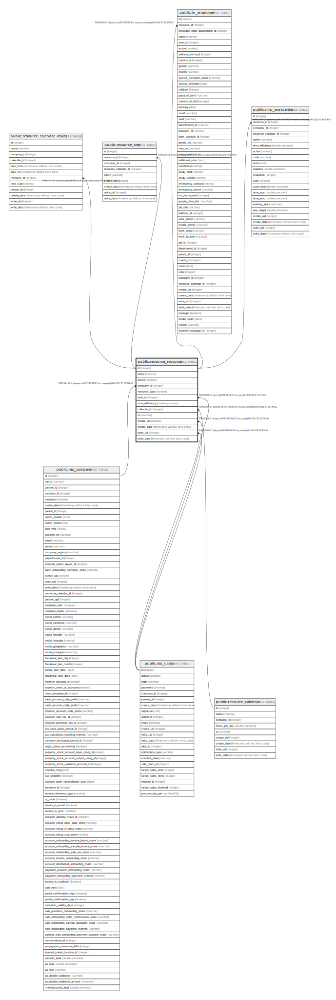

# public.resource_resource

## Description

Resources

## Columns

| Name | Type | Default | Nullable | Children | Parents | Comment |
| ---- | ---- | ------- | -------- | -------- | ------- | ------- |
| id | integer | nextval('resource_resource_id_seq'::regclass) | false | [public.resource_calendar_leaves](public.resource_calendar_leaves.md) [public.resource_test](public.resource_test.md) [public.hr_employee](public.hr_employee.md) [public.mrp_workcenter](public.mrp_workcenter.md) |  |  |
| name | varchar |  | false |  |  | Name |
| active | boolean |  | true |  |  | Active |
| company_id | integer |  | true |  | [public.res_company](public.res_company.md) | Company |
| resource_type | varchar |  | false |  |  | Resource Type |
| user_id | integer |  | true |  | [public.res_users](public.res_users.md) | User |
| time_efficiency | double precision |  | false |  |  | Efficiency Factor |
| calendar_id | integer |  | false |  | [public.resource_calendar](public.resource_calendar.md) | Working Time |
| tz | varchar |  | false |  |  | Timezone |
| create_uid | integer |  | true |  | [public.res_users](public.res_users.md) | Created by |
| create_date | timestamp without time zone |  | true |  |  | Created on |
| write_uid | integer |  | true |  | [public.res_users](public.res_users.md) | Last Updated by |
| write_date | timestamp without time zone |  | true |  |  | Last Updated on |

## Constraints

| Name | Type | Definition | Comment |
| ---- | ---- | ---------- | ------- |
| resource_resource_check_time_efficiency | CHECK | CHECK ((time_efficiency > (0)::double precision)) | CHECK(time_efficiency>0) |
| resource_resource_create_uid_fkey | FOREIGN KEY | FOREIGN KEY (create_uid) REFERENCES res_users(id) ON DELETE SET NULL |  |
| resource_resource_user_id_fkey | FOREIGN KEY | FOREIGN KEY (user_id) REFERENCES res_users(id) ON DELETE SET NULL |  |
| resource_resource_write_uid_fkey | FOREIGN KEY | FOREIGN KEY (write_uid) REFERENCES res_users(id) ON DELETE SET NULL |  |
| resource_resource_company_id_fkey | FOREIGN KEY | FOREIGN KEY (company_id) REFERENCES res_company(id) ON DELETE SET NULL |  |
| resource_resource_calendar_id_fkey | FOREIGN KEY | FOREIGN KEY (calendar_id) REFERENCES resource_calendar(id) ON DELETE SET NULL |  |
| resource_resource_pkey | PRIMARY KEY | PRIMARY KEY (id) |  |

## Indexes

| Name | Definition |
| ---- | ---------- |
| resource_resource_pkey | CREATE UNIQUE INDEX resource_resource_pkey ON public.resource_resource USING btree (id) |

## Relations

---

> Generated by [tbls](https://github.com/k1LoW/tbls)
