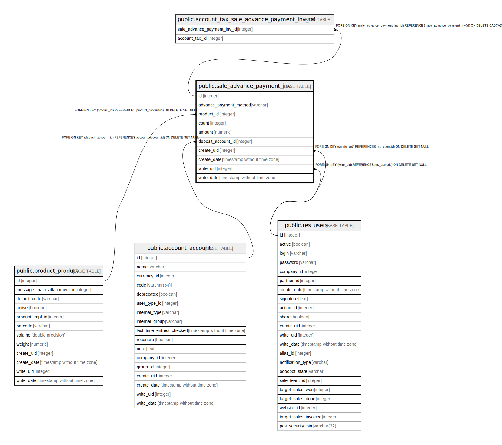

# public.sale_advance_payment_inv

## Description

Sales Advance Payment Invoice

## Columns

| Name | Type | Default | Nullable | Children | Parents | Comment |
| ---- | ---- | ------- | -------- | -------- | ------- | ------- |
| id | integer | nextval('sale_advance_payment_inv_id_seq'::regclass) | false | [public.account_tax_sale_advance_payment_inv_rel](public.account_tax_sale_advance_payment_inv_rel.md) |  |  |
| advance_payment_method | varchar |  | false |  |  | What do you want to invoice? |
| product_id | integer |  | true |  | [public.product_product](public.product_product.md) | Down Payment Product |
| count | integer |  | true |  |  | Order Count |
| amount | numeric |  | true |  |  | Down Payment Amount |
| deposit_account_id | integer |  | true |  | [public.account_account](public.account_account.md) | Income Account |
| create_uid | integer |  | true |  | [public.res_users](public.res_users.md) | Created by |
| create_date | timestamp without time zone |  | true |  |  | Created on |
| write_uid | integer |  | true |  | [public.res_users](public.res_users.md) | Last Updated by |
| write_date | timestamp without time zone |  | true |  |  | Last Updated on |

## Constraints

| Name | Type | Definition |
| ---- | ---- | ---------- |
| sale_advance_payment_inv_create_uid_fkey | FOREIGN KEY | FOREIGN KEY (create_uid) REFERENCES res_users(id) ON DELETE SET NULL |
| sale_advance_payment_inv_write_uid_fkey | FOREIGN KEY | FOREIGN KEY (write_uid) REFERENCES res_users(id) ON DELETE SET NULL |
| sale_advance_payment_inv_product_id_fkey | FOREIGN KEY | FOREIGN KEY (product_id) REFERENCES product_product(id) ON DELETE SET NULL |
| sale_advance_payment_inv_deposit_account_id_fkey | FOREIGN KEY | FOREIGN KEY (deposit_account_id) REFERENCES account_account(id) ON DELETE SET NULL |
| sale_advance_payment_inv_pkey | PRIMARY KEY | PRIMARY KEY (id) |

## Indexes

| Name | Definition |
| ---- | ---------- |
| sale_advance_payment_inv_pkey | CREATE UNIQUE INDEX sale_advance_payment_inv_pkey ON public.sale_advance_payment_inv USING btree (id) |

## Relations

---

> Generated by [tbls](https://github.com/k1LoW/tbls)
