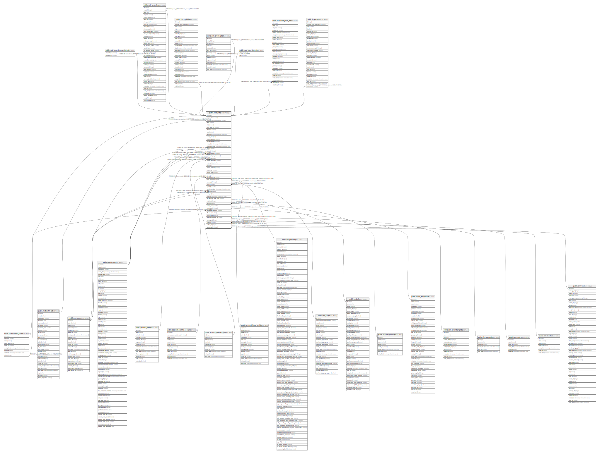

# public.sale_order

## Description

Sale Order

## Columns

| Name | Type | Default | Nullable | Children | Parents | Comment |
| ---- | ---- | ------- | -------- | -------- | ------- | ------- |
| id | integer | nextval('sale_order_id_seq'::regclass) | false | [public.sale_order_transaction_rel](public.sale_order_transaction_rel.md) [public.sale_order_line](public.sale_order_line.md) [public.stock_picking](public.stock_picking.md) [public.procurement_group](public.procurement_group.md) [public.sale_order_option](public.sale_order_option.md) [public.sale_order_tag_rel](public.sale_order_tag_rel.md) [public.purchase_order_line](public.purchase_order_line.md) [public.hr_expense](public.hr_expense.md) |  |  |
| access_token | varchar |  | true |  |  | Security Token |
| message_main_attachment_id | integer |  | true |  | [public.ir_attachment](public.ir_attachment.md) | Main Attachment |
| name | varchar |  | false |  |  | Order Reference |
| origin | varchar |  | true |  |  | Source Document |
| client_order_ref | varchar |  | true |  |  | Customer Reference |
| reference | varchar |  | true |  |  | Payment Ref. |
| state | varchar |  | true |  |  | Status |
| date_order | timestamp without time zone |  | false |  |  | Order Date |
| validity_date | date |  | true |  |  | Validity |
| require_signature | boolean |  | true |  |  | Online Signature |
| require_payment | boolean |  | true |  |  | Online Payment |
| create_date | timestamp without time zone |  | true |  |  | Creation Date |
| confirmation_date | timestamp without time zone |  | true |  |  | Confirmation Date |
| user_id | integer |  | true |  | [public.res_users](public.res_users.md) | Salesperson |
| partner_id | integer |  | false |  | [public.res_partner](public.res_partner.md) | Customer |
| partner_invoice_id | integer |  | false |  | [public.res_partner](public.res_partner.md) | Invoice Address |
| partner_shipping_id | integer |  | false |  | [public.res_partner](public.res_partner.md) | Delivery Address |
| pricelist_id | integer |  | false |  | [public.product_pricelist](public.product_pricelist.md) | Pricelist |
| analytic_account_id | integer |  | true |  | [public.account_analytic_account](public.account_analytic_account.md) | Analytic Account |
| invoice_status | varchar |  | true |  |  | Invoice Status |
| note | text |  | true |  |  | Terms and conditions |
| amount_untaxed | numeric |  | true |  |  | Untaxed Amount |
| amount_tax | numeric |  | true |  |  | Taxes |
| amount_total | numeric |  | true |  |  | Total |
| currency_rate | numeric |  | true |  |  | Currency Rate |
| payment_term_id | integer |  | true |  | [public.account_payment_term](public.account_payment_term.md) | Payment Terms |
| fiscal_position_id | integer |  | true |  | [public.account_fiscal_position](public.account_fiscal_position.md) | Fiscal Position |
| company_id | integer |  | true |  | [public.res_company](public.res_company.md) | Company |
| team_id | integer |  | true |  | [public.crm_team](public.crm_team.md) | Sales Team |
| signed_by | varchar |  | true |  |  | Signed by |
| commitment_date | timestamp without time zone |  | true |  |  | Commitment Date |
| create_uid | integer |  | true |  | [public.res_users](public.res_users.md) | Created by |
| write_uid | integer |  | true |  | [public.res_users](public.res_users.md) | Last Updated by |
| write_date | timestamp without time zone |  | true |  |  | Last Updated on |
| cart_recovery_email_sent | boolean |  | true |  |  | Cart recovery email already sent |
| website_id | integer |  | true |  | [public.website](public.website.md) | Website |
| incoterm | integer |  | true |  | [public.account_incoterms](public.account_incoterms.md) | Incoterms |
| picking_policy | varchar |  | false |  |  | Shipping Policy |
| warehouse_id | integer |  | false |  | [public.stock_warehouse](public.stock_warehouse.md) | Warehouse |
| procurement_group_id | integer |  | true |  | [public.procurement_group](public.procurement_group.md) | Procurement Group |
| effective_date | date |  | true |  |  | Effective Date |
| warning_stock | varchar |  | true |  |  | Warning |
| sale_order_template_id | integer |  | true |  | [public.sale_order_template](public.sale_order_template.md) | Quotation Template |
| campaign_id | integer |  | true |  | [public.utm_campaign](public.utm_campaign.md) | Campaign |
| source_id | integer |  | true |  | [public.utm_source](public.utm_source.md) | Source |
| medium_id | integer |  | true |  | [public.utm_medium](public.utm_medium.md) | Medium |
| opportunity_id | integer |  | true |  | [public.crm_lead](public.crm_lead.md) | Opportunity |

## Constraints

| Name | Type | Definition |
| ---- | ---- | ---------- |
| sale_order_create_uid_fkey | FOREIGN KEY | FOREIGN KEY (create_uid) REFERENCES res_users(id) ON DELETE SET NULL |
| sale_order_user_id_fkey | FOREIGN KEY | FOREIGN KEY (user_id) REFERENCES res_users(id) ON DELETE SET NULL |
| sale_order_write_uid_fkey | FOREIGN KEY | FOREIGN KEY (write_uid) REFERENCES res_users(id) ON DELETE SET NULL |
| sale_order_company_id_fkey | FOREIGN KEY | FOREIGN KEY (company_id) REFERENCES res_company(id) ON DELETE SET NULL |
| sale_order_partner_id_fkey | FOREIGN KEY | FOREIGN KEY (partner_id) REFERENCES res_partner(id) ON DELETE SET NULL |
| sale_order_partner_invoice_id_fkey | FOREIGN KEY | FOREIGN KEY (partner_invoice_id) REFERENCES res_partner(id) ON DELETE SET NULL |
| sale_order_partner_shipping_id_fkey | FOREIGN KEY | FOREIGN KEY (partner_shipping_id) REFERENCES res_partner(id) ON DELETE SET NULL |
| sale_order_message_main_attachment_id_fkey | FOREIGN KEY | FOREIGN KEY (message_main_attachment_id) REFERENCES ir_attachment(id) ON DELETE SET NULL |
| sale_order_medium_id_fkey | FOREIGN KEY | FOREIGN KEY (medium_id) REFERENCES utm_medium(id) ON DELETE SET NULL |
| sale_order_campaign_id_fkey | FOREIGN KEY | FOREIGN KEY (campaign_id) REFERENCES utm_campaign(id) ON DELETE SET NULL |
| sale_order_source_id_fkey | FOREIGN KEY | FOREIGN KEY (source_id) REFERENCES utm_source(id) ON DELETE SET NULL |
| sale_order_team_id_fkey | FOREIGN KEY | FOREIGN KEY (team_id) REFERENCES crm_team(id) ON DELETE SET NULL |
| sale_order_opportunity_id_fkey | FOREIGN KEY | FOREIGN KEY (opportunity_id) REFERENCES crm_lead(id) ON DELETE SET NULL |
| sale_order_website_id_fkey | FOREIGN KEY | FOREIGN KEY (website_id) REFERENCES website(id) ON DELETE SET NULL |
| sale_order_analytic_account_id_fkey | FOREIGN KEY | FOREIGN KEY (analytic_account_id) REFERENCES account_analytic_account(id) ON DELETE SET NULL |
| sale_order_pricelist_id_fkey | FOREIGN KEY | FOREIGN KEY (pricelist_id) REFERENCES product_pricelist(id) ON DELETE SET NULL |
| sale_order_fiscal_position_id_fkey | FOREIGN KEY | FOREIGN KEY (fiscal_position_id) REFERENCES account_fiscal_position(id) ON DELETE SET NULL |
| sale_order_payment_term_id_fkey | FOREIGN KEY | FOREIGN KEY (payment_term_id) REFERENCES account_payment_term(id) ON DELETE SET NULL |
| sale_order_incoterm_fkey | FOREIGN KEY | FOREIGN KEY (incoterm) REFERENCES account_incoterms(id) ON DELETE SET NULL |
| sale_order_pkey | PRIMARY KEY | PRIMARY KEY (id) |
| sale_order_procurement_group_id_fkey | FOREIGN KEY | FOREIGN KEY (procurement_group_id) REFERENCES procurement_group(id) ON DELETE SET NULL |
| sale_order_warehouse_id_fkey | FOREIGN KEY | FOREIGN KEY (warehouse_id) REFERENCES stock_warehouse(id) ON DELETE SET NULL |
| sale_order_sale_order_template_id_fkey | FOREIGN KEY | FOREIGN KEY (sale_order_template_id) REFERENCES sale_order_template(id) ON DELETE SET NULL |

## Indexes

| Name | Definition |
| ---- | ---------- |
| sale_order_pkey | CREATE UNIQUE INDEX sale_order_pkey ON public.sale_order USING btree (id) |
| sale_order_message_main_attachment_id_index | CREATE INDEX sale_order_message_main_attachment_id_index ON public.sale_order USING btree (message_main_attachment_id) |
| sale_order_name_index | CREATE INDEX sale_order_name_index ON public.sale_order USING btree (name) |
| sale_order_state_index | CREATE INDEX sale_order_state_index ON public.sale_order USING btree (state) |
| sale_order_date_order_index | CREATE INDEX sale_order_date_order_index ON public.sale_order USING btree (date_order) |
| sale_order_create_date_index | CREATE INDEX sale_order_create_date_index ON public.sale_order USING btree (create_date) |
| sale_order_confirmation_date_index | CREATE INDEX sale_order_confirmation_date_index ON public.sale_order USING btree (confirmation_date) |
| sale_order_user_id_index | CREATE INDEX sale_order_user_id_index ON public.sale_order USING btree (user_id) |
| sale_order_partner_id_index | CREATE INDEX sale_order_partner_id_index ON public.sale_order USING btree (partner_id) |

## Relations

---

> Generated by [tbls](https://github.com/k1LoW/tbls)
