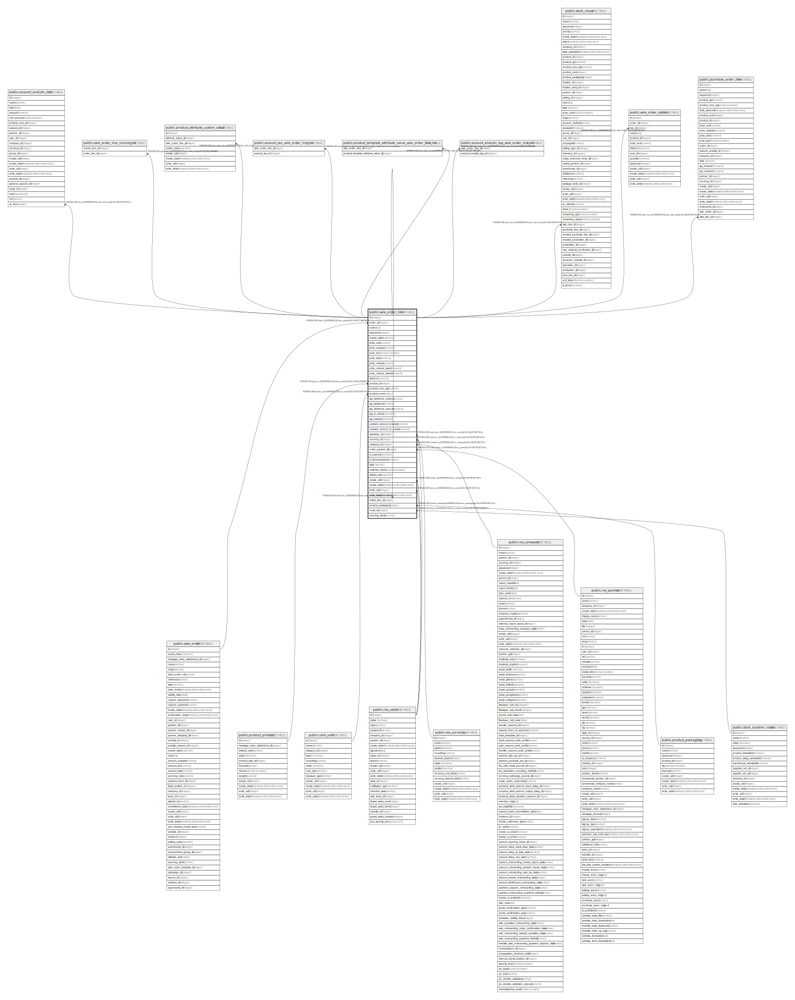

# public.sale_order_line

## Description

Sales Order Line

## Columns

| Name | Type | Default | Nullable | Children | Parents | Comment |
| ---- | ---- | ------- | -------- | -------- | ------- | ------- |
| id | integer | nextval('sale_order_line_id_seq'::regclass) | false | [public.account_analytic_line](public.account_analytic_line.md) [public.sale_order_line_invoice_rel](public.sale_order_line_invoice_rel.md) [public.product_attribute_custom_value](public.product_attribute_custom_value.md) [public.sale_order_line](public.sale_order_line.md) [public.account_tax_sale_order_line_rel](public.account_tax_sale_order_line_rel.md) [public.product_template_attribute_value_sale_order_line_rel](public.product_template_attribute_value_sale_order_line_rel.md) [public.account_analytic_tag_sale_order_line_rel](public.account_analytic_tag_sale_order_line_rel.md) [public.stock_move](public.stock_move.md) [public.sale_order_option](public.sale_order_option.md) [public.purchase_order_line](public.purchase_order_line.md) |  |  |
| order_id | integer |  | false |  | [public.sale_order](public.sale_order.md) | Order Reference |
| name | text |  | false |  |  | Description |
| sequence | integer |  | true |  |  | Sequence |
| invoice_status | varchar |  | true |  |  | Invoice Status |
| price_unit | numeric |  | false |  |  | Unit Price |
| price_subtotal | numeric |  | true |  |  | Subtotal |
| price_tax | double precision |  | true |  |  | Total Tax |
| price_total | numeric |  | true |  |  | Total |
| price_reduce | numeric |  | true |  |  | Price Reduce |
| price_reduce_taxinc | numeric |  | true |  |  | Price Reduce Tax inc |
| price_reduce_taxexcl | numeric |  | true |  |  | Price Reduce Tax excl |
| discount | numeric |  | true |  |  | Discount (%) |
| product_id | integer |  | true |  | [public.product_product](public.product_product.md) | Product |
| product_uom_qty | numeric |  | false |  |  | Ordered Quantity |
| product_uom | integer |  | true |  | [public.uom_uom](public.uom_uom.md) | Unit of Measure |
| qty_delivered_method | varchar |  | true |  |  | Method to update delivered qty |
| qty_delivered | numeric |  | true |  |  | Delivered Quantity |
| qty_delivered_manual | numeric |  | true |  |  | Delivered Manually |
| qty_to_invoice | numeric |  | true |  |  | To Invoice Quantity |
| qty_invoiced | numeric |  | true |  |  | Invoiced Quantity |
| untaxed_amount_invoiced | numeric |  | true |  |  | Untaxed Invoiced Amount |
| untaxed_amount_to_invoice | numeric |  | true |  |  | Untaxed Amount To Invoice |
| salesman_id | integer |  | true |  | [public.res_users](public.res_users.md) | Salesperson |
| currency_id | integer |  | true |  | [public.res_currency](public.res_currency.md) | Currency |
| company_id | integer |  | true |  | [public.res_company](public.res_company.md) | Company |
| order_partner_id | integer |  | true |  | [public.res_partner](public.res_partner.md) | Customer |
| is_expense | boolean |  | true |  |  | Is expense |
| is_downpayment | boolean |  | true |  |  | Is a down payment |
| state | varchar |  | true |  |  | Order Status |
| customer_lead | double precision |  | false |  |  | Delivery Lead Time |
| display_type | varchar |  | true |  |  | Display Type |
| create_uid | integer |  | true |  | [public.res_users](public.res_users.md) | Created by |
| create_date | timestamp without time zone |  | true |  |  | Created on |
| write_uid | integer |  | true |  | [public.res_users](public.res_users.md) | Last Updated by |
| write_date | timestamp without time zone |  | true |  |  | Last Updated on |
| linked_line_id | integer |  | true |  | [public.sale_order_line](public.sale_order_line.md) | Linked Order Line |
| product_packaging | integer |  | true |  | [public.product_packaging](public.product_packaging.md) | Package |
| route_id | integer |  | true |  | [public.stock_location_route](public.stock_location_route.md) | Route |
| warning_stock | varchar |  | true |  |  | Warning |

## Constraints

| Name | Type | Definition | Comment |
| ---- | ---- | ---------- | ------- |
| sale_order_line_accountable_required_fields | CHECK | CHECK (((display_type IS NOT NULL) OR ((product_id IS NOT NULL) AND (product_uom IS NOT NULL)))) | CHECK(display_type IS NOT NULL OR (product_id IS NOT NULL AND product_uom IS NOT NULL)) |
| sale_order_line_non_accountable_null_fields | CHECK | CHECK (((display_type IS NULL) OR ((product_id IS NULL) AND (price_unit = (0)::numeric) AND (product_uom_qty = (0)::numeric) AND (product_uom IS NULL) AND (customer_lead = (0)::double precision)))) | CHECK(display_type IS NULL OR (product_id IS NULL AND price_unit = 0 AND product_uom_qty = 0 AND product_uom IS NULL AND customer_lead = 0)) |
| sale_order_line_create_uid_fkey | FOREIGN KEY | FOREIGN KEY (create_uid) REFERENCES res_users(id) ON DELETE SET NULL |  |
| sale_order_line_salesman_id_fkey | FOREIGN KEY | FOREIGN KEY (salesman_id) REFERENCES res_users(id) ON DELETE SET NULL |  |
| sale_order_line_write_uid_fkey | FOREIGN KEY | FOREIGN KEY (write_uid) REFERENCES res_users(id) ON DELETE SET NULL |  |
| sale_order_line_currency_id_fkey | FOREIGN KEY | FOREIGN KEY (currency_id) REFERENCES res_currency(id) ON DELETE SET NULL |  |
| sale_order_line_company_id_fkey | FOREIGN KEY | FOREIGN KEY (company_id) REFERENCES res_company(id) ON DELETE SET NULL |  |
| sale_order_line_order_partner_id_fkey | FOREIGN KEY | FOREIGN KEY (order_partner_id) REFERENCES res_partner(id) ON DELETE SET NULL |  |
| sale_order_line_product_uom_fkey | FOREIGN KEY | FOREIGN KEY (product_uom) REFERENCES uom_uom(id) ON DELETE SET NULL |  |
| sale_order_line_product_id_fkey | FOREIGN KEY | FOREIGN KEY (product_id) REFERENCES product_product(id) ON DELETE RESTRICT |  |
| sale_order_line_product_packaging_fkey | FOREIGN KEY | FOREIGN KEY (product_packaging) REFERENCES product_packaging(id) ON DELETE SET NULL |  |
| sale_order_line_order_id_fkey | FOREIGN KEY | FOREIGN KEY (order_id) REFERENCES sale_order(id) ON DELETE CASCADE |  |
| sale_order_line_linked_line_id_fkey | FOREIGN KEY | FOREIGN KEY (linked_line_id) REFERENCES sale_order_line(id) ON DELETE CASCADE |  |
| sale_order_line_pkey | PRIMARY KEY | PRIMARY KEY (id) |  |
| sale_order_line_route_id_fkey | FOREIGN KEY | FOREIGN KEY (route_id) REFERENCES stock_location_route(id) ON DELETE RESTRICT |  |

## Indexes

| Name | Definition |
| ---- | ---------- |
| sale_order_line_pkey | CREATE UNIQUE INDEX sale_order_line_pkey ON public.sale_order_line USING btree (id) |
| sale_order_line_order_id_index | CREATE INDEX sale_order_line_order_id_index ON public.sale_order_line USING btree (order_id) |

## Relations

---

> Generated by [tbls](https://github.com/k1LoW/tbls)
