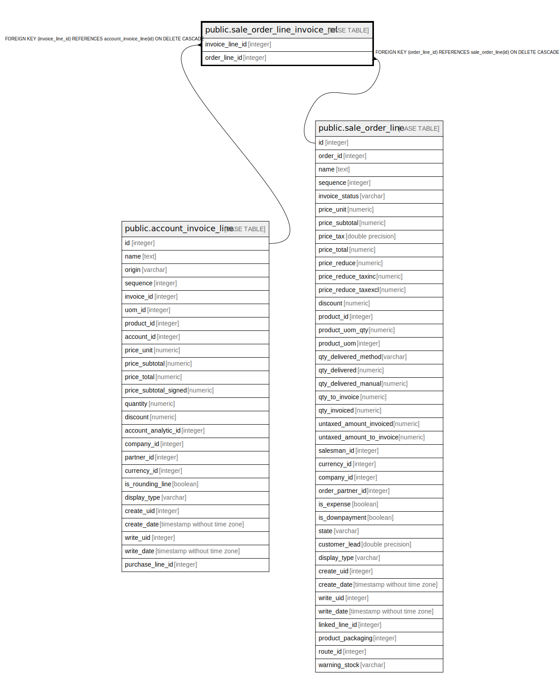

# public.sale_order_line_invoice_rel

## Description

RELATION BETWEEN account_invoice_line AND sale_order_line

## Columns

| Name | Type | Default | Nullable | Children | Parents | Comment |
| ---- | ---- | ------- | -------- | -------- | ------- | ------- |
| invoice_line_id | integer |  | false |  | [public.account_invoice_line](public.account_invoice_line.md) |  |
| order_line_id | integer |  | false |  | [public.sale_order_line](public.sale_order_line.md) |  |

## Constraints

| Name | Type | Definition |
| ---- | ---- | ---------- |
| sale_order_line_invoice_rel_invoice_line_id_fkey | FOREIGN KEY | FOREIGN KEY (invoice_line_id) REFERENCES account_invoice_line(id) ON DELETE CASCADE |
| sale_order_line_invoice_rel_invoice_line_id_order_line_id_key | UNIQUE | UNIQUE (invoice_line_id, order_line_id) |
| sale_order_line_invoice_rel_order_line_id_fkey | FOREIGN KEY | FOREIGN KEY (order_line_id) REFERENCES sale_order_line(id) ON DELETE CASCADE |

## Indexes

| Name | Definition |
| ---- | ---------- |
| sale_order_line_invoice_rel_invoice_line_id_order_line_id_key | CREATE UNIQUE INDEX sale_order_line_invoice_rel_invoice_line_id_order_line_id_key ON public.sale_order_line_invoice_rel USING btree (invoice_line_id, order_line_id) |
| sale_order_line_invoice_rel_invoice_line_id_idx | CREATE INDEX sale_order_line_invoice_rel_invoice_line_id_idx ON public.sale_order_line_invoice_rel USING btree (invoice_line_id) |
| sale_order_line_invoice_rel_order_line_id_idx | CREATE INDEX sale_order_line_invoice_rel_order_line_id_idx ON public.sale_order_line_invoice_rel USING btree (order_line_id) |

## Relations

---

> Generated by [tbls](https://github.com/k1LoW/tbls)
