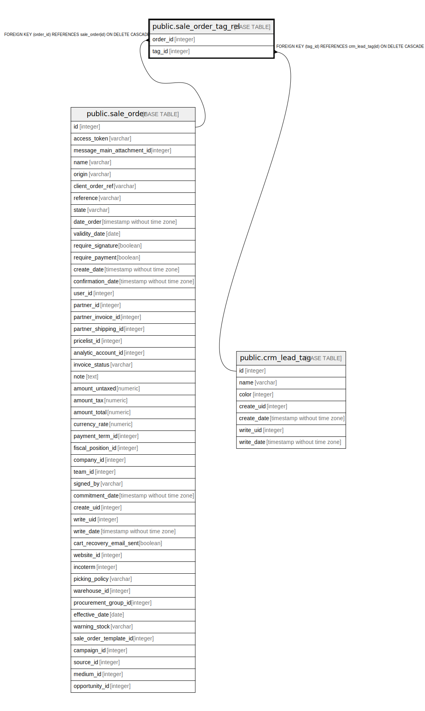

# public.sale_order_tag_rel

## Description

RELATION BETWEEN sale_order AND crm_lead_tag

## Columns

| Name | Type | Default | Nullable | Children | Parents | Comment |
| ---- | ---- | ------- | -------- | -------- | ------- | ------- |
| order_id | integer |  | false |  | [public.sale_order](public.sale_order.md) |  |
| tag_id | integer |  | false |  | [public.crm_lead_tag](public.crm_lead_tag.md) |  |

## Constraints

| Name | Type | Definition |
| ---- | ---- | ---------- |
| sale_order_tag_rel_tag_id_fkey | FOREIGN KEY | FOREIGN KEY (tag_id) REFERENCES crm_lead_tag(id) ON DELETE CASCADE |
| sale_order_tag_rel_order_id_fkey | FOREIGN KEY | FOREIGN KEY (order_id) REFERENCES sale_order(id) ON DELETE CASCADE |
| sale_order_tag_rel_order_id_tag_id_key | UNIQUE | UNIQUE (order_id, tag_id) |

## Indexes

| Name | Definition |
| ---- | ---------- |
| sale_order_tag_rel_order_id_tag_id_key | CREATE UNIQUE INDEX sale_order_tag_rel_order_id_tag_id_key ON public.sale_order_tag_rel USING btree (order_id, tag_id) |
| sale_order_tag_rel_order_id_idx | CREATE INDEX sale_order_tag_rel_order_id_idx ON public.sale_order_tag_rel USING btree (order_id) |
| sale_order_tag_rel_tag_id_idx | CREATE INDEX sale_order_tag_rel_tag_id_idx ON public.sale_order_tag_rel USING btree (tag_id) |

## Relations

---

> Generated by [tbls](https://github.com/k1LoW/tbls)
