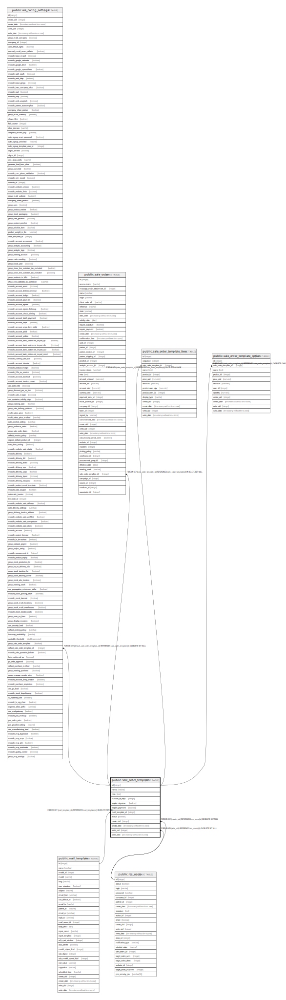

# public.sale_order_template

## Description

Quotation Template

## Columns

| Name | Type | Default | Nullable | Children | Parents | Comment |
| ---- | ---- | ------- | -------- | -------- | ------- | ------- |
| id | integer | nextval('sale_order_template_id_seq'::regclass) | false | [public.res_config_settings](public.res_config_settings.md) [public.sale_order](public.sale_order.md) [public.sale_order_template_line](public.sale_order_template_line.md) [public.sale_order_template_option](public.sale_order_template_option.md) |  |  |
| name | varchar |  | false |  |  | Quotation Template |
| note | text |  | true |  |  | Terms and conditions |
| number_of_days | integer |  | true |  |  | Quotation Duration |
| require_signature | boolean |  | true |  |  | Online Signature |
| require_payment | boolean |  | true |  |  | Online Payment |
| mail_template_id | integer |  | true |  | [public.mail_template](public.mail_template.md) | Confirmation Mail |
| active | boolean |  | true |  |  | Active |
| create_uid | integer |  | true |  | [public.res_users](public.res_users.md) | Created by |
| create_date | timestamp without time zone |  | true |  |  | Created on |
| write_uid | integer |  | true |  | [public.res_users](public.res_users.md) | Last Updated by |
| write_date | timestamp without time zone |  | true |  |  | Last Updated on |

## Constraints

| Name | Type | Definition |
| ---- | ---- | ---------- |
| sale_order_template_create_uid_fkey | FOREIGN KEY | FOREIGN KEY (create_uid) REFERENCES res_users(id) ON DELETE SET NULL |
| sale_order_template_write_uid_fkey | FOREIGN KEY | FOREIGN KEY (write_uid) REFERENCES res_users(id) ON DELETE SET NULL |
| sale_order_template_mail_template_id_fkey | FOREIGN KEY | FOREIGN KEY (mail_template_id) REFERENCES mail_template(id) ON DELETE SET NULL |
| sale_order_template_pkey | PRIMARY KEY | PRIMARY KEY (id) |

## Indexes

| Name | Definition |
| ---- | ---------- |
| sale_order_template_pkey | CREATE UNIQUE INDEX sale_order_template_pkey ON public.sale_order_template USING btree (id) |

## Relations

---

> Generated by [tbls](https://github.com/k1LoW/tbls)
