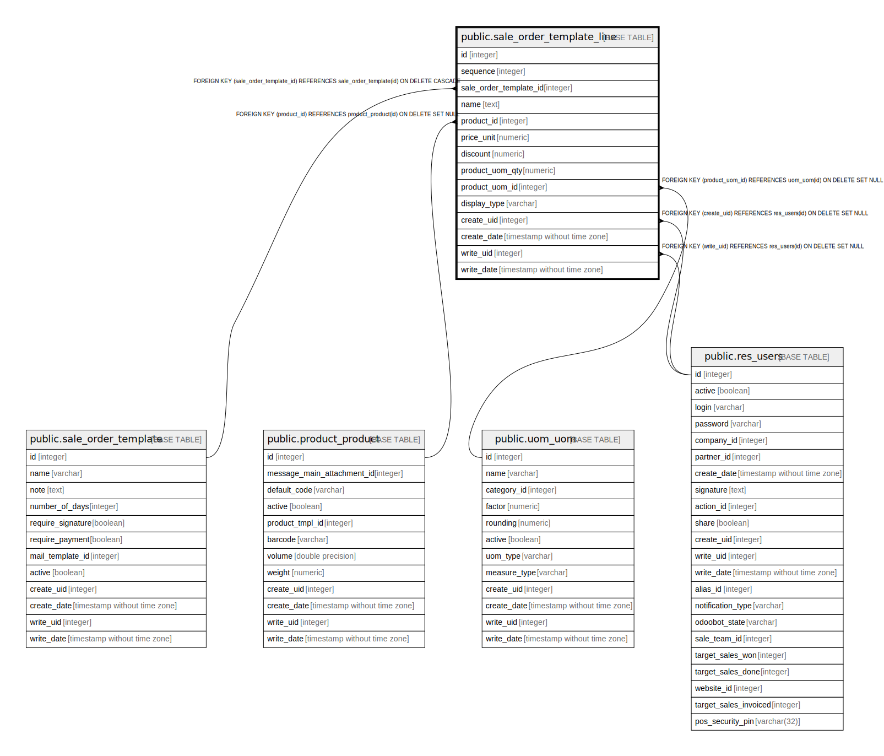

# public.sale_order_template_line

## Description

Quotation Template Line

## Columns

| Name | Type | Default | Nullable | Children | Parents | Comment |
| ---- | ---- | ------- | -------- | -------- | ------- | ------- |
| id | integer | nextval('sale_order_template_line_id_seq'::regclass) | false |  |  |  |
| sequence | integer |  | true |  |  | Sequence |
| sale_order_template_id | integer |  | false |  | [public.sale_order_template](public.sale_order_template.md) | Quotation Template Reference |
| name | text |  | false |  |  | Description |
| product_id | integer |  | true |  | [public.product_product](public.product_product.md) | Product |
| price_unit | numeric |  | false |  |  | Unit Price |
| discount | numeric |  | true |  |  | Discount (%) |
| product_uom_qty | numeric |  | false |  |  | Quantity |
| product_uom_id | integer |  | true |  | [public.uom_uom](public.uom_uom.md) | Unit of Measure |
| display_type | varchar |  | true |  |  | Display Type |
| create_uid | integer |  | true |  | [public.res_users](public.res_users.md) | Created by |
| create_date | timestamp without time zone |  | true |  |  | Created on |
| write_uid | integer |  | true |  | [public.res_users](public.res_users.md) | Last Updated by |
| write_date | timestamp without time zone |  | true |  |  | Last Updated on |

## Constraints

| Name | Type | Definition | Comment |
| ---- | ---- | ---------- | ------- |
| sale_order_template_line_accountable_product_id_required | CHECK | CHECK (((display_type IS NOT NULL) OR ((product_id IS NOT NULL) AND (product_uom_id IS NOT NULL)))) | CHECK(display_type IS NOT NULL OR (product_id IS NOT NULL AND product_uom_id IS NOT NULL)) |
| sale_order_template_line_non_accountable_fields_null | CHECK | CHECK (((display_type IS NULL) OR ((product_id IS NULL) AND (price_unit = (0)::numeric) AND (product_uom_qty = (0)::numeric) AND (product_uom_id IS NULL)))) | CHECK(display_type IS NULL OR (product_id IS NULL AND price_unit = 0 AND product_uom_qty = 0 AND product_uom_id IS NULL)) |
| sale_order_template_line_create_uid_fkey | FOREIGN KEY | FOREIGN KEY (create_uid) REFERENCES res_users(id) ON DELETE SET NULL |  |
| sale_order_template_line_write_uid_fkey | FOREIGN KEY | FOREIGN KEY (write_uid) REFERENCES res_users(id) ON DELETE SET NULL |  |
| sale_order_template_line_product_uom_id_fkey | FOREIGN KEY | FOREIGN KEY (product_uom_id) REFERENCES uom_uom(id) ON DELETE SET NULL |  |
| sale_order_template_line_product_id_fkey | FOREIGN KEY | FOREIGN KEY (product_id) REFERENCES product_product(id) ON DELETE SET NULL |  |
| sale_order_template_line_sale_order_template_id_fkey | FOREIGN KEY | FOREIGN KEY (sale_order_template_id) REFERENCES sale_order_template(id) ON DELETE CASCADE |  |
| sale_order_template_line_pkey | PRIMARY KEY | PRIMARY KEY (id) |  |

## Indexes

| Name | Definition |
| ---- | ---------- |
| sale_order_template_line_pkey | CREATE UNIQUE INDEX sale_order_template_line_pkey ON public.sale_order_template_line USING btree (id) |
| sale_order_template_line_sale_order_template_id_index | CREATE INDEX sale_order_template_line_sale_order_template_id_index ON public.sale_order_template_line USING btree (sale_order_template_id) |

## Relations

---

> Generated by [tbls](https://github.com/k1LoW/tbls)
