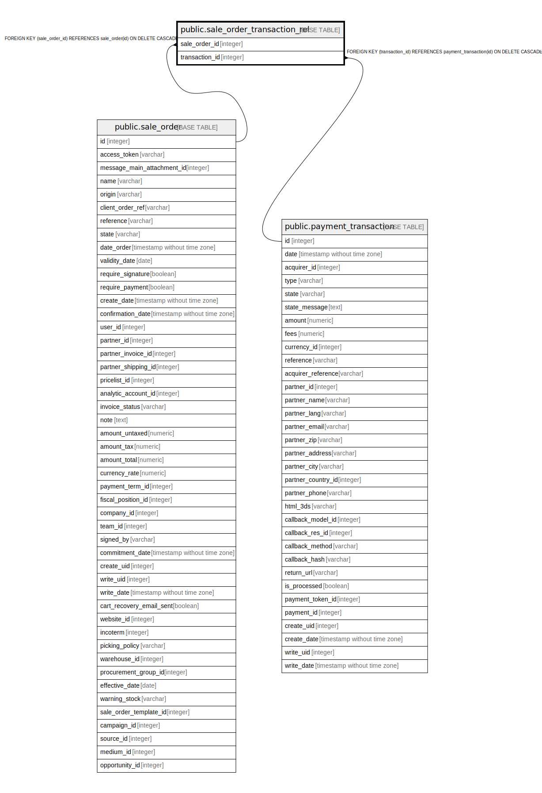

# public.sale_order_transaction_rel

## Description

RELATION BETWEEN sale_order AND payment_transaction

## Columns

| Name | Type | Default | Nullable | Children | Parents | Comment |
| ---- | ---- | ------- | -------- | -------- | ------- | ------- |
| sale_order_id | integer |  | false |  | [public.sale_order](public.sale_order.md) |  |
| transaction_id | integer |  | false |  | [public.payment_transaction](public.payment_transaction.md) |  |

## Constraints

| Name | Type | Definition |
| ---- | ---- | ---------- |
| sale_order_transaction_rel_transaction_id_fkey | FOREIGN KEY | FOREIGN KEY (transaction_id) REFERENCES payment_transaction(id) ON DELETE CASCADE |
| sale_order_transaction_rel_sale_order_id_fkey | FOREIGN KEY | FOREIGN KEY (sale_order_id) REFERENCES sale_order(id) ON DELETE CASCADE |
| sale_order_transaction_rel_sale_order_id_transaction_id_key | UNIQUE | UNIQUE (sale_order_id, transaction_id) |

## Indexes

| Name | Definition |
| ---- | ---------- |
| sale_order_transaction_rel_sale_order_id_transaction_id_key | CREATE UNIQUE INDEX sale_order_transaction_rel_sale_order_id_transaction_id_key ON public.sale_order_transaction_rel USING btree (sale_order_id, transaction_id) |
| sale_order_transaction_rel_sale_order_id_idx | CREATE INDEX sale_order_transaction_rel_sale_order_id_idx ON public.sale_order_transaction_rel USING btree (sale_order_id) |
| sale_order_transaction_rel_transaction_id_idx | CREATE INDEX sale_order_transaction_rel_transaction_id_idx ON public.sale_order_transaction_rel USING btree (transaction_id) |

## Relations

---

> Generated by [tbls](https://github.com/k1LoW/tbls)
