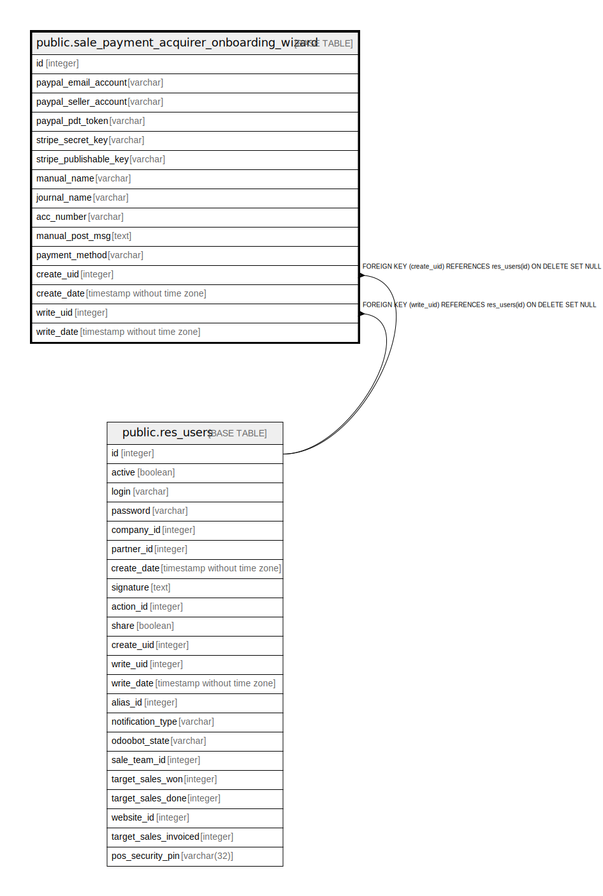

# public.sale_payment_acquirer_onboarding_wizard

## Description

Sale Payment acquire onboarding wizard

## Columns

| Name | Type | Default | Nullable | Children | Parents | Comment |
| ---- | ---- | ------- | -------- | -------- | ------- | ------- |
| id | integer | nextval('sale_payment_acquirer_onboarding_wizard_id_seq'::regclass) | false |  |  |  |
| paypal_email_account | varchar |  | true |  |  | PayPal Email ID |
| paypal_seller_account | varchar |  | true |  |  | Paypal Merchant ID |
| paypal_pdt_token | varchar |  | true |  |  | Paypal PDT Token |
| stripe_secret_key | varchar |  | true |  |  | Stripe Secret Key |
| stripe_publishable_key | varchar |  | true |  |  | Stripe Publishable Key |
| manual_name | varchar |  | true |  |  | Method |
| journal_name | varchar |  | true |  |  | Bank Name |
| acc_number | varchar |  | true |  |  | Account Number |
| manual_post_msg | text |  | true |  |  | Payment Instructions |
| payment_method | varchar |  | true |  |  | Payment Method |
| create_uid | integer |  | true |  | [public.res_users](public.res_users.md) | Created by |
| create_date | timestamp without time zone |  | true |  |  | Created on |
| write_uid | integer |  | true |  | [public.res_users](public.res_users.md) | Last Updated by |
| write_date | timestamp without time zone |  | true |  |  | Last Updated on |

## Constraints

| Name | Type | Definition |
| ---- | ---- | ---------- |
| sale_payment_acquirer_onboarding_wizard_create_uid_fkey | FOREIGN KEY | FOREIGN KEY (create_uid) REFERENCES res_users(id) ON DELETE SET NULL |
| sale_payment_acquirer_onboarding_wizard_write_uid_fkey | FOREIGN KEY | FOREIGN KEY (write_uid) REFERENCES res_users(id) ON DELETE SET NULL |
| sale_payment_acquirer_onboarding_wizard_pkey | PRIMARY KEY | PRIMARY KEY (id) |

## Indexes

| Name | Definition |
| ---- | ---------- |
| sale_payment_acquirer_onboarding_wizard_pkey | CREATE UNIQUE INDEX sale_payment_acquirer_onboarding_wizard_pkey ON public.sale_payment_acquirer_onboarding_wizard USING btree (id) |

## Relations

---

> Generated by [tbls](https://github.com/k1LoW/tbls)
