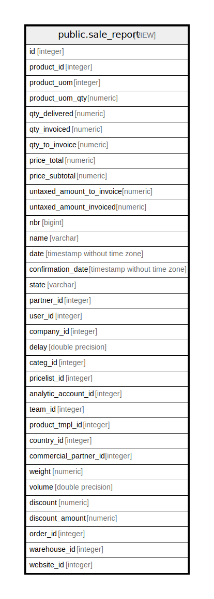

# public.sale_report

## Description

<details>
<summary><strong>Table Definition</strong></summary>

```sql
CREATE VIEW sale_report AS (
 SELECT min(l.id) AS id,
    l.product_id,
    t.uom_id AS product_uom,
    sum(((l.product_uom_qty / u.factor) * u2.factor)) AS product_uom_qty,
    sum(((l.qty_delivered / u.factor) * u2.factor)) AS qty_delivered,
    sum(((l.qty_invoiced / u.factor) * u2.factor)) AS qty_invoiced,
    sum(((l.qty_to_invoice / u.factor) * u2.factor)) AS qty_to_invoice,
    sum((l.price_total /
        CASE COALESCE(s.currency_rate, (0)::numeric)
            WHEN 0 THEN 1.0
            ELSE s.currency_rate
        END)) AS price_total,
    sum((l.price_subtotal /
        CASE COALESCE(s.currency_rate, (0)::numeric)
            WHEN 0 THEN 1.0
            ELSE s.currency_rate
        END)) AS price_subtotal,
    sum((l.untaxed_amount_to_invoice /
        CASE COALESCE(s.currency_rate, (0)::numeric)
            WHEN 0 THEN 1.0
            ELSE s.currency_rate
        END)) AS untaxed_amount_to_invoice,
    sum((l.untaxed_amount_invoiced /
        CASE COALESCE(s.currency_rate, (0)::numeric)
            WHEN 0 THEN 1.0
            ELSE s.currency_rate
        END)) AS untaxed_amount_invoiced,
    count(*) AS nbr,
    s.name,
    s.date_order AS date,
    s.confirmation_date,
    s.state,
    s.partner_id,
    s.user_id,
    s.company_id,
    (date_part('epoch'::text, avg((date_trunc('day'::text, s.date_order) - date_trunc('day'::text, s.create_date)))) / ((((24 * 60) * 60))::numeric(16,2))::double precision) AS delay,
    t.categ_id,
    s.pricelist_id,
    s.analytic_account_id,
    s.team_id,
    p.product_tmpl_id,
    partner.country_id,
    partner.commercial_partner_id,
    sum((((p.weight * l.product_uom_qty) / u.factor) * u2.factor)) AS weight,
    sum((((p.volume * (l.product_uom_qty)::double precision) / (u.factor)::double precision) * (u2.factor)::double precision)) AS volume,
    l.discount,
    sum(((((l.price_unit * l.product_uom_qty) * l.discount) / 100.0) /
        CASE COALESCE(s.currency_rate, (0)::numeric)
            WHEN 0 THEN 1.0
            ELSE s.currency_rate
        END)) AS discount_amount,
    s.id AS order_id,
    s.warehouse_id,
    s.website_id
   FROM (((((((sale_order_line l
     JOIN sale_order s ON ((l.order_id = s.id)))
     JOIN res_partner partner ON ((s.partner_id = partner.id)))
     LEFT JOIN product_product p ON ((l.product_id = p.id)))
     LEFT JOIN product_template t ON ((p.product_tmpl_id = t.id)))
     LEFT JOIN uom_uom u ON ((u.id = l.product_uom)))
     LEFT JOIN uom_uom u2 ON ((u2.id = t.uom_id)))
     LEFT JOIN product_pricelist pp ON ((s.pricelist_id = pp.id)))
  WHERE (l.product_id IS NOT NULL)
  GROUP BY l.product_id, l.order_id, t.uom_id, t.categ_id, s.name, s.date_order, s.confirmation_date, s.partner_id, s.user_id, s.state, s.company_id, s.pricelist_id, s.analytic_account_id, s.team_id, p.product_tmpl_id, partner.country_id, partner.commercial_partner_id, l.discount, s.id, s.website_id, s.warehouse_id
UNION ALL
 SELECT min(l.id) AS id,
    l.product_id,
    t.uom_id AS product_uom,
    sum(l.qty) AS product_uom_qty,
    sum(l.qty) AS qty_delivered,
        CASE
            WHEN ((pos.state)::text = 'invoiced'::text) THEN sum(l.qty)
            ELSE (0)::numeric
        END AS qty_invoiced,
        CASE
            WHEN ((pos.state)::text <> 'invoiced'::text) THEN sum(l.qty)
            ELSE (0)::numeric
        END AS qty_to_invoice,
    (sum(l.price_subtotal_incl) / min(
        CASE COALESCE(pos.currency_rate, (0)::numeric)
            WHEN 0 THEN 1.0
            ELSE pos.currency_rate
        END)) AS price_total,
    (sum(l.price_subtotal) / min(
        CASE COALESCE(pos.currency_rate, (0)::numeric)
            WHEN 0 THEN 1.0
            ELSE pos.currency_rate
        END)) AS price_subtotal,
    (
        CASE
            WHEN ((pos.state)::text <> 'invoiced'::text) THEN sum(l.price_subtotal_incl)
            ELSE (0)::numeric
        END / min(
        CASE COALESCE(pos.currency_rate, (0)::numeric)
            WHEN 0 THEN 1.0
            ELSE pos.currency_rate
        END)) AS untaxed_amount_to_invoice,
    (
        CASE
            WHEN ((pos.state)::text = 'invoiced'::text) THEN sum(l.price_subtotal_incl)
            ELSE (0)::numeric
        END / min(
        CASE COALESCE(pos.currency_rate, (0)::numeric)
            WHEN 0 THEN 1.0
            ELSE pos.currency_rate
        END)) AS untaxed_amount_invoiced,
    count(*) AS nbr,
    pos.name,
    pos.date_order AS date,
    pos.date_order AS confirmation_date,
        CASE
            WHEN ((pos.state)::text = 'draft'::text) THEN 'pos_draft'::character varying
            WHEN ((pos.state)::text = 'done'::text) THEN 'pos_done'::character varying
            ELSE pos.state
        END AS state,
    pos.partner_id,
    pos.user_id,
    pos.company_id,
    (date_part('epoch'::text, avg((date_trunc('day'::text, pos.date_order) - date_trunc('day'::text, pos.create_date)))) / ((((24 * 60) * 60))::numeric(16,2))::double precision) AS delay,
    t.categ_id,
    pos.pricelist_id,
    NULL::integer AS analytic_account_id,
    config.crm_team_id AS team_id,
    p.product_tmpl_id,
    partner.country_id,
    partner.commercial_partner_id,
    ( SELECT sum(((t_1.weight * l_1.qty) / u_1.factor)) AS sum
           FROM (((pos_order_line l_1
             JOIN product_product p_1 ON ((l_1.product_id = p_1.id)))
             LEFT JOIN product_template t_1 ON ((p_1.product_tmpl_id = t_1.id)))
             LEFT JOIN uom_uom u_1 ON ((u_1.id = t_1.uom_id)))) AS weight,
    ( SELECT sum(((t_1.volume * (l_1.qty)::double precision) / (u_1.factor)::double precision)) AS sum
           FROM (((pos_order_line l_1
             JOIN product_product p_1 ON ((l_1.product_id = p_1.id)))
             LEFT JOIN product_template t_1 ON ((p_1.product_tmpl_id = t_1.id)))
             LEFT JOIN uom_uom u_1 ON ((u_1.id = t_1.uom_id)))) AS volume,
    l.discount,
    sum(((((l.price_unit * l.discount) * l.qty) / 100.0) /
        CASE COALESCE(pos.currency_rate, (0)::numeric)
            WHEN 0 THEN 1.0
            ELSE pos.currency_rate
        END)) AS discount_amount,
    NULL::integer AS order_id,
    NULL::integer AS warehouse_id,
    NULL::integer AS website_id
   FROM ((((((((pos_order_line l
     JOIN pos_order pos ON ((l.order_id = pos.id)))
     LEFT JOIN res_partner partner ON (((pos.partner_id = partner.id) OR (pos.partner_id = NULL::integer))))
     LEFT JOIN product_product p ON ((l.product_id = p.id)))
     LEFT JOIN product_template t ON ((p.product_tmpl_id = t.id)))
     LEFT JOIN uom_uom u ON ((u.id = t.uom_id)))
     LEFT JOIN pos_session session ON ((session.id = pos.session_id)))
     LEFT JOIN pos_config config ON ((config.id = session.config_id)))
     LEFT JOIN product_pricelist pp ON ((pos.pricelist_id = pp.id)))
  GROUP BY l.order_id, l.product_id, l.price_unit, l.discount, l.qty, t.uom_id, t.categ_id, pos.name, pos.date_order, pos.partner_id, pos.user_id, pos.state, pos.company_id, pos.pricelist_id, p.product_tmpl_id, partner.country_id, partner.commercial_partner_id, u.factor, config.crm_team_id
)
```

</details>

## Columns

| Name | Type | Default | Nullable | Children | Parents | Comment |
| ---- | ---- | ------- | -------- | -------- | ------- | ------- |
| id | integer |  | true |  |  |  |
| product_id | integer |  | true |  |  |  |
| product_uom | integer |  | true |  |  |  |
| product_uom_qty | numeric |  | true |  |  |  |
| qty_delivered | numeric |  | true |  |  |  |
| qty_invoiced | numeric |  | true |  |  |  |
| qty_to_invoice | numeric |  | true |  |  |  |
| price_total | numeric |  | true |  |  |  |
| price_subtotal | numeric |  | true |  |  |  |
| untaxed_amount_to_invoice | numeric |  | true |  |  |  |
| untaxed_amount_invoiced | numeric |  | true |  |  |  |
| nbr | bigint |  | true |  |  |  |
| name | varchar |  | true |  |  |  |
| date | timestamp without time zone |  | true |  |  |  |
| confirmation_date | timestamp without time zone |  | true |  |  |  |
| state | varchar |  | true |  |  |  |
| partner_id | integer |  | true |  |  |  |
| user_id | integer |  | true |  |  |  |
| company_id | integer |  | true |  |  |  |
| delay | double precision |  | true |  |  |  |
| categ_id | integer |  | true |  |  |  |
| pricelist_id | integer |  | true |  |  |  |
| analytic_account_id | integer |  | true |  |  |  |
| team_id | integer |  | true |  |  |  |
| product_tmpl_id | integer |  | true |  |  |  |
| country_id | integer |  | true |  |  |  |
| commercial_partner_id | integer |  | true |  |  |  |
| weight | numeric |  | true |  |  |  |
| volume | double precision |  | true |  |  |  |
| discount | numeric |  | true |  |  |  |
| discount_amount | numeric |  | true |  |  |  |
| order_id | integer |  | true |  |  |  |
| warehouse_id | integer |  | true |  |  |  |
| website_id | integer |  | true |  |  |  |

## Relations



---

> Generated by [tbls](https://github.com/k1LoW/tbls)
