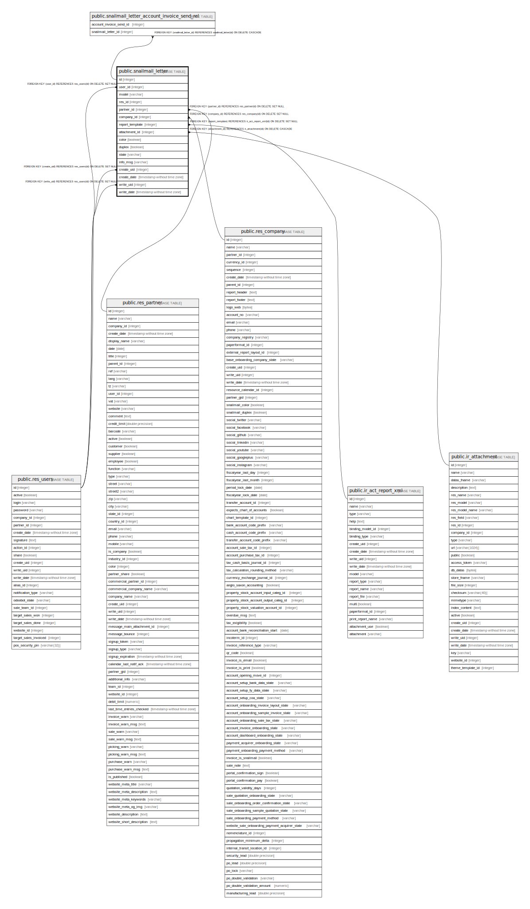

# public.snailmail_letter

## Description

Snailmail Letter

## Columns

| Name | Type | Default | Nullable | Children | Parents | Comment |
| ---- | ---- | ------- | -------- | -------- | ------- | ------- |
| id | integer | nextval('snailmail_letter_id_seq'::regclass) | false | [public.snailmail_letter_account_invoice_send_rel](public.snailmail_letter_account_invoice_send_rel.md) |  |  |
| user_id | integer |  | true |  | [public.res_users](public.res_users.md) | User sending the letter |
| model | varchar |  | false |  |  | Model |
| res_id | integer |  | false |  |  | Document ID |
| partner_id | integer |  | false |  | [public.res_partner](public.res_partner.md) | Recipient |
| company_id | integer |  | false |  | [public.res_company](public.res_company.md) | Company |
| report_template | integer |  | true |  | [public.ir_act_report_xml](public.ir_act_report_xml.md) | Optional report to print and attach |
| attachment_id | integer |  | true |  | [public.ir_attachment](public.ir_attachment.md) | Attachment |
| color | boolean |  | true |  |  | Color |
| duplex | boolean |  | true |  |  | Both side |
| state | varchar |  | true |  |  | Status |
| info_msg | varchar |  | true |  |  | Information |
| create_uid | integer |  | true |  | [public.res_users](public.res_users.md) | Created by |
| create_date | timestamp without time zone |  | true |  |  | Created on |
| write_uid | integer |  | true |  | [public.res_users](public.res_users.md) | Last Updated by |
| write_date | timestamp without time zone |  | true |  |  | Last Updated on |

## Constraints

| Name | Type | Definition |
| ---- | ---- | ---------- |
| snailmail_letter_report_template_fkey | FOREIGN KEY | FOREIGN KEY (report_template) REFERENCES ir_act_report_xml(id) ON DELETE SET NULL |
| snailmail_letter_create_uid_fkey | FOREIGN KEY | FOREIGN KEY (create_uid) REFERENCES res_users(id) ON DELETE SET NULL |
| snailmail_letter_user_id_fkey | FOREIGN KEY | FOREIGN KEY (user_id) REFERENCES res_users(id) ON DELETE SET NULL |
| snailmail_letter_write_uid_fkey | FOREIGN KEY | FOREIGN KEY (write_uid) REFERENCES res_users(id) ON DELETE SET NULL |
| snailmail_letter_company_id_fkey | FOREIGN KEY | FOREIGN KEY (company_id) REFERENCES res_company(id) ON DELETE SET NULL |
| snailmail_letter_partner_id_fkey | FOREIGN KEY | FOREIGN KEY (partner_id) REFERENCES res_partner(id) ON DELETE SET NULL |
| snailmail_letter_attachment_id_fkey | FOREIGN KEY | FOREIGN KEY (attachment_id) REFERENCES ir_attachment(id) ON DELETE CASCADE |
| snailmail_letter_pkey | PRIMARY KEY | PRIMARY KEY (id) |

## Indexes

| Name | Definition |
| ---- | ---------- |
| snailmail_letter_pkey | CREATE UNIQUE INDEX snailmail_letter_pkey ON public.snailmail_letter USING btree (id) |

## Relations

---

> Generated by [tbls](https://github.com/k1LoW/tbls)
