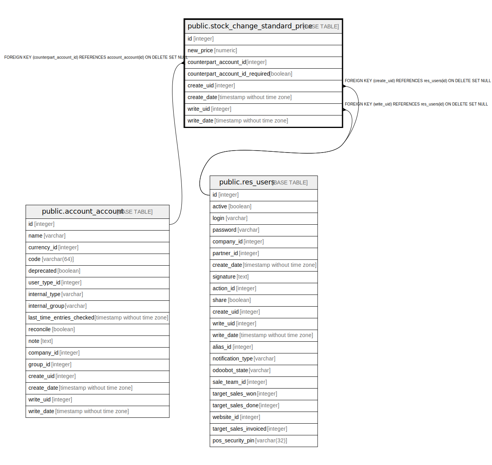

# public.stock_change_standard_price

## Description

Change Standard Price

## Columns

| Name | Type | Default | Nullable | Children | Parents | Comment |
| ---- | ---- | ------- | -------- | -------- | ------- | ------- |
| id | integer | nextval('stock_change_standard_price_id_seq'::regclass) | false |  |  |  |
| new_price | numeric |  | false |  |  | Price |
| counterpart_account_id | integer |  | true |  | [public.account_account](public.account_account.md) | Counter-Part Account |
| counterpart_account_id_required | boolean |  | true |  |  | Counter-Part Account Required |
| create_uid | integer |  | true |  | [public.res_users](public.res_users.md) | Created by |
| create_date | timestamp without time zone |  | true |  |  | Created on |
| write_uid | integer |  | true |  | [public.res_users](public.res_users.md) | Last Updated by |
| write_date | timestamp without time zone |  | true |  |  | Last Updated on |

## Constraints

| Name | Type | Definition |
| ---- | ---- | ---------- |
| stock_change_standard_price_create_uid_fkey | FOREIGN KEY | FOREIGN KEY (create_uid) REFERENCES res_users(id) ON DELETE SET NULL |
| stock_change_standard_price_write_uid_fkey | FOREIGN KEY | FOREIGN KEY (write_uid) REFERENCES res_users(id) ON DELETE SET NULL |
| stock_change_standard_price_counterpart_account_id_fkey | FOREIGN KEY | FOREIGN KEY (counterpart_account_id) REFERENCES account_account(id) ON DELETE SET NULL |
| stock_change_standard_price_pkey | PRIMARY KEY | PRIMARY KEY (id) |

## Indexes

| Name | Definition |
| ---- | ---------- |
| stock_change_standard_price_pkey | CREATE UNIQUE INDEX stock_change_standard_price_pkey ON public.stock_change_standard_price USING btree (id) |

## Relations

---

> Generated by [tbls](https://github.com/k1LoW/tbls)
