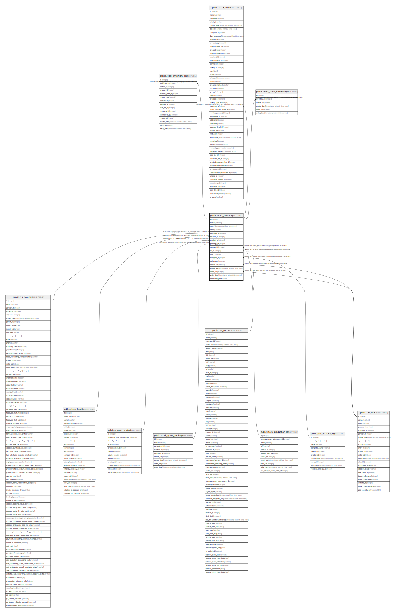

# public.stock_inventory

## Description

Inventory

## Columns

| Name | Type | Default | Nullable | Children | Parents | Comment |
| ---- | ---- | ------- | -------- | -------- | ------- | ------- |
| id | integer | nextval('stock_inventory_id_seq'::regclass) | false | [public.stock_inventory_line](public.stock_inventory_line.md) [public.stock_move](public.stock_move.md) [public.stock_track_confirmation](public.stock_track_confirmation.md) |  |  |
| name | varchar |  | false |  |  | Inventory Reference |
| date | timestamp without time zone |  | false |  |  | Inventory Date |
| state | varchar |  | true |  |  | Status |
| company_id | integer |  | false |  | [public.res_company](public.res_company.md) | Company |
| location_id | integer |  | false |  | [public.stock_location](public.stock_location.md) | Inventoried Location |
| product_id | integer |  | true |  | [public.product_product](public.product_product.md) | Inventoried Product |
| package_id | integer |  | true |  | [public.stock_quant_package](public.stock_quant_package.md) | Inventoried Pack |
| partner_id | integer |  | true |  | [public.res_partner](public.res_partner.md) | Inventoried Owner |
| lot_id | integer |  | true |  | [public.stock_production_lot](public.stock_production_lot.md) | Inventoried Lot/Serial Number |
| filter | varchar |  | false |  |  | Inventory of |
| category_id | integer |  | true |  | [public.product_category](public.product_category.md) | Product Category |
| exhausted | boolean |  | true |  |  | Include Exhausted Products |
| create_uid | integer |  | true |  | [public.res_users](public.res_users.md) | Created by |
| create_date | timestamp without time zone |  | true |  |  | Created on |
| write_uid | integer |  | true |  | [public.res_users](public.res_users.md) | Last Updated by |
| write_date | timestamp without time zone |  | true |  |  | Last Updated on |
| accounting_date | date |  | true |  |  | Accounting Date |

## Constraints

| Name | Type | Definition |
| ---- | ---- | ---------- |
| stock_inventory_create_uid_fkey | FOREIGN KEY | FOREIGN KEY (create_uid) REFERENCES res_users(id) ON DELETE SET NULL |
| stock_inventory_write_uid_fkey | FOREIGN KEY | FOREIGN KEY (write_uid) REFERENCES res_users(id) ON DELETE SET NULL |
| stock_inventory_company_id_fkey | FOREIGN KEY | FOREIGN KEY (company_id) REFERENCES res_company(id) ON DELETE SET NULL |
| stock_inventory_partner_id_fkey | FOREIGN KEY | FOREIGN KEY (partner_id) REFERENCES res_partner(id) ON DELETE SET NULL |
| stock_inventory_category_id_fkey | FOREIGN KEY | FOREIGN KEY (category_id) REFERENCES product_category(id) ON DELETE SET NULL |
| stock_inventory_product_id_fkey | FOREIGN KEY | FOREIGN KEY (product_id) REFERENCES product_product(id) ON DELETE SET NULL |
| stock_inventory_pkey | PRIMARY KEY | PRIMARY KEY (id) |
| stock_inventory_location_id_fkey | FOREIGN KEY | FOREIGN KEY (location_id) REFERENCES stock_location(id) ON DELETE SET NULL |
| stock_inventory_lot_id_fkey | FOREIGN KEY | FOREIGN KEY (lot_id) REFERENCES stock_production_lot(id) ON DELETE SET NULL |
| stock_inventory_package_id_fkey | FOREIGN KEY | FOREIGN KEY (package_id) REFERENCES stock_quant_package(id) ON DELETE SET NULL |

## Indexes

| Name | Definition |
| ---- | ---------- |
| stock_inventory_pkey | CREATE UNIQUE INDEX stock_inventory_pkey ON public.stock_inventory USING btree (id) |
| stock_inventory_state_index | CREATE INDEX stock_inventory_state_index ON public.stock_inventory USING btree (state) |
| stock_inventory_company_id_index | CREATE INDEX stock_inventory_company_id_index ON public.stock_inventory USING btree (company_id) |

## Relations

---

> Generated by [tbls](https://github.com/k1LoW/tbls)
