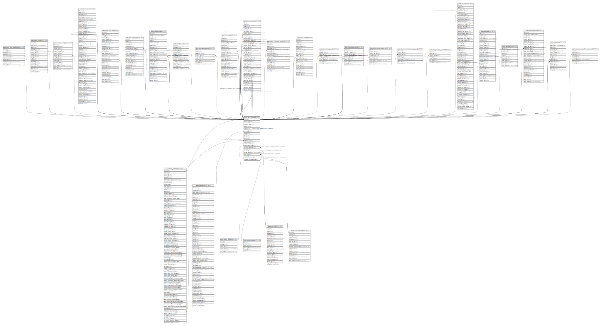

# public.stock_location

## Description

Inventory Locations

## Columns

| Name | Type | Default | Nullable | Children | Parents | Comment |
| ---- | ---- | ------- | -------- | -------- | ------- | ------- |
| id | integer | nextval('stock_location_id_seq'::regclass) | false | [public.res_company](public.res_company.md) [public.stock_fixed_putaway_strat](public.stock_fixed_putaway_strat.md) [public.stock_inventory](public.stock_inventory.md) [public.stock_inventory_line](public.stock_inventory_line.md) [public.stock_location](public.stock_location.md) [public.stock_move](public.stock_move.md) [public.stock_move_line](public.stock_move_line.md) [public.stock_picking_type](public.stock_picking_type.md) [public.stock_picking](public.stock_picking.md) [public.stock_quant](public.stock_quant.md) [public.stock_quant_package](public.stock_quant_package.md) [public.stock_rule](public.stock_rule.md) [public.stock_warehouse](public.stock_warehouse.md) [public.stock_warehouse_orderpoint](public.stock_warehouse_orderpoint.md) [public.stock_scrap](public.stock_scrap.md) [public.stock_package_level](public.stock_package_level.md) [public.stock_return_picking](public.stock_return_picking.md) [public.stock_change_product_qty](public.stock_change_product_qty.md) [public.stock_warn_insufficient_qty_scrap](public.stock_warn_insufficient_qty_scrap.md) [public.stock_package_destination](public.stock_package_destination.md) [public.pos_config](public.pos_config.md) [public.pos_order](public.pos_order.md) [public.mrp_routing](public.mrp_routing.md) [public.mrp_production](public.mrp_production.md) [public.mrp_unbuild](public.mrp_unbuild.md) [public.stock_warn_insufficient_qty_unbuild](public.stock_warn_insufficient_qty_unbuild.md) |  |  |
| parent_path | varchar |  | true |  |  |  |
| name | varchar |  | false |  |  | Location Name |
| complete_name | varchar |  | true |  |  | Full Location Name |
| active | boolean |  | true |  |  | Active |
| usage | varchar |  | false |  |  | Location Type |
| location_id | integer |  | true |  | [public.stock_location](public.stock_location.md) | Parent Location |
| partner_id | integer |  | true |  | [public.res_partner](public.res_partner.md) | Owner |
| comment | text |  | true |  |  | Additional Information |
| posx | integer |  | true |  |  | Corridor (X) |
| posy | integer |  | true |  |  | Shelves (Y) |
| posz | integer |  | true |  |  | Height (Z) |
| company_id | integer |  | true |  | [public.res_company](public.res_company.md) | Company |
| scrap_location | boolean |  | true |  |  | Is a Scrap Location? |
| return_location | boolean |  | true |  |  | Is a Return Location? |
| removal_strategy_id | integer |  | true |  | [public.product_removal](public.product_removal.md) | Removal Strategy |
| putaway_strategy_id | integer |  | true |  | [public.product_putaway](public.product_putaway.md) | Put Away Strategy |
| barcode | varchar |  | true |  |  | Barcode |
| create_uid | integer |  | true |  | [public.res_users](public.res_users.md) | Created by |
| create_date | timestamp without time zone |  | true |  |  | Created on |
| write_uid | integer |  | true |  | [public.res_users](public.res_users.md) | Last Updated by |
| write_date | timestamp without time zone |  | true |  |  | Last Updated on |
| valuation_in_account_id | integer |  | true |  | [public.account_account](public.account_account.md) | Stock Valuation Account (Incoming) |
| valuation_out_account_id | integer |  | true |  | [public.account_account](public.account_account.md) | Stock Valuation Account (Outgoing) |

## Constraints

| Name | Type | Definition | Comment |
| ---- | ---- | ---------- | ------- |
| stock_location_create_uid_fkey | FOREIGN KEY | FOREIGN KEY (create_uid) REFERENCES res_users(id) ON DELETE SET NULL |  |
| stock_location_write_uid_fkey | FOREIGN KEY | FOREIGN KEY (write_uid) REFERENCES res_users(id) ON DELETE SET NULL |  |
| stock_location_company_id_fkey | FOREIGN KEY | FOREIGN KEY (company_id) REFERENCES res_company(id) ON DELETE SET NULL |  |
| stock_location_partner_id_fkey | FOREIGN KEY | FOREIGN KEY (partner_id) REFERENCES res_partner(id) ON DELETE SET NULL |  |
| stock_location_valuation_in_account_id_fkey | FOREIGN KEY | FOREIGN KEY (valuation_in_account_id) REFERENCES account_account(id) ON DELETE SET NULL |  |
| stock_location_valuation_out_account_id_fkey | FOREIGN KEY | FOREIGN KEY (valuation_out_account_id) REFERENCES account_account(id) ON DELETE SET NULL |  |
| stock_location_removal_strategy_id_fkey | FOREIGN KEY | FOREIGN KEY (removal_strategy_id) REFERENCES product_removal(id) ON DELETE SET NULL |  |
| stock_location_putaway_strategy_id_fkey | FOREIGN KEY | FOREIGN KEY (putaway_strategy_id) REFERENCES product_putaway(id) ON DELETE SET NULL |  |
| stock_location_location_id_fkey | FOREIGN KEY | FOREIGN KEY (location_id) REFERENCES stock_location(id) ON DELETE CASCADE |  |
| stock_location_pkey | PRIMARY KEY | PRIMARY KEY (id) |  |
| stock_location_barcode_company_uniq | UNIQUE | UNIQUE (barcode, company_id) | unique (barcode,company_id) |

## Indexes

| Name | Definition |
| ---- | ---------- |
| stock_location_pkey | CREATE UNIQUE INDEX stock_location_pkey ON public.stock_location USING btree (id) |
| stock_location_usage_index | CREATE INDEX stock_location_usage_index ON public.stock_location USING btree (usage) |
| stock_location_location_id_index | CREATE INDEX stock_location_location_id_index ON public.stock_location USING btree (location_id) |
| stock_location_parent_path_index | CREATE INDEX stock_location_parent_path_index ON public.stock_location USING btree (parent_path) |
| stock_location_company_id_index | CREATE INDEX stock_location_company_id_index ON public.stock_location USING btree (company_id) |
| stock_location_barcode_company_uniq | CREATE UNIQUE INDEX stock_location_barcode_company_uniq ON public.stock_location USING btree (barcode, company_id) |

## Relations

---

> Generated by [tbls](https://github.com/k1LoW/tbls)
