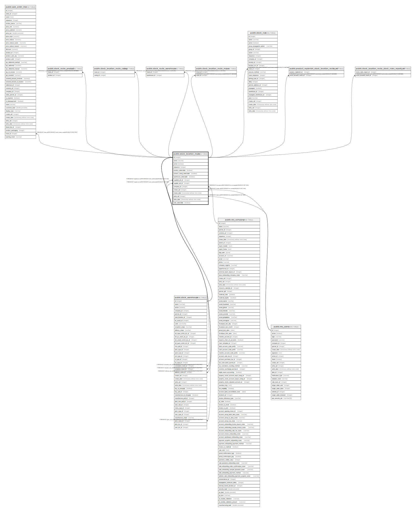

# public.stock_location_route

## Description

Inventory Routes

## Columns

| Name | Type | Default | Nullable | Children | Parents | Comment |
| ---- | ---- | ------- | -------- | -------- | ------- | ------- |
| id | integer | nextval('stock_location_route_id_seq'::regclass) | false | [public.sale_order_line](public.sale_order_line.md) [public.stock_route_product](public.stock_route_product.md) [public.stock_location_route_categ](public.stock_location_route_categ.md) [public.stock_route_warehouse](public.stock_route_warehouse.md) [public.stock_location_route_move](public.stock_location_route_move.md) [public.stock_rule](public.stock_rule.md) [public.stock_warehouse](public.stock_warehouse.md) [public.product_replenish_stock_location_route_rel](public.product_replenish_stock_location_route_rel.md) [public.stock_location_route_stock_rules_report_rel](public.stock_location_route_stock_rules_report_rel.md) |  |  |
| name | varchar |  | false |  |  | Route |
| active | boolean |  | true |  |  | Active |
| sequence | integer |  | true |  |  | Sequence |
| product_selectable | boolean |  | true |  |  | Applicable on Product |
| product_categ_selectable | boolean |  | true |  |  | Applicable on Product Category |
| warehouse_selectable | boolean |  | true |  |  | Applicable on Warehouse |
| supplied_wh_id | integer |  | true |  | [public.stock_warehouse](public.stock_warehouse.md) | Supplied Warehouse |
| supplier_wh_id | integer |  | true |  | [public.stock_warehouse](public.stock_warehouse.md) | Supplying Warehouse |
| company_id | integer |  | true |  | [public.res_company](public.res_company.md) | Company |
| create_uid | integer |  | true |  | [public.res_users](public.res_users.md) | Created by |
| create_date | timestamp without time zone |  | true |  |  | Created on |
| write_uid | integer |  | true |  | [public.res_users](public.res_users.md) | Last Updated by |
| write_date | timestamp without time zone |  | true |  |  | Last Updated on |
| sale_selectable | boolean |  | true |  |  | Selectable on Sales Order Line |

## Constraints

| Name | Type | Definition |
| ---- | ---- | ---------- |
| stock_location_route_create_uid_fkey | FOREIGN KEY | FOREIGN KEY (create_uid) REFERENCES res_users(id) ON DELETE SET NULL |
| stock_location_route_write_uid_fkey | FOREIGN KEY | FOREIGN KEY (write_uid) REFERENCES res_users(id) ON DELETE SET NULL |
| stock_location_route_company_id_fkey | FOREIGN KEY | FOREIGN KEY (company_id) REFERENCES res_company(id) ON DELETE SET NULL |
| stock_location_route_pkey | PRIMARY KEY | PRIMARY KEY (id) |
| stock_location_route_supplied_wh_id_fkey | FOREIGN KEY | FOREIGN KEY (supplied_wh_id) REFERENCES stock_warehouse(id) ON DELETE SET NULL |
| stock_location_route_supplier_wh_id_fkey | FOREIGN KEY | FOREIGN KEY (supplier_wh_id) REFERENCES stock_warehouse(id) ON DELETE SET NULL |

## Indexes

| Name | Definition |
| ---- | ---------- |
| stock_location_route_pkey | CREATE UNIQUE INDEX stock_location_route_pkey ON public.stock_location_route USING btree (id) |
| stock_location_route_company_id_index | CREATE INDEX stock_location_route_company_id_index ON public.stock_location_route USING btree (company_id) |

## Relations

---

> Generated by [tbls](https://github.com/k1LoW/tbls)
