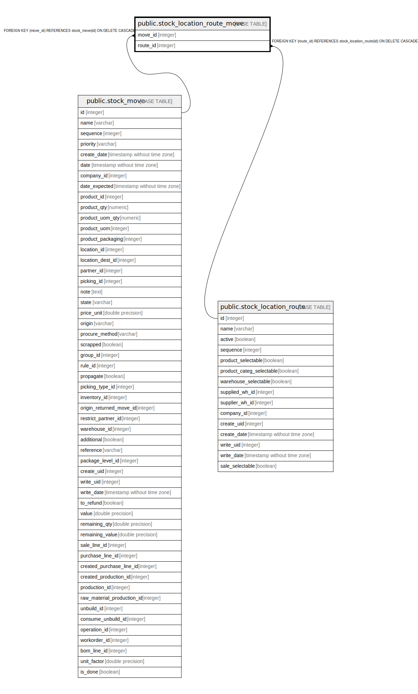

# public.stock_location_route_move

## Description

RELATION BETWEEN stock_move AND stock_location_route

## Columns

| Name | Type | Default | Nullable | Children | Parents | Comment |
| ---- | ---- | ------- | -------- | -------- | ------- | ------- |
| move_id | integer |  | false |  | [public.stock_move](public.stock_move.md) |  |
| route_id | integer |  | false |  | [public.stock_location_route](public.stock_location_route.md) |  |

## Constraints

| Name | Type | Definition |
| ---- | ---- | ---------- |
| stock_location_route_move_route_id_fkey | FOREIGN KEY | FOREIGN KEY (route_id) REFERENCES stock_location_route(id) ON DELETE CASCADE |
| stock_location_route_move_move_id_fkey | FOREIGN KEY | FOREIGN KEY (move_id) REFERENCES stock_move(id) ON DELETE CASCADE |
| stock_location_route_move_move_id_route_id_key | UNIQUE | UNIQUE (move_id, route_id) |

## Indexes

| Name | Definition |
| ---- | ---------- |
| stock_location_route_move_move_id_route_id_key | CREATE UNIQUE INDEX stock_location_route_move_move_id_route_id_key ON public.stock_location_route_move USING btree (move_id, route_id) |
| stock_location_route_move_move_id_idx | CREATE INDEX stock_location_route_move_move_id_idx ON public.stock_location_route_move USING btree (move_id) |
| stock_location_route_move_route_id_idx | CREATE INDEX stock_location_route_move_route_id_idx ON public.stock_location_route_move USING btree (route_id) |

## Relations

---

> Generated by [tbls](https://github.com/k1LoW/tbls)
