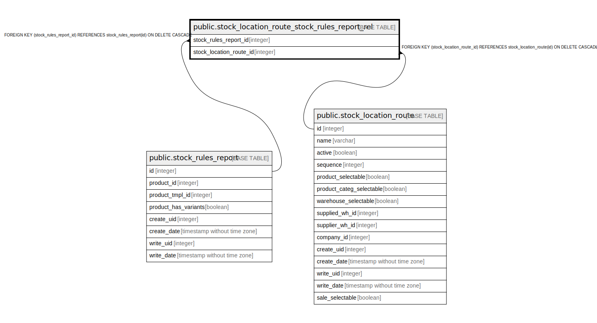

# public.stock_location_route_stock_rules_report_rel

## Description

RELATION BETWEEN stock_rules_report AND stock_location_route

## Columns

| Name | Type | Default | Nullable | Children | Parents | Comment |
| ---- | ---- | ------- | -------- | -------- | ------- | ------- |
| stock_rules_report_id | integer |  | false |  | [public.stock_rules_report](public.stock_rules_report.md) |  |
| stock_location_route_id | integer |  | false |  | [public.stock_location_route](public.stock_location_route.md) |  |

## Constraints

| Name | Type | Definition |
| ---- | ---- | ---------- |
| stock_location_route_stock_rules_r_stock_location_route_id_fkey | FOREIGN KEY | FOREIGN KEY (stock_location_route_id) REFERENCES stock_location_route(id) ON DELETE CASCADE |
| stock_location_route_stock_rules_rep_stock_rules_report_id_fkey | FOREIGN KEY | FOREIGN KEY (stock_rules_report_id) REFERENCES stock_rules_report(id) ON DELETE CASCADE |
| stock_location_route_stock_ru_stock_rules_report_id_stock_l_key | UNIQUE | UNIQUE (stock_rules_report_id, stock_location_route_id) |

## Indexes

| Name | Definition |
| ---- | ---------- |
| stock_location_route_stock_ru_stock_rules_report_id_stock_l_key | CREATE UNIQUE INDEX stock_location_route_stock_ru_stock_rules_report_id_stock_l_key ON public.stock_location_route_stock_rules_report_rel USING btree (stock_rules_report_id, stock_location_route_id) |
| stock_location_route_stock_rules_repo_stock_rules_report_id_idx | CREATE INDEX stock_location_route_stock_rules_repo_stock_rules_report_id_idx ON public.stock_location_route_stock_rules_report_rel USING btree (stock_rules_report_id) |
| stock_location_route_stock_rules_re_stock_location_route_id_idx | CREATE INDEX stock_location_route_stock_rules_re_stock_location_route_id_idx ON public.stock_location_route_stock_rules_report_rel USING btree (stock_location_route_id) |

## Relations

---

> Generated by [tbls](https://github.com/k1LoW/tbls)
