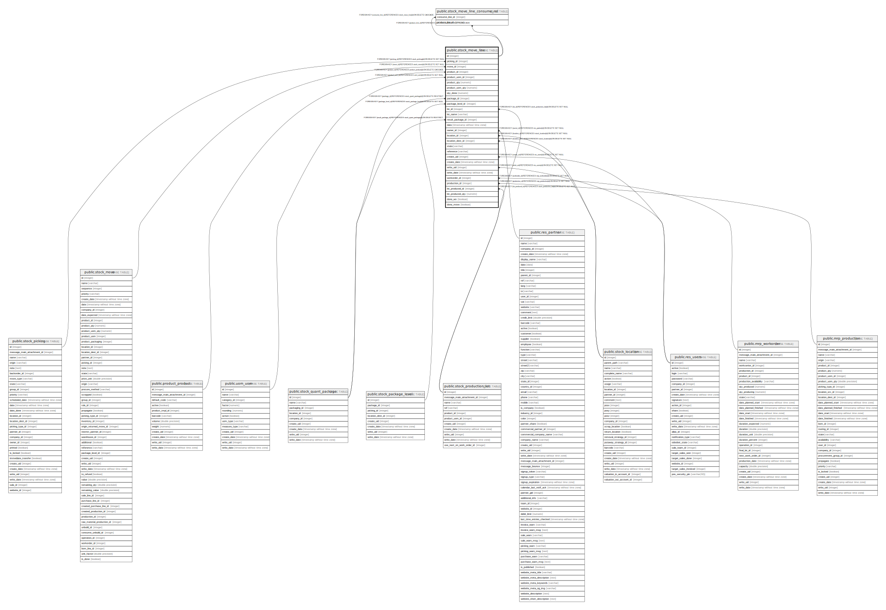

# public.stock_move_line

## Description

Product Moves (Stock Move Line)

## Columns

| Name | Type | Default | Nullable | Children | Parents | Comment |
| ---- | ---- | ------- | -------- | -------- | ------- | ------- |
| id | integer | nextval('stock_move_line_id_seq'::regclass) | false | [public.stock_move_line_consume_rel](public.stock_move_line_consume_rel.md) |  |  |
| picking_id | integer |  | true |  | [public.stock_picking](public.stock_picking.md) | Stock Picking |
| move_id | integer |  | true |  | [public.stock_move](public.stock_move.md) | Stock Move |
| product_id | integer |  | true |  | [public.product_product](public.product_product.md) | Product |
| product_uom_id | integer |  | false |  | [public.uom_uom](public.uom_uom.md) | Unit of Measure |
| product_qty | numeric |  | true |  |  | Real Reserved Quantity |
| product_uom_qty | numeric |  | false |  |  | Reserved |
| qty_done | numeric |  | true |  |  | Done |
| package_id | integer |  | true |  | [public.stock_quant_package](public.stock_quant_package.md) | Source Package |
| package_level_id | integer |  | true |  | [public.stock_package_level](public.stock_package_level.md) | Package Level |
| lot_id | integer |  | true |  | [public.stock_production_lot](public.stock_production_lot.md) | Lot/Serial Number |
| lot_name | varchar |  | true |  |  | Lot/Serial Number Name |
| result_package_id | integer |  | true |  | [public.stock_quant_package](public.stock_quant_package.md) | Destination Package |
| date | timestamp without time zone |  | false |  |  | Date |
| owner_id | integer |  | true |  | [public.res_partner](public.res_partner.md) | Owner |
| location_id | integer |  | false |  | [public.stock_location](public.stock_location.md) | From |
| location_dest_id | integer |  | false |  | [public.stock_location](public.stock_location.md) | To |
| state | varchar |  | true |  |  | Status |
| reference | varchar |  | true |  |  | Reference |
| create_uid | integer |  | true |  | [public.res_users](public.res_users.md) | Created by |
| create_date | timestamp without time zone |  | true |  |  | Created on |
| write_uid | integer |  | true |  | [public.res_users](public.res_users.md) | Last Updated by |
| write_date | timestamp without time zone |  | true |  |  | Last Updated on |
| workorder_id | integer |  | true |  | [public.mrp_workorder](public.mrp_workorder.md) | Work Order |
| production_id | integer |  | true |  | [public.mrp_production](public.mrp_production.md) | Production Order |
| lot_produced_id | integer |  | true |  | [public.stock_production_lot](public.stock_production_lot.md) | Finished Lot/Serial Number |
| lot_produced_qty | numeric |  | true |  |  | Quantity Finished Product |
| done_wo | boolean |  | true |  |  | Done for Work Order |
| done_move | boolean |  | true |  |  | Move Done |

## Constraints

| Name | Type | Definition |
| ---- | ---- | ---------- |
| stock_move_line_create_uid_fkey | FOREIGN KEY | FOREIGN KEY (create_uid) REFERENCES res_users(id) ON DELETE SET NULL |
| stock_move_line_write_uid_fkey | FOREIGN KEY | FOREIGN KEY (write_uid) REFERENCES res_users(id) ON DELETE SET NULL |
| stock_move_line_owner_id_fkey | FOREIGN KEY | FOREIGN KEY (owner_id) REFERENCES res_partner(id) ON DELETE SET NULL |
| stock_move_line_product_uom_id_fkey | FOREIGN KEY | FOREIGN KEY (product_uom_id) REFERENCES uom_uom(id) ON DELETE SET NULL |
| stock_move_line_product_id_fkey | FOREIGN KEY | FOREIGN KEY (product_id) REFERENCES product_product(id) ON DELETE CASCADE |
| stock_move_line_location_dest_id_fkey | FOREIGN KEY | FOREIGN KEY (location_dest_id) REFERENCES stock_location(id) ON DELETE SET NULL |
| stock_move_line_location_id_fkey | FOREIGN KEY | FOREIGN KEY (location_id) REFERENCES stock_location(id) ON DELETE SET NULL |
| stock_move_line_move_id_fkey | FOREIGN KEY | FOREIGN KEY (move_id) REFERENCES stock_move(id) ON DELETE SET NULL |
| stock_move_line_pkey | PRIMARY KEY | PRIMARY KEY (id) |
| stock_move_line_lot_id_fkey | FOREIGN KEY | FOREIGN KEY (lot_id) REFERENCES stock_production_lot(id) ON DELETE SET NULL |
| stock_move_line_lot_produced_id_fkey | FOREIGN KEY | FOREIGN KEY (lot_produced_id) REFERENCES stock_production_lot(id) ON DELETE SET NULL |
| stock_move_line_picking_id_fkey | FOREIGN KEY | FOREIGN KEY (picking_id) REFERENCES stock_picking(id) ON DELETE SET NULL |
| stock_move_line_package_id_fkey | FOREIGN KEY | FOREIGN KEY (package_id) REFERENCES stock_quant_package(id) ON DELETE RESTRICT |
| stock_move_line_result_package_id_fkey | FOREIGN KEY | FOREIGN KEY (result_package_id) REFERENCES stock_quant_package(id) ON DELETE RESTRICT |
| stock_move_line_package_level_id_fkey | FOREIGN KEY | FOREIGN KEY (package_level_id) REFERENCES stock_package_level(id) ON DELETE SET NULL |
| stock_move_line_production_id_fkey | FOREIGN KEY | FOREIGN KEY (production_id) REFERENCES mrp_production(id) ON DELETE SET NULL |
| stock_move_line_workorder_id_fkey | FOREIGN KEY | FOREIGN KEY (workorder_id) REFERENCES mrp_workorder(id) ON DELETE SET NULL |

## Indexes

| Name | Definition |
| ---- | ---------- |
| stock_move_line_pkey | CREATE UNIQUE INDEX stock_move_line_pkey ON public.stock_move_line USING btree (id) |
| stock_move_line_move_id_index | CREATE INDEX stock_move_line_move_id_index ON public.stock_move_line USING btree (move_id) |
| stock_move_line_free_reservation_index | CREATE INDEX stock_move_line_free_reservation_index ON public.stock_move_line USING btree (id, product_id, lot_id, location_id, owner_id, package_id) WHERE (((state IS NULL) OR ((state)::text <> ALL ((ARRAY['cancel'::character varying, 'done'::character varying])::text[]))) AND (product_qty > (0)::numeric)) |

## Relations

---

> Generated by [tbls](https://github.com/k1LoW/tbls)
