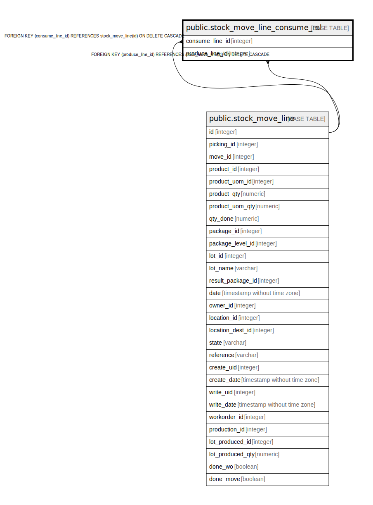

# public.stock_move_line_consume_rel

## Description

RELATION BETWEEN stock_move_line AND stock_move_line

## Columns

| Name | Type | Default | Nullable | Children | Parents | Comment |
| ---- | ---- | ------- | -------- | -------- | ------- | ------- |
| consume_line_id | integer |  | false |  | [public.stock_move_line](public.stock_move_line.md) |  |
| produce_line_id | integer |  | false |  | [public.stock_move_line](public.stock_move_line.md) |  |

## Constraints

| Name | Type | Definition |
| ---- | ---- | ---------- |
| stock_move_line_consume_rel_consume_line_id_fkey | FOREIGN KEY | FOREIGN KEY (consume_line_id) REFERENCES stock_move_line(id) ON DELETE CASCADE |
| stock_move_line_consume_rel_produce_line_id_fkey | FOREIGN KEY | FOREIGN KEY (produce_line_id) REFERENCES stock_move_line(id) ON DELETE CASCADE |
| stock_move_line_consume_rel_consume_line_id_produce_line_id_key | UNIQUE | UNIQUE (consume_line_id, produce_line_id) |

## Indexes

| Name | Definition |
| ---- | ---------- |
| stock_move_line_consume_rel_consume_line_id_produce_line_id_key | CREATE UNIQUE INDEX stock_move_line_consume_rel_consume_line_id_produce_line_id_key ON public.stock_move_line_consume_rel USING btree (consume_line_id, produce_line_id) |
| stock_move_line_consume_rel_consume_line_id_idx | CREATE INDEX stock_move_line_consume_rel_consume_line_id_idx ON public.stock_move_line_consume_rel USING btree (consume_line_id) |
| stock_move_line_consume_rel_produce_line_id_idx | CREATE INDEX stock_move_line_consume_rel_produce_line_id_idx ON public.stock_move_line_consume_rel USING btree (produce_line_id) |

## Relations

---

> Generated by [tbls](https://github.com/k1LoW/tbls)
