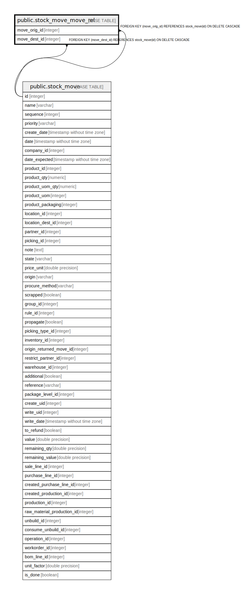

# public.stock_move_move_rel

## Description

RELATION BETWEEN stock_move AND stock_move

## Columns

| Name | Type | Default | Nullable | Children | Parents | Comment |
| ---- | ---- | ------- | -------- | -------- | ------- | ------- |
| move_orig_id | integer |  | false |  | [public.stock_move](public.stock_move.md) |  |
| move_dest_id | integer |  | false |  | [public.stock_move](public.stock_move.md) |  |

## Constraints

| Name | Type | Definition |
| ---- | ---- | ---------- |
| stock_move_move_rel_move_dest_id_fkey | FOREIGN KEY | FOREIGN KEY (move_dest_id) REFERENCES stock_move(id) ON DELETE CASCADE |
| stock_move_move_rel_move_orig_id_fkey | FOREIGN KEY | FOREIGN KEY (move_orig_id) REFERENCES stock_move(id) ON DELETE CASCADE |
| stock_move_move_rel_move_orig_id_move_dest_id_key | UNIQUE | UNIQUE (move_orig_id, move_dest_id) |

## Indexes

| Name | Definition |
| ---- | ---------- |
| stock_move_move_rel_move_orig_id_move_dest_id_key | CREATE UNIQUE INDEX stock_move_move_rel_move_orig_id_move_dest_id_key ON public.stock_move_move_rel USING btree (move_orig_id, move_dest_id) |
| stock_move_move_rel_move_orig_id_idx | CREATE INDEX stock_move_move_rel_move_orig_id_idx ON public.stock_move_move_rel USING btree (move_orig_id) |
| stock_move_move_rel_move_dest_id_idx | CREATE INDEX stock_move_move_rel_move_dest_id_idx ON public.stock_move_move_rel USING btree (move_dest_id) |

## Relations

---

> Generated by [tbls](https://github.com/k1LoW/tbls)
