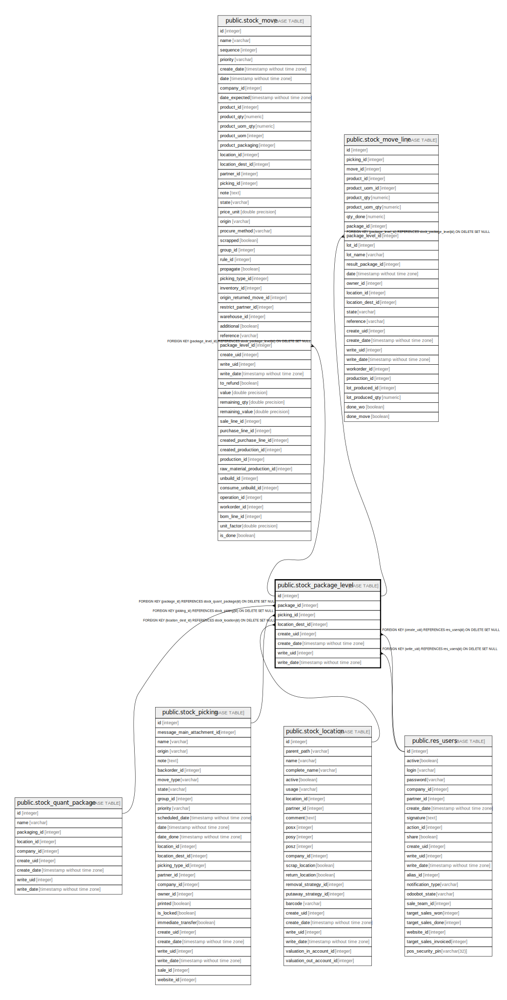

# public.stock_package_level

## Description

Stock Package Level

## Columns

| Name | Type | Default | Nullable | Children | Parents | Comment |
| ---- | ---- | ------- | -------- | -------- | ------- | ------- |
| id | integer | nextval('stock_package_level_id_seq'::regclass) | false | [public.stock_move](public.stock_move.md) [public.stock_move_line](public.stock_move_line.md) |  |  |
| package_id | integer |  | false |  | [public.stock_quant_package](public.stock_quant_package.md) | Package |
| picking_id | integer |  | true |  | [public.stock_picking](public.stock_picking.md) | Picking |
| location_dest_id | integer |  | true |  | [public.stock_location](public.stock_location.md) | To |
| create_uid | integer |  | true |  | [public.res_users](public.res_users.md) | Created by |
| create_date | timestamp without time zone |  | true |  |  | Created on |
| write_uid | integer |  | true |  | [public.res_users](public.res_users.md) | Last Updated by |
| write_date | timestamp without time zone |  | true |  |  | Last Updated on |

## Constraints

| Name | Type | Definition |
| ---- | ---- | ---------- |
| stock_package_level_create_uid_fkey | FOREIGN KEY | FOREIGN KEY (create_uid) REFERENCES res_users(id) ON DELETE SET NULL |
| stock_package_level_write_uid_fkey | FOREIGN KEY | FOREIGN KEY (write_uid) REFERENCES res_users(id) ON DELETE SET NULL |
| stock_package_level_location_dest_id_fkey | FOREIGN KEY | FOREIGN KEY (location_dest_id) REFERENCES stock_location(id) ON DELETE SET NULL |
| stock_package_level_picking_id_fkey | FOREIGN KEY | FOREIGN KEY (picking_id) REFERENCES stock_picking(id) ON DELETE SET NULL |
| stock_package_level_package_id_fkey | FOREIGN KEY | FOREIGN KEY (package_id) REFERENCES stock_quant_package(id) ON DELETE SET NULL |
| stock_package_level_pkey | PRIMARY KEY | PRIMARY KEY (id) |

## Indexes

| Name | Definition |
| ---- | ---------- |
| stock_package_level_pkey | CREATE UNIQUE INDEX stock_package_level_pkey ON public.stock_package_level USING btree (id) |

## Relations

---

> Generated by [tbls](https://github.com/k1LoW/tbls)
