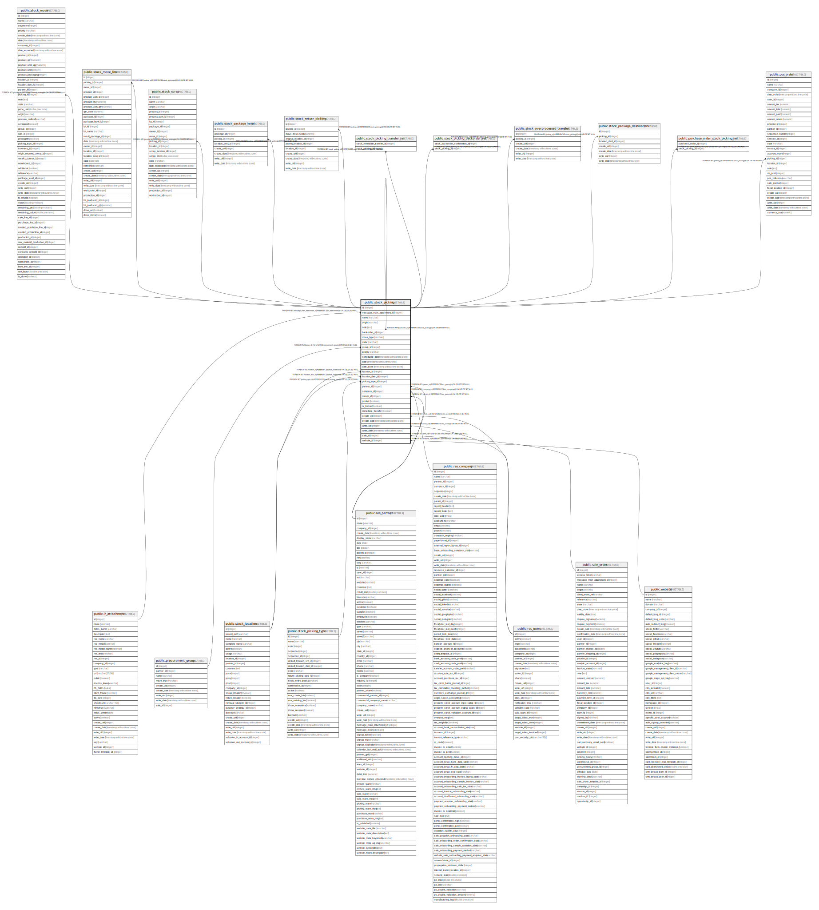

# public.stock_picking

## Description

Transfer

## Columns

| Name | Type | Default | Nullable | Children | Parents | Comment |
| ---- | ---- | ------- | -------- | -------- | ------- | ------- |
| id | integer | nextval('stock_picking_id_seq'::regclass) | false | [public.stock_move](public.stock_move.md) [public.stock_move_line](public.stock_move_line.md) [public.stock_picking](public.stock_picking.md) [public.stock_scrap](public.stock_scrap.md) [public.stock_package_level](public.stock_package_level.md) [public.stock_return_picking](public.stock_return_picking.md) [public.stock_picking_transfer_rel](public.stock_picking_transfer_rel.md) [public.stock_picking_backorder_rel](public.stock_picking_backorder_rel.md) [public.stock_overprocessed_transfer](public.stock_overprocessed_transfer.md) [public.stock_package_destination](public.stock_package_destination.md) [public.purchase_order_stock_picking_rel](public.purchase_order_stock_picking_rel.md) [public.pos_order](public.pos_order.md) |  |  |
| message_main_attachment_id | integer |  | true |  | [public.ir_attachment](public.ir_attachment.md) | Main Attachment |
| name | varchar |  | true |  |  | Reference |
| origin | varchar |  | true |  |  | Source Document |
| note | text |  | true |  |  | Notes |
| backorder_id | integer |  | true |  | [public.stock_picking](public.stock_picking.md) | Back Order of |
| move_type | varchar |  | false |  |  | Shipping Policy |
| state | varchar |  | true |  |  | Status |
| group_id | integer |  | true |  | [public.procurement_group](public.procurement_group.md) | Procurement Group |
| priority | varchar |  | true |  |  | Priority |
| scheduled_date | timestamp without time zone |  | true |  |  | Scheduled Date |
| date | timestamp without time zone |  | true |  |  | Creation Date |
| date_done | timestamp without time zone |  | true |  |  | Date of Transfer |
| location_id | integer |  | false |  | [public.stock_location](public.stock_location.md) | Source Location |
| location_dest_id | integer |  | false |  | [public.stock_location](public.stock_location.md) | Destination Location |
| picking_type_id | integer |  | false |  | [public.stock_picking_type](public.stock_picking_type.md) | Operation Type |
| partner_id | integer |  | true |  | [public.res_partner](public.res_partner.md) | Partner |
| company_id | integer |  | false |  | [public.res_company](public.res_company.md) | Company |
| owner_id | integer |  | true |  | [public.res_partner](public.res_partner.md) | Owner |
| printed | boolean |  | true |  |  | Printed |
| is_locked | boolean |  | true |  |  | Is Locked |
| immediate_transfer | boolean |  | true |  |  | Immediate Transfer |
| create_uid | integer |  | true |  | [public.res_users](public.res_users.md) | Created by |
| create_date | timestamp without time zone |  | true |  |  | Created on |
| write_uid | integer |  | true |  | [public.res_users](public.res_users.md) | Last Updated by |
| write_date | timestamp without time zone |  | true |  |  | Last Updated on |
| sale_id | integer |  | true |  | [public.sale_order](public.sale_order.md) | Sales Order |
| website_id | integer |  | true |  | [public.website](public.website.md) | Website |

## Constraints

| Name | Type | Definition | Comment |
| ---- | ---- | ---------- | ------- |
| stock_picking_create_uid_fkey | FOREIGN KEY | FOREIGN KEY (create_uid) REFERENCES res_users(id) ON DELETE SET NULL |  |
| stock_picking_write_uid_fkey | FOREIGN KEY | FOREIGN KEY (write_uid) REFERENCES res_users(id) ON DELETE SET NULL |  |
| stock_picking_company_id_fkey | FOREIGN KEY | FOREIGN KEY (company_id) REFERENCES res_company(id) ON DELETE SET NULL |  |
| stock_picking_owner_id_fkey | FOREIGN KEY | FOREIGN KEY (owner_id) REFERENCES res_partner(id) ON DELETE SET NULL |  |
| stock_picking_partner_id_fkey | FOREIGN KEY | FOREIGN KEY (partner_id) REFERENCES res_partner(id) ON DELETE SET NULL |  |
| stock_picking_message_main_attachment_id_fkey | FOREIGN KEY | FOREIGN KEY (message_main_attachment_id) REFERENCES ir_attachment(id) ON DELETE SET NULL |  |
| stock_picking_website_id_fkey | FOREIGN KEY | FOREIGN KEY (website_id) REFERENCES website(id) ON DELETE SET NULL |  |
| stock_picking_sale_id_fkey | FOREIGN KEY | FOREIGN KEY (sale_id) REFERENCES sale_order(id) ON DELETE SET NULL |  |
| stock_picking_location_dest_id_fkey | FOREIGN KEY | FOREIGN KEY (location_dest_id) REFERENCES stock_location(id) ON DELETE SET NULL |  |
| stock_picking_location_id_fkey | FOREIGN KEY | FOREIGN KEY (location_id) REFERENCES stock_location(id) ON DELETE SET NULL |  |
| stock_picking_picking_type_id_fkey | FOREIGN KEY | FOREIGN KEY (picking_type_id) REFERENCES stock_picking_type(id) ON DELETE SET NULL |  |
| stock_picking_backorder_id_fkey | FOREIGN KEY | FOREIGN KEY (backorder_id) REFERENCES stock_picking(id) ON DELETE SET NULL |  |
| stock_picking_pkey | PRIMARY KEY | PRIMARY KEY (id) |  |
| stock_picking_name_uniq | UNIQUE | UNIQUE (name, company_id) | unique(name, company_id) |
| stock_picking_group_id_fkey | FOREIGN KEY | FOREIGN KEY (group_id) REFERENCES procurement_group(id) ON DELETE SET NULL |  |

## Indexes

| Name | Definition |
| ---- | ---------- |
| stock_picking_pkey | CREATE UNIQUE INDEX stock_picking_pkey ON public.stock_picking USING btree (id) |
| stock_picking_message_main_attachment_id_index | CREATE INDEX stock_picking_message_main_attachment_id_index ON public.stock_picking USING btree (message_main_attachment_id) |
| stock_picking_name_index | CREATE INDEX stock_picking_name_index ON public.stock_picking USING btree (name) |
| stock_picking_origin_index | CREATE INDEX stock_picking_origin_index ON public.stock_picking USING btree (origin) |
| stock_picking_backorder_id_index | CREATE INDEX stock_picking_backorder_id_index ON public.stock_picking USING btree (backorder_id) |
| stock_picking_state_index | CREATE INDEX stock_picking_state_index ON public.stock_picking USING btree (state) |
| stock_picking_priority_index | CREATE INDEX stock_picking_priority_index ON public.stock_picking USING btree (priority) |
| stock_picking_scheduled_date_index | CREATE INDEX stock_picking_scheduled_date_index ON public.stock_picking USING btree (scheduled_date) |
| stock_picking_date_index | CREATE INDEX stock_picking_date_index ON public.stock_picking USING btree (date) |
| stock_picking_company_id_index | CREATE INDEX stock_picking_company_id_index ON public.stock_picking USING btree (company_id) |
| stock_picking_name_uniq | CREATE UNIQUE INDEX stock_picking_name_uniq ON public.stock_picking USING btree (name, company_id) |

## Relations

---

> Generated by [tbls](https://github.com/k1LoW/tbls)
