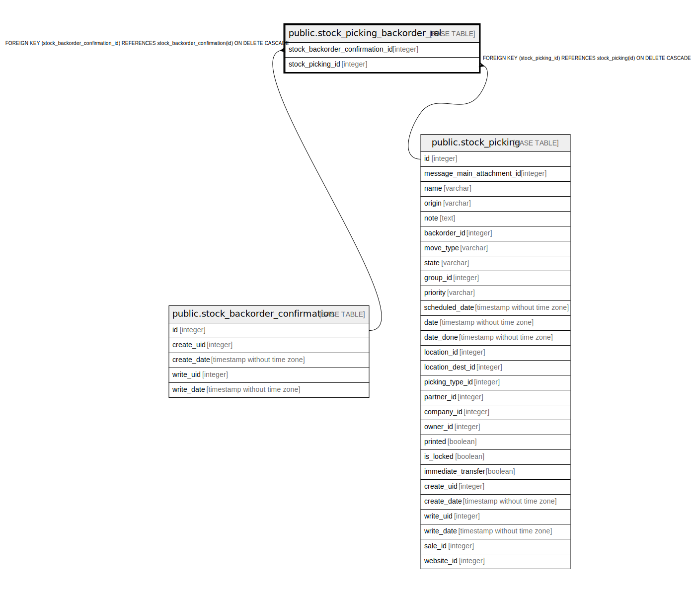

# public.stock_picking_backorder_rel

## Description

RELATION BETWEEN stock_backorder_confirmation AND stock_picking

## Columns

| Name | Type | Default | Nullable | Children | Parents | Comment |
| ---- | ---- | ------- | -------- | -------- | ------- | ------- |
| stock_backorder_confirmation_id | integer |  | false |  | [public.stock_backorder_confirmation](public.stock_backorder_confirmation.md) |  |
| stock_picking_id | integer |  | false |  | [public.stock_picking](public.stock_picking.md) |  |

## Constraints

| Name | Type | Definition |
| ---- | ---- | ---------- |
| stock_picking_backorder_rel_stock_picking_id_fkey | FOREIGN KEY | FOREIGN KEY (stock_picking_id) REFERENCES stock_picking(id) ON DELETE CASCADE |
| stock_picking_backorder_rel_stock_backorder_confirmation_i_fkey | FOREIGN KEY | FOREIGN KEY (stock_backorder_confirmation_id) REFERENCES stock_backorder_confirmation(id) ON DELETE CASCADE |
| stock_picking_backorder_rel_stock_backorder_confirmation_id_key | UNIQUE | UNIQUE (stock_backorder_confirmation_id, stock_picking_id) |

## Indexes

| Name | Definition |
| ---- | ---------- |
| stock_picking_backorder_rel_stock_backorder_confirmation_id_key | CREATE UNIQUE INDEX stock_picking_backorder_rel_stock_backorder_confirmation_id_key ON public.stock_picking_backorder_rel USING btree (stock_backorder_confirmation_id, stock_picking_id) |
| stock_picking_backorder_rel_stock_backorder_confirmation_id_idx | CREATE INDEX stock_picking_backorder_rel_stock_backorder_confirmation_id_idx ON public.stock_picking_backorder_rel USING btree (stock_backorder_confirmation_id) |
| stock_picking_backorder_rel_stock_picking_id_idx | CREATE INDEX stock_picking_backorder_rel_stock_picking_id_idx ON public.stock_picking_backorder_rel USING btree (stock_picking_id) |

## Relations

---

> Generated by [tbls](https://github.com/k1LoW/tbls)
