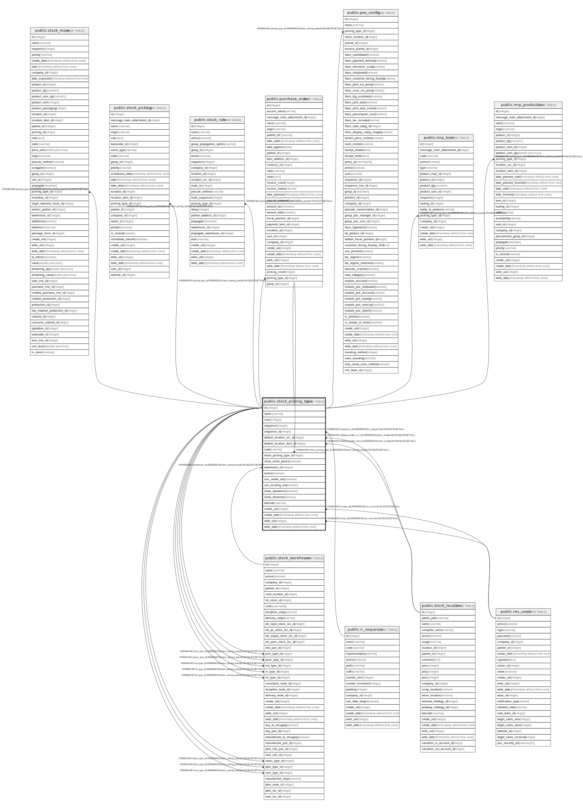

# public.stock_picking_type

## Description

Picking Type

## Columns

| Name | Type | Default | Nullable | Children | Parents | Comment |
| ---- | ---- | ------- | -------- | -------- | ------- | ------- |
| id | integer | nextval('stock_picking_type_id_seq'::regclass) | false | [public.stock_move](public.stock_move.md) [public.stock_picking_type](public.stock_picking_type.md) [public.stock_picking](public.stock_picking.md) [public.stock_rule](public.stock_rule.md) [public.stock_warehouse](public.stock_warehouse.md) [public.purchase_order](public.purchase_order.md) [public.pos_config](public.pos_config.md) [public.mrp_bom](public.mrp_bom.md) [public.mrp_production](public.mrp_production.md) |  |  |
| name | varchar |  | false |  |  | Operation Type |
| color | integer |  | true |  |  | Color |
| sequence | integer |  | true |  |  | Sequence |
| sequence_id | integer |  | false |  | [public.ir_sequence](public.ir_sequence.md) | Reference Sequence |
| default_location_src_id | integer |  | true |  | [public.stock_location](public.stock_location.md) | Default Source Location |
| default_location_dest_id | integer |  | true |  | [public.stock_location](public.stock_location.md) | Default Destination Location |
| code | varchar |  | false |  |  | Type of Operation |
| return_picking_type_id | integer |  | true |  | [public.stock_picking_type](public.stock_picking_type.md) | Operation Type for Returns |
| show_entire_packs | boolean |  | true |  |  | Move Entire Packages |
| warehouse_id | integer |  | true |  | [public.stock_warehouse](public.stock_warehouse.md) | Warehouse |
| active | boolean |  | true |  |  | Active |
| use_create_lots | boolean |  | true |  |  | Create New Lots/Serial Numbers |
| use_existing_lots | boolean |  | true |  |  | Use Existing Lots/Serial Numbers |
| show_operations | boolean |  | true |  |  | Show Detailed Operations |
| show_reserved | boolean |  | true |  |  | Show Reserved |
| barcode | varchar |  | true |  |  | Barcode |
| create_uid | integer |  | true |  | [public.res_users](public.res_users.md) | Created by |
| create_date | timestamp without time zone |  | true |  |  | Created on |
| write_uid | integer |  | true |  | [public.res_users](public.res_users.md) | Last Updated by |
| write_date | timestamp without time zone |  | true |  |  | Last Updated on |

## Constraints

| Name | Type | Definition |
| ---- | ---- | ---------- |
| stock_picking_type_create_uid_fkey | FOREIGN KEY | FOREIGN KEY (create_uid) REFERENCES res_users(id) ON DELETE SET NULL |
| stock_picking_type_write_uid_fkey | FOREIGN KEY | FOREIGN KEY (write_uid) REFERENCES res_users(id) ON DELETE SET NULL |
| stock_picking_type_sequence_id_fkey | FOREIGN KEY | FOREIGN KEY (sequence_id) REFERENCES ir_sequence(id) ON DELETE SET NULL |
| stock_picking_type_default_location_dest_id_fkey | FOREIGN KEY | FOREIGN KEY (default_location_dest_id) REFERENCES stock_location(id) ON DELETE SET NULL |
| stock_picking_type_default_location_src_id_fkey | FOREIGN KEY | FOREIGN KEY (default_location_src_id) REFERENCES stock_location(id) ON DELETE SET NULL |
| stock_picking_type_pkey | PRIMARY KEY | PRIMARY KEY (id) |
| stock_picking_type_return_picking_type_id_fkey | FOREIGN KEY | FOREIGN KEY (return_picking_type_id) REFERENCES stock_picking_type(id) ON DELETE SET NULL |
| stock_picking_type_warehouse_id_fkey | FOREIGN KEY | FOREIGN KEY (warehouse_id) REFERENCES stock_warehouse(id) ON DELETE CASCADE |

## Indexes

| Name | Definition |
| ---- | ---------- |
| stock_picking_type_pkey | CREATE UNIQUE INDEX stock_picking_type_pkey ON public.stock_picking_type USING btree (id) |

## Relations

---

> Generated by [tbls](https://github.com/k1LoW/tbls)
