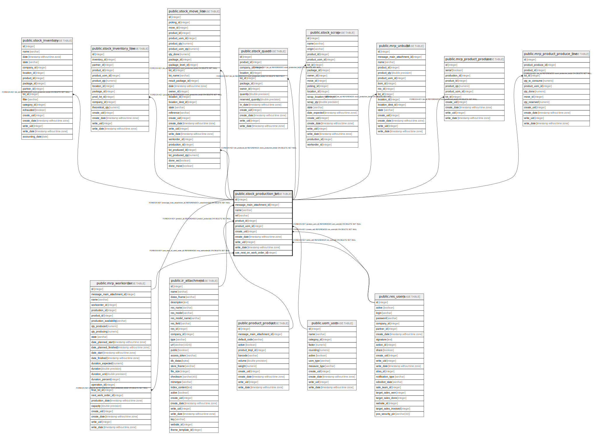

# public.stock_production_lot

## Description

Lot/Serial

## Columns

| Name | Type | Default | Nullable | Children | Parents | Comment |
| ---- | ---- | ------- | -------- | -------- | ------- | ------- |
| id | integer | nextval('stock_production_lot_id_seq'::regclass) | false | [public.stock_inventory](public.stock_inventory.md) [public.stock_inventory_line](public.stock_inventory_line.md) [public.stock_move_line](public.stock_move_line.md) [public.stock_quant](public.stock_quant.md) [public.stock_scrap](public.stock_scrap.md) [public.mrp_unbuild](public.mrp_unbuild.md) [public.mrp_workorder](public.mrp_workorder.md) [public.mrp_product_produce](public.mrp_product_produce.md) [public.mrp_product_produce_line](public.mrp_product_produce_line.md) |  |  |
| message_main_attachment_id | integer |  | true |  | [public.ir_attachment](public.ir_attachment.md) | Main Attachment |
| name | varchar |  | false |  |  | Lot/Serial Number |
| ref | varchar |  | true |  |  | Internal Reference |
| product_id | integer |  | false |  | [public.product_product](public.product_product.md) | Product |
| product_uom_id | integer |  | true |  | [public.uom_uom](public.uom_uom.md) | Unit of Measure |
| create_uid | integer |  | true |  | [public.res_users](public.res_users.md) | Created by |
| create_date | timestamp without time zone |  | true |  |  | Created on |
| write_uid | integer |  | true |  | [public.res_users](public.res_users.md) | Last Updated by |
| write_date | timestamp without time zone |  | true |  |  | Last Updated on |
| use_next_on_work_order_id | integer |  | true |  | [public.mrp_workorder](public.mrp_workorder.md) | Next Work Order to Use |

## Constraints

| Name | Type | Definition | Comment |
| ---- | ---- | ---------- | ------- |
| stock_production_lot_create_uid_fkey | FOREIGN KEY | FOREIGN KEY (create_uid) REFERENCES res_users(id) ON DELETE SET NULL |  |
| stock_production_lot_write_uid_fkey | FOREIGN KEY | FOREIGN KEY (write_uid) REFERENCES res_users(id) ON DELETE SET NULL |  |
| stock_production_lot_message_main_attachment_id_fkey | FOREIGN KEY | FOREIGN KEY (message_main_attachment_id) REFERENCES ir_attachment(id) ON DELETE SET NULL |  |
| stock_production_lot_product_uom_id_fkey | FOREIGN KEY | FOREIGN KEY (product_uom_id) REFERENCES uom_uom(id) ON DELETE SET NULL |  |
| stock_production_lot_product_id_fkey | FOREIGN KEY | FOREIGN KEY (product_id) REFERENCES product_product(id) ON DELETE SET NULL |  |
| stock_production_lot_pkey | PRIMARY KEY | PRIMARY KEY (id) |  |
| stock_production_lot_name_ref_uniq | UNIQUE | UNIQUE (name, product_id) | unique (name, product_id) |
| stock_production_lot_use_next_on_work_order_id_fkey | FOREIGN KEY | FOREIGN KEY (use_next_on_work_order_id) REFERENCES mrp_workorder(id) ON DELETE SET NULL |  |

## Indexes

| Name | Definition |
| ---- | ---------- |
| stock_production_lot_pkey | CREATE UNIQUE INDEX stock_production_lot_pkey ON public.stock_production_lot USING btree (id) |
| stock_production_lot_message_main_attachment_id_index | CREATE INDEX stock_production_lot_message_main_attachment_id_index ON public.stock_production_lot USING btree (message_main_attachment_id) |
| stock_production_lot_name_ref_uniq | CREATE UNIQUE INDEX stock_production_lot_name_ref_uniq ON public.stock_production_lot USING btree (name, product_id) |

## Relations

---

> Generated by [tbls](https://github.com/k1LoW/tbls)
