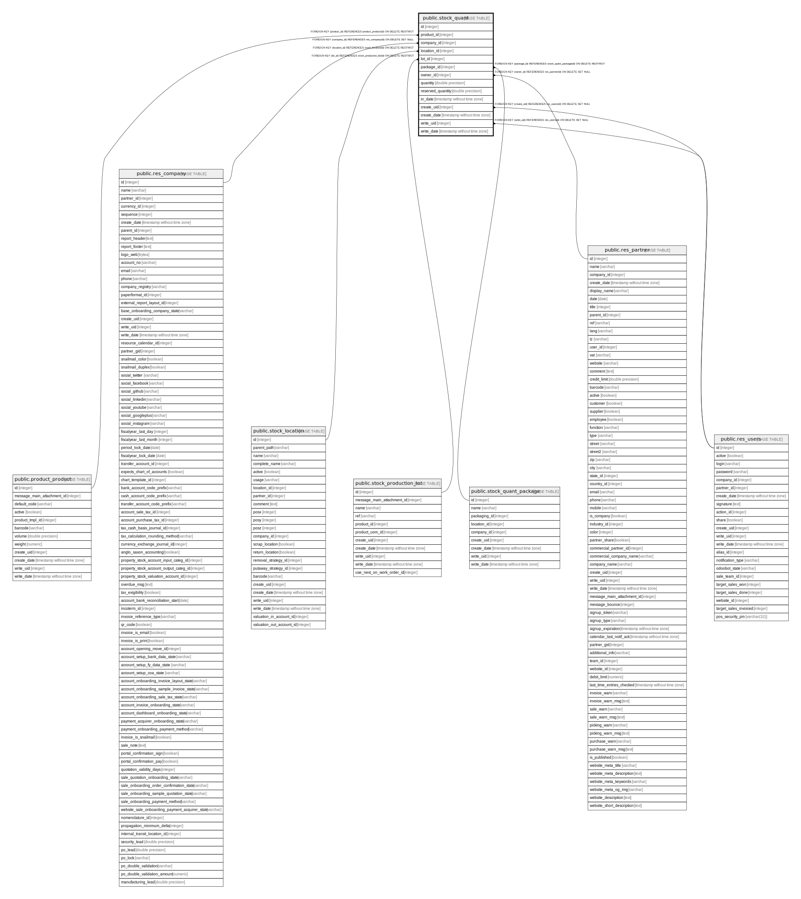

# public.stock_quant

## Description

Quants

## Columns

| Name | Type | Default | Nullable | Children | Parents | Comment |
| ---- | ---- | ------- | -------- | -------- | ------- | ------- |
| id | integer | nextval('stock_quant_id_seq'::regclass) | false |  |  |  |
| product_id | integer |  | false |  | [public.product_product](public.product_product.md) | Product |
| company_id | integer |  | true |  | [public.res_company](public.res_company.md) | Company |
| location_id | integer |  | false |  | [public.stock_location](public.stock_location.md) | Location |
| lot_id | integer |  | true |  | [public.stock_production_lot](public.stock_production_lot.md) | Lot/Serial Number |
| package_id | integer |  | true |  | [public.stock_quant_package](public.stock_quant_package.md) | Package |
| owner_id | integer |  | true |  | [public.res_partner](public.res_partner.md) | Owner |
| quantity | double precision |  | false |  |  | Quantity |
| reserved_quantity | double precision |  | false |  |  | Reserved Quantity |
| in_date | timestamp without time zone |  | true |  |  | Incoming Date |
| create_uid | integer |  | true |  | [public.res_users](public.res_users.md) | Created by |
| create_date | timestamp without time zone |  | true |  |  | Created on |
| write_uid | integer |  | true |  | [public.res_users](public.res_users.md) | Last Updated by |
| write_date | timestamp without time zone |  | true |  |  | Last Updated on |

## Constraints

| Name | Type | Definition |
| ---- | ---- | ---------- |
| stock_quant_create_uid_fkey | FOREIGN KEY | FOREIGN KEY (create_uid) REFERENCES res_users(id) ON DELETE SET NULL |
| stock_quant_write_uid_fkey | FOREIGN KEY | FOREIGN KEY (write_uid) REFERENCES res_users(id) ON DELETE SET NULL |
| stock_quant_company_id_fkey | FOREIGN KEY | FOREIGN KEY (company_id) REFERENCES res_company(id) ON DELETE SET NULL |
| stock_quant_owner_id_fkey | FOREIGN KEY | FOREIGN KEY (owner_id) REFERENCES res_partner(id) ON DELETE SET NULL |
| stock_quant_product_id_fkey | FOREIGN KEY | FOREIGN KEY (product_id) REFERENCES product_product(id) ON DELETE RESTRICT |
| stock_quant_location_id_fkey | FOREIGN KEY | FOREIGN KEY (location_id) REFERENCES stock_location(id) ON DELETE RESTRICT |
| stock_quant_lot_id_fkey | FOREIGN KEY | FOREIGN KEY (lot_id) REFERENCES stock_production_lot(id) ON DELETE RESTRICT |
| stock_quant_pkey | PRIMARY KEY | PRIMARY KEY (id) |
| stock_quant_package_id_fkey | FOREIGN KEY | FOREIGN KEY (package_id) REFERENCES stock_quant_package(id) ON DELETE RESTRICT |

## Indexes

| Name | Definition |
| ---- | ---------- |
| stock_quant_pkey | CREATE UNIQUE INDEX stock_quant_pkey ON public.stock_quant USING btree (id) |
| stock_quant_product_id_index | CREATE INDEX stock_quant_product_id_index ON public.stock_quant USING btree (product_id) |
| stock_quant_location_id_index | CREATE INDEX stock_quant_location_id_index ON public.stock_quant USING btree (location_id) |
| stock_quant_lot_id_index | CREATE INDEX stock_quant_lot_id_index ON public.stock_quant USING btree (lot_id) |

## Relations

---

> Generated by [tbls](https://github.com/k1LoW/tbls)
