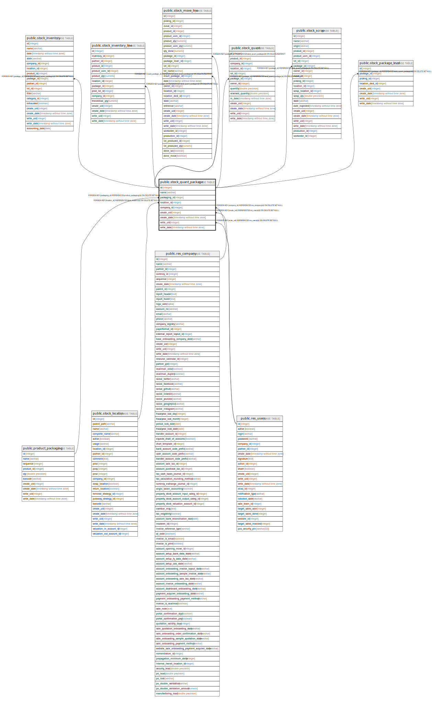

# public.stock_quant_package

## Description

Packages

## Columns

| Name | Type | Default | Nullable | Children | Parents | Comment |
| ---- | ---- | ------- | -------- | -------- | ------- | ------- |
| id | integer | nextval('stock_quant_package_id_seq'::regclass) | false | [public.stock_inventory](public.stock_inventory.md) [public.stock_inventory_line](public.stock_inventory_line.md) [public.stock_move_line](public.stock_move_line.md) [public.stock_quant](public.stock_quant.md) [public.stock_scrap](public.stock_scrap.md) [public.stock_package_level](public.stock_package_level.md) |  |  |
| name | varchar |  | true |  |  | Package Reference |
| packaging_id | integer |  | true |  | [public.product_packaging](public.product_packaging.md) | Package Type |
| location_id | integer |  | true |  | [public.stock_location](public.stock_location.md) | Location |
| company_id | integer |  | true |  | [public.res_company](public.res_company.md) | Company |
| create_uid | integer |  | true |  | [public.res_users](public.res_users.md) | Created by |
| create_date | timestamp without time zone |  | true |  |  | Created on |
| write_uid | integer |  | true |  | [public.res_users](public.res_users.md) | Last Updated by |
| write_date | timestamp without time zone |  | true |  |  | Last Updated on |

## Constraints

| Name | Type | Definition |
| ---- | ---- | ---------- |
| stock_quant_package_create_uid_fkey | FOREIGN KEY | FOREIGN KEY (create_uid) REFERENCES res_users(id) ON DELETE SET NULL |
| stock_quant_package_write_uid_fkey | FOREIGN KEY | FOREIGN KEY (write_uid) REFERENCES res_users(id) ON DELETE SET NULL |
| stock_quant_package_company_id_fkey | FOREIGN KEY | FOREIGN KEY (company_id) REFERENCES res_company(id) ON DELETE SET NULL |
| stock_quant_package_packaging_id_fkey | FOREIGN KEY | FOREIGN KEY (packaging_id) REFERENCES product_packaging(id) ON DELETE SET NULL |
| stock_quant_package_location_id_fkey | FOREIGN KEY | FOREIGN KEY (location_id) REFERENCES stock_location(id) ON DELETE SET NULL |
| stock_quant_package_pkey | PRIMARY KEY | PRIMARY KEY (id) |

## Indexes

| Name | Definition |
| ---- | ---------- |
| stock_quant_package_pkey | CREATE UNIQUE INDEX stock_quant_package_pkey ON public.stock_quant_package USING btree (id) |
| stock_quant_package_name_index | CREATE INDEX stock_quant_package_name_index ON public.stock_quant_package USING btree (name) |
| stock_quant_package_packaging_id_index | CREATE INDEX stock_quant_package_packaging_id_index ON public.stock_quant_package USING btree (packaging_id) |
| stock_quant_package_location_id_index | CREATE INDEX stock_quant_package_location_id_index ON public.stock_quant_package USING btree (location_id) |
| stock_quant_package_company_id_index | CREATE INDEX stock_quant_package_company_id_index ON public.stock_quant_package USING btree (company_id) |

## Relations

---

> Generated by [tbls](https://github.com/k1LoW/tbls)
