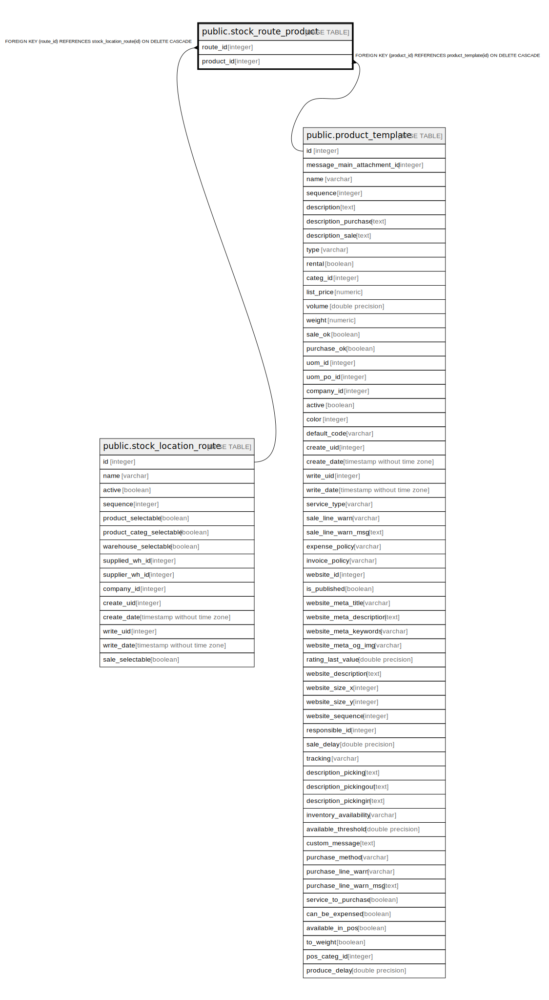

# public.stock_route_product

## Description

RELATION BETWEEN stock_location_route AND product_template

## Columns

| Name | Type | Default | Nullable | Children | Parents | Comment |
| ---- | ---- | ------- | -------- | -------- | ------- | ------- |
| route_id | integer |  | false |  | [public.stock_location_route](public.stock_location_route.md) |  |
| product_id | integer |  | false |  | [public.product_template](public.product_template.md) |  |

## Constraints

| Name | Type | Definition |
| ---- | ---- | ---------- |
| stock_route_product_product_id_fkey | FOREIGN KEY | FOREIGN KEY (product_id) REFERENCES product_template(id) ON DELETE CASCADE |
| stock_route_product_route_id_fkey | FOREIGN KEY | FOREIGN KEY (route_id) REFERENCES stock_location_route(id) ON DELETE CASCADE |
| stock_route_product_route_id_product_id_key | UNIQUE | UNIQUE (route_id, product_id) |

## Indexes

| Name | Definition |
| ---- | ---------- |
| stock_route_product_route_id_product_id_key | CREATE UNIQUE INDEX stock_route_product_route_id_product_id_key ON public.stock_route_product USING btree (route_id, product_id) |
| stock_route_product_route_id_idx | CREATE INDEX stock_route_product_route_id_idx ON public.stock_route_product USING btree (route_id) |
| stock_route_product_product_id_idx | CREATE INDEX stock_route_product_product_id_idx ON public.stock_route_product USING btree (product_id) |

## Relations

---

> Generated by [tbls](https://github.com/k1LoW/tbls)
