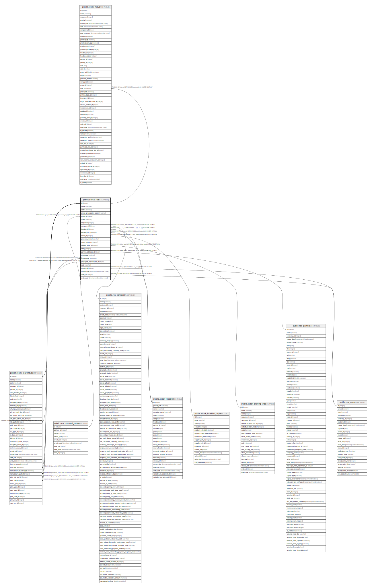

# public.stock_rule

## Description

Stock Rule

## Columns

| Name | Type | Default | Nullable | Children | Parents | Comment |
| ---- | ---- | ------- | -------- | -------- | ------- | ------- |
| id | integer | nextval('stock_rule_id_seq'::regclass) | false | [public.stock_move](public.stock_move.md) [public.stock_warehouse](public.stock_warehouse.md) |  |  |
| name | varchar |  | false |  |  | Name |
| active | boolean |  | true |  |  | Active |
| group_propagation_option | varchar |  | true |  |  | Propagation of Procurement Group |
| group_id | integer |  | true |  | [public.procurement_group](public.procurement_group.md) | Fixed Procurement Group |
| action | varchar |  | false |  |  | Action |
| sequence | integer |  | true |  |  | Sequence |
| company_id | integer |  | true |  | [public.res_company](public.res_company.md) | Company |
| location_id | integer |  | false |  | [public.stock_location](public.stock_location.md) | Destination Location |
| location_src_id | integer |  | true |  | [public.stock_location](public.stock_location.md) | Source Location |
| route_id | integer |  | false |  | [public.stock_location_route](public.stock_location_route.md) | Route |
| procure_method | varchar |  | false |  |  | Move Supply Method |
| route_sequence | integer |  | true |  |  | Route Sequence |
| picking_type_id | integer |  | false |  | [public.stock_picking_type](public.stock_picking_type.md) | Operation Type |
| delay | integer |  | true |  |  | Delay |
| partner_address_id | integer |  | true |  | [public.res_partner](public.res_partner.md) | Partner Address |
| propagate | boolean |  | true |  |  | Propagate cancel and split |
| warehouse_id | integer |  | true |  | [public.stock_warehouse](public.stock_warehouse.md) | Warehouse |
| propagate_warehouse_id | integer |  | true |  | [public.stock_warehouse](public.stock_warehouse.md) | Warehouse to Propagate |
| auto | varchar |  | false |  |  | Automatic Move |
| create_uid | integer |  | true |  | [public.res_users](public.res_users.md) | Created by |
| create_date | timestamp without time zone |  | true |  |  | Created on |
| write_uid | integer |  | true |  | [public.res_users](public.res_users.md) | Last Updated by |
| write_date | timestamp without time zone |  | true |  |  | Last Updated on |

## Constraints

| Name | Type | Definition |
| ---- | ---- | ---------- |
| stock_rule_create_uid_fkey | FOREIGN KEY | FOREIGN KEY (create_uid) REFERENCES res_users(id) ON DELETE SET NULL |
| stock_rule_write_uid_fkey | FOREIGN KEY | FOREIGN KEY (write_uid) REFERENCES res_users(id) ON DELETE SET NULL |
| stock_rule_company_id_fkey | FOREIGN KEY | FOREIGN KEY (company_id) REFERENCES res_company(id) ON DELETE SET NULL |
| stock_rule_partner_address_id_fkey | FOREIGN KEY | FOREIGN KEY (partner_address_id) REFERENCES res_partner(id) ON DELETE SET NULL |
| stock_rule_location_id_fkey | FOREIGN KEY | FOREIGN KEY (location_id) REFERENCES stock_location(id) ON DELETE SET NULL |
| stock_rule_location_src_id_fkey | FOREIGN KEY | FOREIGN KEY (location_src_id) REFERENCES stock_location(id) ON DELETE SET NULL |
| stock_rule_route_id_fkey | FOREIGN KEY | FOREIGN KEY (route_id) REFERENCES stock_location_route(id) ON DELETE CASCADE |
| stock_rule_picking_type_id_fkey | FOREIGN KEY | FOREIGN KEY (picking_type_id) REFERENCES stock_picking_type(id) ON DELETE SET NULL |
| stock_rule_pkey | PRIMARY KEY | PRIMARY KEY (id) |
| stock_rule_group_id_fkey | FOREIGN KEY | FOREIGN KEY (group_id) REFERENCES procurement_group(id) ON DELETE SET NULL |
| stock_rule_propagate_warehouse_id_fkey | FOREIGN KEY | FOREIGN KEY (propagate_warehouse_id) REFERENCES stock_warehouse(id) ON DELETE SET NULL |
| stock_rule_warehouse_id_fkey | FOREIGN KEY | FOREIGN KEY (warehouse_id) REFERENCES stock_warehouse(id) ON DELETE SET NULL |

## Indexes

| Name | Definition |
| ---- | ---------- |
| stock_rule_pkey | CREATE UNIQUE INDEX stock_rule_pkey ON public.stock_rule USING btree (id) |
| stock_rule_auto_index | CREATE INDEX stock_rule_auto_index ON public.stock_rule USING btree (auto) |

## Relations

---

> Generated by [tbls](https://github.com/k1LoW/tbls)
