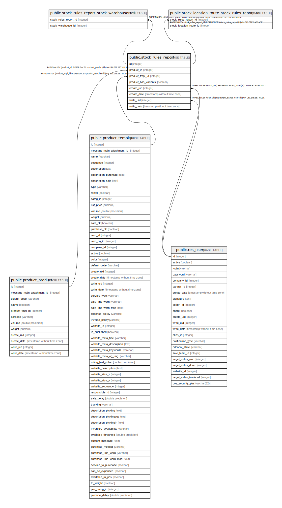

# public.stock_rules_report

## Description

Stock Rules report

## Columns

| Name | Type | Default | Nullable | Children | Parents | Comment |
| ---- | ---- | ------- | -------- | -------- | ------- | ------- |
| id | integer | nextval('stock_rules_report_id_seq'::regclass) | false | [public.stock_rules_report_stock_warehouse_rel](public.stock_rules_report_stock_warehouse_rel.md) [public.stock_location_route_stock_rules_report_rel](public.stock_location_route_stock_rules_report_rel.md) |  |  |
| product_id | integer |  | false |  | [public.product_product](public.product_product.md) | Product |
| product_tmpl_id | integer |  | false |  | [public.product_template](public.product_template.md) | Product Tmpl |
| product_has_variants | boolean |  | false |  |  | Has variants |
| create_uid | integer |  | true |  | [public.res_users](public.res_users.md) | Created by |
| create_date | timestamp without time zone |  | true |  |  | Created on |
| write_uid | integer |  | true |  | [public.res_users](public.res_users.md) | Last Updated by |
| write_date | timestamp without time zone |  | true |  |  | Last Updated on |

## Constraints

| Name | Type | Definition |
| ---- | ---- | ---------- |
| stock_rules_report_create_uid_fkey | FOREIGN KEY | FOREIGN KEY (create_uid) REFERENCES res_users(id) ON DELETE SET NULL |
| stock_rules_report_write_uid_fkey | FOREIGN KEY | FOREIGN KEY (write_uid) REFERENCES res_users(id) ON DELETE SET NULL |
| stock_rules_report_product_tmpl_id_fkey | FOREIGN KEY | FOREIGN KEY (product_tmpl_id) REFERENCES product_template(id) ON DELETE SET NULL |
| stock_rules_report_product_id_fkey | FOREIGN KEY | FOREIGN KEY (product_id) REFERENCES product_product(id) ON DELETE SET NULL |
| stock_rules_report_pkey | PRIMARY KEY | PRIMARY KEY (id) |

## Indexes

| Name | Definition |
| ---- | ---------- |
| stock_rules_report_pkey | CREATE UNIQUE INDEX stock_rules_report_pkey ON public.stock_rules_report USING btree (id) |

## Relations

---

> Generated by [tbls](https://github.com/k1LoW/tbls)
