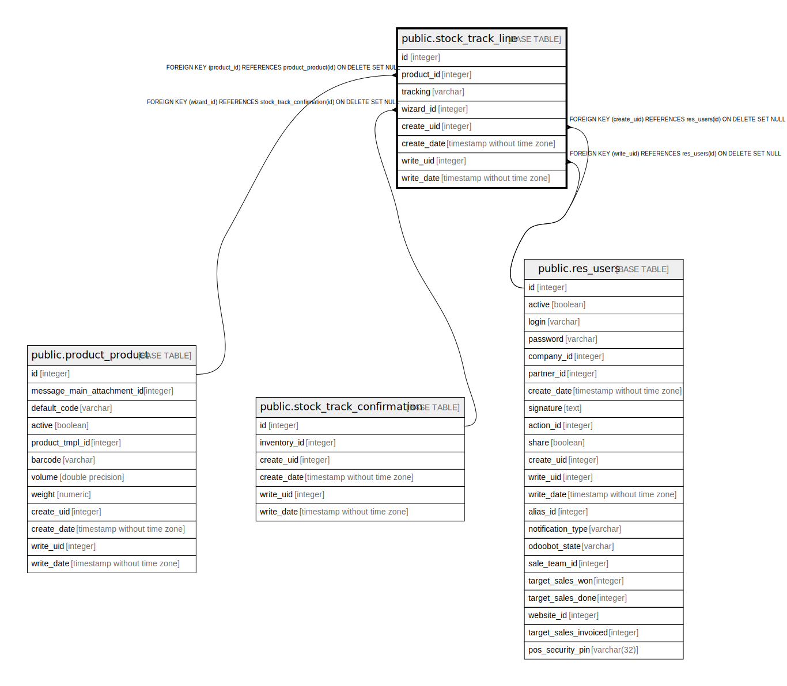

# public.stock_track_line

## Description

Stock Track Line

## Columns

| Name | Type | Default | Nullable | Children | Parents | Comment |
| ---- | ---- | ------- | -------- | -------- | ------- | ------- |
| id | integer | nextval('stock_track_line_id_seq'::regclass) | false |  |  |  |
| product_id | integer |  | true |  | [public.product_product](public.product_product.md) | Product |
| tracking | varchar |  | true |  |  | Tracking |
| wizard_id | integer |  | true |  | [public.stock_track_confirmation](public.stock_track_confirmation.md) | Wizard |
| create_uid | integer |  | true |  | [public.res_users](public.res_users.md) | Created by |
| create_date | timestamp without time zone |  | true |  |  | Created on |
| write_uid | integer |  | true |  | [public.res_users](public.res_users.md) | Last Updated by |
| write_date | timestamp without time zone |  | true |  |  | Last Updated on |

## Constraints

| Name | Type | Definition |
| ---- | ---- | ---------- |
| stock_track_line_create_uid_fkey | FOREIGN KEY | FOREIGN KEY (create_uid) REFERENCES res_users(id) ON DELETE SET NULL |
| stock_track_line_write_uid_fkey | FOREIGN KEY | FOREIGN KEY (write_uid) REFERENCES res_users(id) ON DELETE SET NULL |
| stock_track_line_product_id_fkey | FOREIGN KEY | FOREIGN KEY (product_id) REFERENCES product_product(id) ON DELETE SET NULL |
| stock_track_line_wizard_id_fkey | FOREIGN KEY | FOREIGN KEY (wizard_id) REFERENCES stock_track_confirmation(id) ON DELETE SET NULL |
| stock_track_line_pkey | PRIMARY KEY | PRIMARY KEY (id) |

## Indexes

| Name | Definition |
| ---- | ---------- |
| stock_track_line_pkey | CREATE UNIQUE INDEX stock_track_line_pkey ON public.stock_track_line USING btree (id) |

## Relations

---

> Generated by [tbls](https://github.com/k1LoW/tbls)
