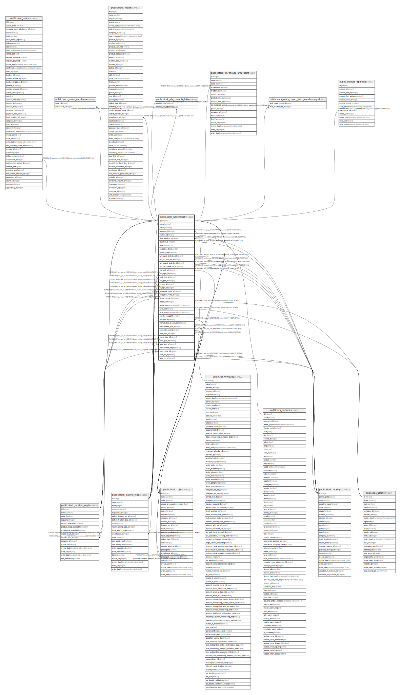

# public.stock_warehouse

## Description

Warehouse

## Columns

| Name | Type | Default | Nullable | Children | Parents | Comment |
| ---- | ---- | ------- | -------- | -------- | ------- | ------- |
| id | integer | nextval('stock_warehouse_id_seq'::regclass) | false | [public.sale_order](public.sale_order.md) [public.stock_location_route](public.stock_location_route.md) [public.stock_route_warehouse](public.stock_route_warehouse.md) [public.stock_move](public.stock_move.md) [public.stock_picking_type](public.stock_picking_type.md) [public.stock_rule](public.stock_rule.md) [public.stock_wh_resupply_table](public.stock_wh_resupply_table.md) [public.stock_warehouse_orderpoint](public.stock_warehouse_orderpoint.md) [public.stock_rules_report_stock_warehouse_rel](public.stock_rules_report_stock_warehouse_rel.md) [public.product_replenish](public.product_replenish.md) |  |  |
| name | varchar |  | false |  |  | Warehouse |
| active | boolean |  | true |  |  | Active |
| company_id | integer |  | false |  | [public.res_company](public.res_company.md) | Company |
| partner_id | integer |  | true |  | [public.res_partner](public.res_partner.md) | Address |
| view_location_id | integer |  | false |  | [public.stock_location](public.stock_location.md) | View Location |
| lot_stock_id | integer |  | false |  | [public.stock_location](public.stock_location.md) | Location Stock |
| code | varchar(5) |  | false |  |  | Short Name |
| reception_steps | varchar |  | false |  |  | Incoming Shipments |
| delivery_steps | varchar |  | false |  |  | Outgoing Shipments |
| wh_input_stock_loc_id | integer |  | true |  | [public.stock_location](public.stock_location.md) | Input Location |
| wh_qc_stock_loc_id | integer |  | true |  | [public.stock_location](public.stock_location.md) | Quality Control Location |
| wh_output_stock_loc_id | integer |  | true |  | [public.stock_location](public.stock_location.md) | Output Location |
| wh_pack_stock_loc_id | integer |  | true |  | [public.stock_location](public.stock_location.md) | Packing Location |
| mto_pull_id | integer |  | true |  | [public.stock_rule](public.stock_rule.md) | MTO rule |
| pick_type_id | integer |  | true |  | [public.stock_picking_type](public.stock_picking_type.md) | Pick Type |
| pack_type_id | integer |  | true |  | [public.stock_picking_type](public.stock_picking_type.md) | Pack Type |
| out_type_id | integer |  | true |  | [public.stock_picking_type](public.stock_picking_type.md) | Out Type |
| in_type_id | integer |  | true |  | [public.stock_picking_type](public.stock_picking_type.md) | In Type |
| int_type_id | integer |  | true |  | [public.stock_picking_type](public.stock_picking_type.md) | Internal Type |
| crossdock_route_id | integer |  | true |  | [public.stock_location_route](public.stock_location_route.md) | Crossdock Route |
| reception_route_id | integer |  | true |  | [public.stock_location_route](public.stock_location_route.md) | Receipt Route |
| delivery_route_id | integer |  | true |  | [public.stock_location_route](public.stock_location_route.md) | Delivery Route |
| create_uid | integer |  | true |  | [public.res_users](public.res_users.md) | Created by |
| create_date | timestamp without time zone |  | true |  |  | Created on |
| write_uid | integer |  | true |  | [public.res_users](public.res_users.md) | Last Updated by |
| write_date | timestamp without time zone |  | true |  |  | Last Updated on |
| buy_to_resupply | boolean |  | true |  |  | Buy to Resupply |
| buy_pull_id | integer |  | true |  | [public.stock_rule](public.stock_rule.md) | Buy rule |
| manufacture_to_resupply | boolean |  | true |  |  | Manufacture to Resupply |
| manufacture_pull_id | integer |  | true |  | [public.stock_rule](public.stock_rule.md) | Manufacture Rule |
| pbm_mto_pull_id | integer |  | true |  | [public.stock_rule](public.stock_rule.md) | Picking Before Manufacturing MTO Rule |
| sam_rule_id | integer |  | true |  | [public.stock_rule](public.stock_rule.md) | Stock After Manufacturing Rule |
| manu_type_id | integer |  | true |  | [public.stock_picking_type](public.stock_picking_type.md) | Manufacturing Operation Type |
| pbm_type_id | integer |  | true |  | [public.stock_picking_type](public.stock_picking_type.md) | Picking Before Manufacturing Operation Type |
| sam_type_id | integer |  | true |  | [public.stock_picking_type](public.stock_picking_type.md) | Stock After Manufacturing Operation Type |
| manufacture_steps | varchar |  | false |  |  | Manufacture |
| pbm_route_id | integer |  | true |  | [public.stock_location_route](public.stock_location_route.md) | Picking Before Manufacturing Route |
| pbm_loc_id | integer |  | true |  | [public.stock_location](public.stock_location.md) | Picking before Manufacturing Location |
| sam_loc_id | integer |  | true |  | [public.stock_location](public.stock_location.md) | Stock after Manufacturing Location |

## Constraints

| Name | Type | Definition | Comment |
| ---- | ---- | ---------- | ------- |
| stock_warehouse_create_uid_fkey | FOREIGN KEY | FOREIGN KEY (create_uid) REFERENCES res_users(id) ON DELETE SET NULL |  |
| stock_warehouse_write_uid_fkey | FOREIGN KEY | FOREIGN KEY (write_uid) REFERENCES res_users(id) ON DELETE SET NULL |  |
| stock_warehouse_company_id_fkey | FOREIGN KEY | FOREIGN KEY (company_id) REFERENCES res_company(id) ON DELETE SET NULL |  |
| stock_warehouse_partner_id_fkey | FOREIGN KEY | FOREIGN KEY (partner_id) REFERENCES res_partner(id) ON DELETE SET NULL |  |
| stock_warehouse_lot_stock_id_fkey | FOREIGN KEY | FOREIGN KEY (lot_stock_id) REFERENCES stock_location(id) ON DELETE SET NULL |  |
| stock_warehouse_pbm_loc_id_fkey | FOREIGN KEY | FOREIGN KEY (pbm_loc_id) REFERENCES stock_location(id) ON DELETE SET NULL |  |
| stock_warehouse_sam_loc_id_fkey | FOREIGN KEY | FOREIGN KEY (sam_loc_id) REFERENCES stock_location(id) ON DELETE SET NULL |  |
| stock_warehouse_view_location_id_fkey | FOREIGN KEY | FOREIGN KEY (view_location_id) REFERENCES stock_location(id) ON DELETE SET NULL |  |
| stock_warehouse_wh_input_stock_loc_id_fkey | FOREIGN KEY | FOREIGN KEY (wh_input_stock_loc_id) REFERENCES stock_location(id) ON DELETE SET NULL |  |
| stock_warehouse_wh_output_stock_loc_id_fkey | FOREIGN KEY | FOREIGN KEY (wh_output_stock_loc_id) REFERENCES stock_location(id) ON DELETE SET NULL |  |
| stock_warehouse_wh_pack_stock_loc_id_fkey | FOREIGN KEY | FOREIGN KEY (wh_pack_stock_loc_id) REFERENCES stock_location(id) ON DELETE SET NULL |  |
| stock_warehouse_wh_qc_stock_loc_id_fkey | FOREIGN KEY | FOREIGN KEY (wh_qc_stock_loc_id) REFERENCES stock_location(id) ON DELETE SET NULL |  |
| stock_warehouse_crossdock_route_id_fkey | FOREIGN KEY | FOREIGN KEY (crossdock_route_id) REFERENCES stock_location_route(id) ON DELETE RESTRICT |  |
| stock_warehouse_delivery_route_id_fkey | FOREIGN KEY | FOREIGN KEY (delivery_route_id) REFERENCES stock_location_route(id) ON DELETE RESTRICT |  |
| stock_warehouse_pbm_route_id_fkey | FOREIGN KEY | FOREIGN KEY (pbm_route_id) REFERENCES stock_location_route(id) ON DELETE RESTRICT |  |
| stock_warehouse_reception_route_id_fkey | FOREIGN KEY | FOREIGN KEY (reception_route_id) REFERENCES stock_location_route(id) ON DELETE RESTRICT |  |
| stock_warehouse_in_type_id_fkey | FOREIGN KEY | FOREIGN KEY (in_type_id) REFERENCES stock_picking_type(id) ON DELETE SET NULL |  |
| stock_warehouse_int_type_id_fkey | FOREIGN KEY | FOREIGN KEY (int_type_id) REFERENCES stock_picking_type(id) ON DELETE SET NULL |  |
| stock_warehouse_manu_type_id_fkey | FOREIGN KEY | FOREIGN KEY (manu_type_id) REFERENCES stock_picking_type(id) ON DELETE SET NULL |  |
| stock_warehouse_out_type_id_fkey | FOREIGN KEY | FOREIGN KEY (out_type_id) REFERENCES stock_picking_type(id) ON DELETE SET NULL |  |
| stock_warehouse_pack_type_id_fkey | FOREIGN KEY | FOREIGN KEY (pack_type_id) REFERENCES stock_picking_type(id) ON DELETE SET NULL |  |
| stock_warehouse_pbm_type_id_fkey | FOREIGN KEY | FOREIGN KEY (pbm_type_id) REFERENCES stock_picking_type(id) ON DELETE SET NULL |  |
| stock_warehouse_pick_type_id_fkey | FOREIGN KEY | FOREIGN KEY (pick_type_id) REFERENCES stock_picking_type(id) ON DELETE SET NULL |  |
| stock_warehouse_sam_type_id_fkey | FOREIGN KEY | FOREIGN KEY (sam_type_id) REFERENCES stock_picking_type(id) ON DELETE SET NULL |  |
| stock_warehouse_buy_pull_id_fkey | FOREIGN KEY | FOREIGN KEY (buy_pull_id) REFERENCES stock_rule(id) ON DELETE SET NULL |  |
| stock_warehouse_manufacture_pull_id_fkey | FOREIGN KEY | FOREIGN KEY (manufacture_pull_id) REFERENCES stock_rule(id) ON DELETE SET NULL |  |
| stock_warehouse_mto_pull_id_fkey | FOREIGN KEY | FOREIGN KEY (mto_pull_id) REFERENCES stock_rule(id) ON DELETE SET NULL |  |
| stock_warehouse_pbm_mto_pull_id_fkey | FOREIGN KEY | FOREIGN KEY (pbm_mto_pull_id) REFERENCES stock_rule(id) ON DELETE SET NULL |  |
| stock_warehouse_sam_rule_id_fkey | FOREIGN KEY | FOREIGN KEY (sam_rule_id) REFERENCES stock_rule(id) ON DELETE SET NULL |  |
| stock_warehouse_pkey | PRIMARY KEY | PRIMARY KEY (id) |  |
| stock_warehouse_warehouse_name_uniq | UNIQUE | UNIQUE (name, company_id) | unique(name, company_id) |
| stock_warehouse_warehouse_code_uniq | UNIQUE | UNIQUE (code, company_id) | unique(code, company_id) |

## Indexes

| Name | Definition |
| ---- | ---------- |
| stock_warehouse_pkey | CREATE UNIQUE INDEX stock_warehouse_pkey ON public.stock_warehouse USING btree (id) |
| stock_warehouse_name_index | CREATE INDEX stock_warehouse_name_index ON public.stock_warehouse USING btree (name) |
| stock_warehouse_company_id_index | CREATE INDEX stock_warehouse_company_id_index ON public.stock_warehouse USING btree (company_id) |
| stock_warehouse_warehouse_name_uniq | CREATE UNIQUE INDEX stock_warehouse_warehouse_name_uniq ON public.stock_warehouse USING btree (name, company_id) |
| stock_warehouse_warehouse_code_uniq | CREATE UNIQUE INDEX stock_warehouse_warehouse_code_uniq ON public.stock_warehouse USING btree (code, company_id) |

## Relations

---

> Generated by [tbls](https://github.com/k1LoW/tbls)
