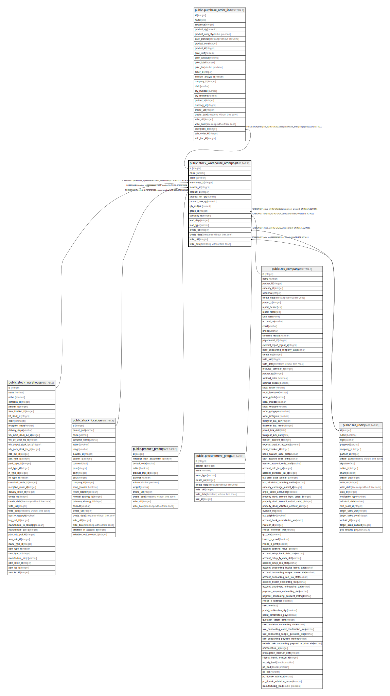

# public.stock_warehouse_orderpoint

## Description

Minimum Inventory Rule

## Columns

| Name | Type | Default | Nullable | Children | Parents | Comment |
| ---- | ---- | ------- | -------- | -------- | ------- | ------- |
| id | integer | nextval('stock_warehouse_orderpoint_id_seq'::regclass) | false | [public.purchase_order_line](public.purchase_order_line.md) |  |  |
| name | varchar |  | false |  |  | Name |
| active | boolean |  | true |  |  | Active |
| warehouse_id | integer |  | false |  | [public.stock_warehouse](public.stock_warehouse.md) | Warehouse |
| location_id | integer |  | false |  | [public.stock_location](public.stock_location.md) | Location |
| product_id | integer |  | false |  | [public.product_product](public.product_product.md) | Product |
| product_min_qty | numeric |  | false |  |  | Minimum Quantity |
| product_max_qty | numeric |  | false |  |  | Maximum Quantity |
| qty_multiple | numeric |  | false |  |  | Qty Multiple |
| group_id | integer |  | true |  | [public.procurement_group](public.procurement_group.md) | Procurement Group |
| company_id | integer |  | false |  | [public.res_company](public.res_company.md) | Company |
| lead_days | integer |  | true |  |  | Lead Time |
| lead_type | varchar |  | false |  |  | Lead Type |
| create_uid | integer |  | true |  | [public.res_users](public.res_users.md) | Created by |
| create_date | timestamp without time zone |  | true |  |  | Created on |
| write_uid | integer |  | true |  | [public.res_users](public.res_users.md) | Last Updated by |
| write_date | timestamp without time zone |  | true |  |  | Last Updated on |

## Constraints

| Name | Type | Definition | Comment |
| ---- | ---- | ---------- | ------- |
| stock_warehouse_orderpoint_qty_multiple_check | CHECK | CHECK ((qty_multiple >= (0)::numeric)) | CHECK( qty_multiple >= 0 ) |
| stock_warehouse_orderpoint_create_uid_fkey | FOREIGN KEY | FOREIGN KEY (create_uid) REFERENCES res_users(id) ON DELETE SET NULL |  |
| stock_warehouse_orderpoint_write_uid_fkey | FOREIGN KEY | FOREIGN KEY (write_uid) REFERENCES res_users(id) ON DELETE SET NULL |  |
| stock_warehouse_orderpoint_company_id_fkey | FOREIGN KEY | FOREIGN KEY (company_id) REFERENCES res_company(id) ON DELETE SET NULL |  |
| stock_warehouse_orderpoint_product_id_fkey | FOREIGN KEY | FOREIGN KEY (product_id) REFERENCES product_product(id) ON DELETE CASCADE |  |
| stock_warehouse_orderpoint_location_id_fkey | FOREIGN KEY | FOREIGN KEY (location_id) REFERENCES stock_location(id) ON DELETE CASCADE |  |
| stock_warehouse_orderpoint_group_id_fkey | FOREIGN KEY | FOREIGN KEY (group_id) REFERENCES procurement_group(id) ON DELETE SET NULL |  |
| stock_warehouse_orderpoint_warehouse_id_fkey | FOREIGN KEY | FOREIGN KEY (warehouse_id) REFERENCES stock_warehouse(id) ON DELETE CASCADE |  |
| stock_warehouse_orderpoint_pkey | PRIMARY KEY | PRIMARY KEY (id) |  |

## Indexes

| Name | Definition |
| ---- | ---------- |
| stock_warehouse_orderpoint_pkey | CREATE UNIQUE INDEX stock_warehouse_orderpoint_pkey ON public.stock_warehouse_orderpoint USING btree (id) |

## Relations

---

> Generated by [tbls](https://github.com/k1LoW/tbls)
