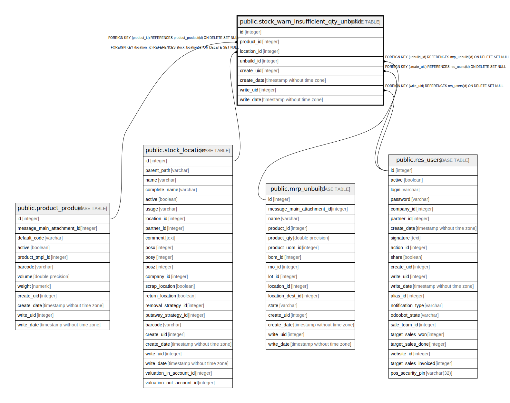

# public.stock_warn_insufficient_qty_unbuild

## Description

Warn Insufficient Unbuild Quantity

## Columns

| Name | Type | Default | Nullable | Children | Parents | Comment |
| ---- | ---- | ------- | -------- | -------- | ------- | ------- |
| id | integer | nextval('stock_warn_insufficient_qty_unbuild_id_seq'::regclass) | false |  |  |  |
| product_id | integer |  | false |  | [public.product_product](public.product_product.md) | Product |
| location_id | integer |  | false |  | [public.stock_location](public.stock_location.md) | Location |
| unbuild_id | integer |  | true |  | [public.mrp_unbuild](public.mrp_unbuild.md) | Unbuild |
| create_uid | integer |  | true |  | [public.res_users](public.res_users.md) | Created by |
| create_date | timestamp without time zone |  | true |  |  | Created on |
| write_uid | integer |  | true |  | [public.res_users](public.res_users.md) | Last Updated by |
| write_date | timestamp without time zone |  | true |  |  | Last Updated on |

## Constraints

| Name | Type | Definition |
| ---- | ---- | ---------- |
| stock_warn_insufficient_qty_unbuild_create_uid_fkey | FOREIGN KEY | FOREIGN KEY (create_uid) REFERENCES res_users(id) ON DELETE SET NULL |
| stock_warn_insufficient_qty_unbuild_write_uid_fkey | FOREIGN KEY | FOREIGN KEY (write_uid) REFERENCES res_users(id) ON DELETE SET NULL |
| stock_warn_insufficient_qty_unbuild_product_id_fkey | FOREIGN KEY | FOREIGN KEY (product_id) REFERENCES product_product(id) ON DELETE SET NULL |
| stock_warn_insufficient_qty_unbuild_location_id_fkey | FOREIGN KEY | FOREIGN KEY (location_id) REFERENCES stock_location(id) ON DELETE SET NULL |
| stock_warn_insufficient_qty_unbuild_unbuild_id_fkey | FOREIGN KEY | FOREIGN KEY (unbuild_id) REFERENCES mrp_unbuild(id) ON DELETE SET NULL |
| stock_warn_insufficient_qty_unbuild_pkey | PRIMARY KEY | PRIMARY KEY (id) |

## Indexes

| Name | Definition |
| ---- | ---------- |
| stock_warn_insufficient_qty_unbuild_pkey | CREATE UNIQUE INDEX stock_warn_insufficient_qty_unbuild_pkey ON public.stock_warn_insufficient_qty_unbuild USING btree (id) |

## Relations

---

> Generated by [tbls](https://github.com/k1LoW/tbls)
