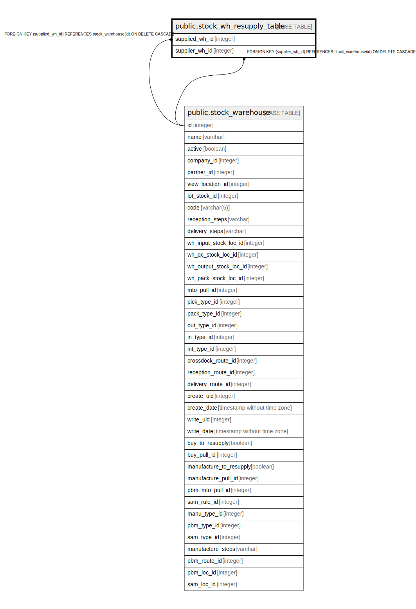

# public.stock_wh_resupply_table

## Description

RELATION BETWEEN stock_warehouse AND stock_warehouse

## Columns

| Name | Type | Default | Nullable | Children | Parents | Comment |
| ---- | ---- | ------- | -------- | -------- | ------- | ------- |
| supplied_wh_id | integer |  | false |  | [public.stock_warehouse](public.stock_warehouse.md) |  |
| supplier_wh_id | integer |  | false |  | [public.stock_warehouse](public.stock_warehouse.md) |  |

## Constraints

| Name | Type | Definition |
| ---- | ---- | ---------- |
| stock_wh_resupply_table_supplied_wh_id_fkey | FOREIGN KEY | FOREIGN KEY (supplied_wh_id) REFERENCES stock_warehouse(id) ON DELETE CASCADE |
| stock_wh_resupply_table_supplier_wh_id_fkey | FOREIGN KEY | FOREIGN KEY (supplier_wh_id) REFERENCES stock_warehouse(id) ON DELETE CASCADE |
| stock_wh_resupply_table_supplied_wh_id_supplier_wh_id_key | UNIQUE | UNIQUE (supplied_wh_id, supplier_wh_id) |

## Indexes

| Name | Definition |
| ---- | ---------- |
| stock_wh_resupply_table_supplied_wh_id_supplier_wh_id_key | CREATE UNIQUE INDEX stock_wh_resupply_table_supplied_wh_id_supplier_wh_id_key ON public.stock_wh_resupply_table USING btree (supplied_wh_id, supplier_wh_id) |
| stock_wh_resupply_table_supplied_wh_id_idx | CREATE INDEX stock_wh_resupply_table_supplied_wh_id_idx ON public.stock_wh_resupply_table USING btree (supplied_wh_id) |
| stock_wh_resupply_table_supplier_wh_id_idx | CREATE INDEX stock_wh_resupply_table_supplier_wh_id_idx ON public.stock_wh_resupply_table USING btree (supplier_wh_id) |

## Relations

---

> Generated by [tbls](https://github.com/k1LoW/tbls)
